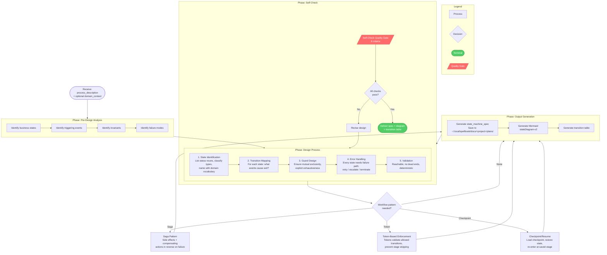
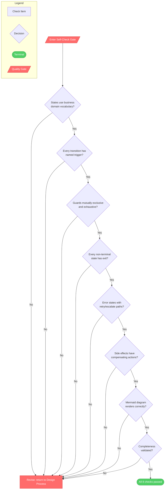

<!-- diagram-meta: {"source": "skills/designing-workflows/SKILL.md","source_hash": "sha256:b0e9c3d820cc4013b890046613c776ac2bcf3c9367fa4ee446a005546e0843c8","generated_at": "2026-03-19T06:17:02Z","generator": "generate_diagrams.py"} -->
# Diagram: designing-workflows

This skill is relatively compact — a single-phase workflow design process without subagent dispatches or complex branching. One diagram will suffice.

## Overview: Designing Workflows Skill

```mermaid
flowchart TD
    subgraph Legend
        direction LR
        L1[Process]
        L2{Decision}
        L3([Terminal]):::success
        L4[/Quality Gate/]:::gate
    end

    Start([Receive process_description<br>+ optional domain_context]) --> Analysis

    subgraph Analysis ["Phase: Pre-Design Analysis"]
        A1[Identify business states]
        A2[Identify triggering events]
        A3[Identify invariants]
        A4[Identify failure modes]
        A1 --> A2 --> A3 --> A4
    end

    Analysis --> Design

    subgraph Design ["Phase: Design Process"]
        D1["1. State Identification<br>List status nouns, classify types,<br>name with domain vocabulary"]
        D2["2. Transition Mapping<br>For each state: what events cause exit?"]
        D3["3. Guard Design<br>Ensure mutual exclusivity,<br>explicit exhaustiveness"]
        D4["4. Error Handling<br>Every state needs failure path:<br>retry / escalate / terminate"]
        D5["5. Validation<br>Reachable, no dead ends, deterministic"]
        D1 --> D2 --> D3 --> D4 --> D5
    end

    Design --> PatternSelect

    PatternSelect{Workflow pattern<br>needed?}
    PatternSelect -->|Saga| Saga["Saga Pattern<br>Side effects + compensating<br>actions in reverse on failure"]
    PatternSelect -->|Token| Token["Token-Based Enforcement<br>Tokens validate allowed transitions,<br>prevent stage skipping"]
    PatternSelect -->|Checkpoint| Checkpoint["Checkpoint/Resume<br>Load checkpoint, restore state,<br>re-enter at saved stage"]
    PatternSelect -->|None| Generate

    Saga --> Generate
    Token --> Generate
    Checkpoint --> Generate

    subgraph Generate ["Phase: Output Generation"]
        G1["Generate state_machine_spec<br>Save to ~/.local/spellbook/docs/&lt;project&gt;/plans/"]
        G2["Generate Mermaid stateDiagram-v2"]
        G3["Generate transition table"]
        G1 --> G2 --> G3
    end

    Generate --> SelfCheck

    subgraph SelfCheck ["Phase: Self-Check"]
        SC[/"Self-Check Quality Gate<br>8 criteria"/]:::gate
        SC --> CheckPass{All checks<br>pass?}
        CheckPass -->|No| Revise["Revise design"]
        Revise --> Design
        CheckPass -->|Yes| Done
    end

    Done([Deliver spec + diagram<br>+ transition table]):::success

    classDef gate fill:#ff6b6b,stroke:#d63031,color:#fff
    classDef success fill:#51cf66,stroke:#2f9e44,color:#fff
```

## Self-Check Quality Gate Detail

The quality gate at the end of the design process enforces all 8 criteria before completion. Failure on any criterion loops back to the Design phase.

```mermaid
flowchart TD
    subgraph Legend
        direction LR
        L1[Check Item]
        L2{Decision}
        L3([Terminal]):::success
        L4[/Quality Gate/]:::gate
    end

    Entry[/Enter Self-Check Gate/]:::gate --> C1

    C1{States use business<br>domain vocabulary?}
    C1 -->|No| Fail
    C1 -->|Yes| C2

    C2{Every transition has<br>named trigger?}
    C2 -->|No| Fail
    C2 -->|Yes| C3

    C3{Guards mutually exclusive<br>and exhaustive?}
    C3 -->|No| Fail
    C3 -->|Yes| C4

    C4{Every non-terminal<br>state has exit?}
    C4 -->|No| Fail
    C4 -->|Yes| C5

    C5{Error states with<br>retry/escalate paths?}
    C5 -->|No| Fail
    C5 -->|Yes| C6

    C6{Side effects have<br>compensating actions?}
    C6 -->|No| Fail
    C6 -->|Yes| C7

    C7{Mermaid diagram<br>renders correctly?}
    C7 -->|No| Fail
    C7 -->|Yes| C8

    C8{Completeness<br>validated?}
    C8 -->|No| Fail
    C8 -->|Yes| Pass

    Fail["Revise: return to Design Process"]:::gate
    Pass([All 8 checks passed]):::success

    classDef gate fill:#ff6b6b,stroke:#d63031,color:#fff
    classDef success fill:#51cf66,stroke:#2f9e44,color:#fff
```

## Forbidden Actions (Anti-Pattern Guard Rails)

These are checked implicitly throughout the design process and enforced by the self-check gate:

| Anti-Pattern | Prevented By |
|---|---|
| States named after implementation ("step1") | Self-check: domain vocabulary |
| Transitions without named triggers | Self-check: named triggers |
| Overlapping guards (ambiguous transitions) | Self-check: mutual exclusivity |
| Missing error handling (happy path only) | Self-check: error state paths |
| Side effects without compensating actions | Self-check: compensating actions |
| Dead-end states not marked terminal | Self-check: non-terminal exits |
| Implicit guards ("else" without condition) | Self-check: exhaustive guards |
| Skipping completeness validation | Self-check: completeness validated |

## Cross-Reference: Overview Nodes to Detail

| Overview Node | Detail Section |
|---|---|
| Analysis phase | Pre-Design Analysis: 4 questions (states, events, invariants, failures) |
| Design Process | 5-step sequential process (State ID, Transitions, Guards, Errors, Validation) |
| Pattern Select | Optional: Saga, Token-Based, or Checkpoint/Resume patterns |
| Output Generation | 3 artifacts: spec file, Mermaid diagram, transition table |
| Self-Check | 8-criterion quality gate with loop-back on failure |
