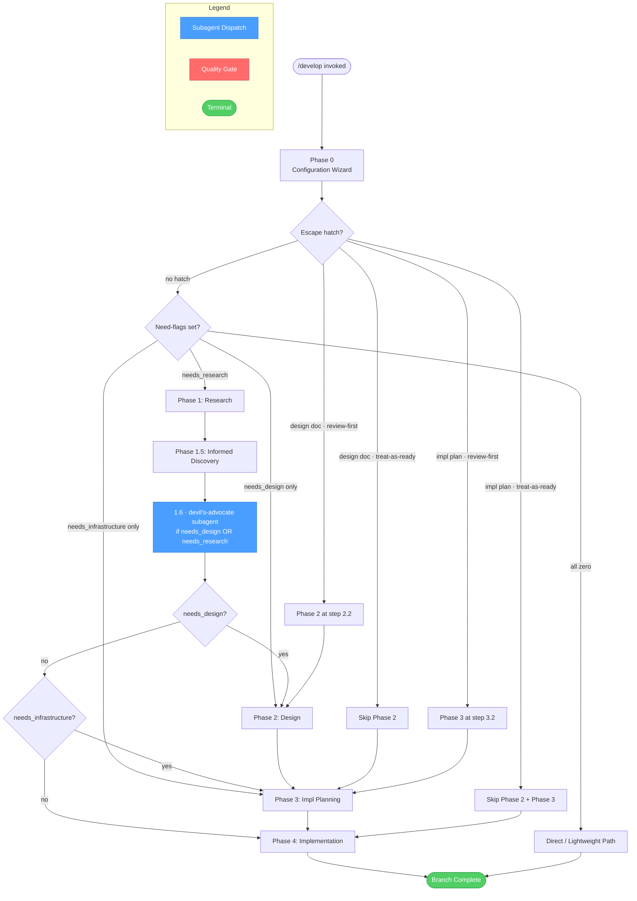
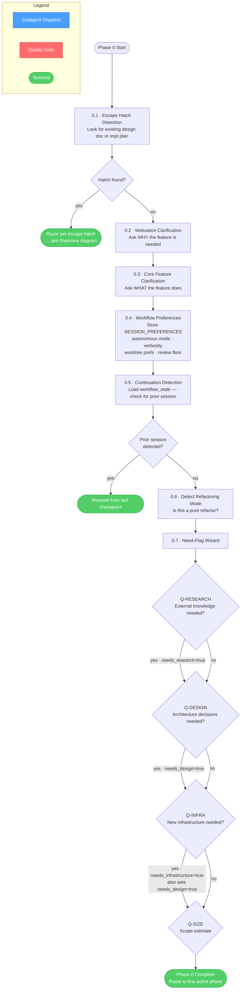
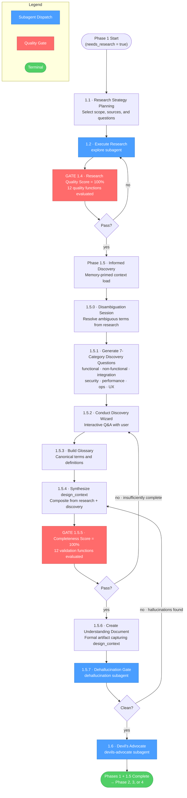
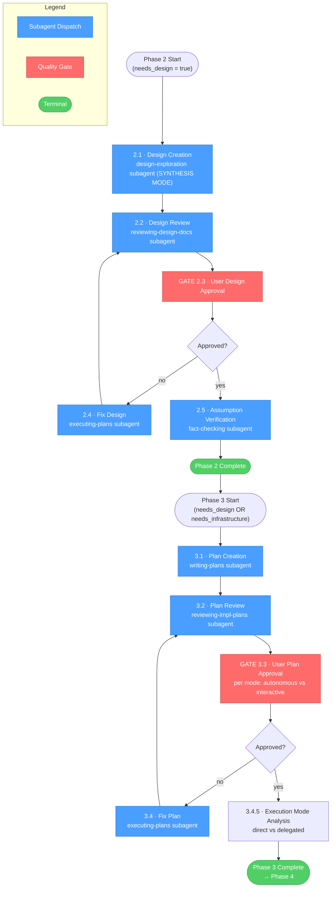
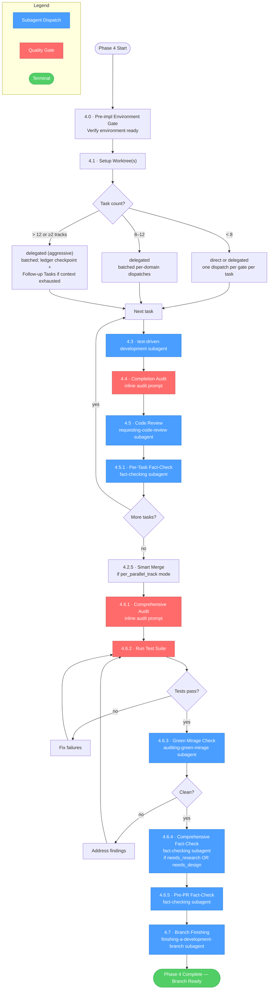
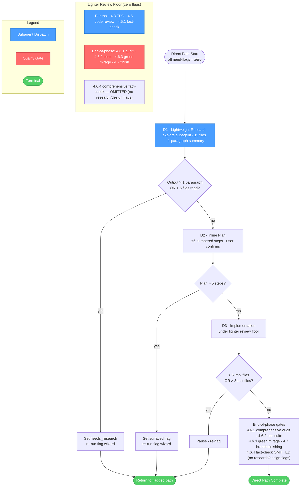

<!-- diagram-meta: {"source": "skills/develop/SKILL.md", "source_hash": "sha256:1964c2a15065e6c830a702a7418243990aabb68abd327b103be7f4f0b9ca970b", "generated_at": "2026-05-25T01:32:42Z", "generator": "generate_diagrams.py"} -->
# Diagram: develop

## Overview: `develop` Skill — Phase Routing

High-level phase routing, escape hatch handling, and need-flag dispatch.

---

## Phase 0: Configuration Wizard

Steps 0.1–0.7: escape hatch detection, motivation/scope clarification, preferences storage, continuation detection, refactoring mode, and need-flag wizard.

---

## Phases 1 + 1.5: Research and Informed Discovery

Phase 1 (steps 1.1–1.4) and Phase 1.5 (steps 1.5.0–1.6). Both phases require `needs_research`. Contains two never-bypassable quality gates and two subagent-backed verification steps.

---

## Phases 2 + 3: Design and Implementation Planning

Phase 2 (needs_design) and Phase 3 (needs_design OR needs_infrastructure). Both include subagent-authored artifacts, review subagents, user-approval gates, and fix loops.

---

## Phase 4: Implementation

Steps 4.0–4.7: environment gate, worktree setup, task batching, per-task loop (TDD → audit → review → fact-check), smart merge, and end-of-phase gates.

---

## Direct / Lightweight Path

Fast path when all need-flags are zero. Three guardrails re-route to the flagged path if thresholds are breached; otherwise proceeds under a lighter review floor.

---

## Cross-Reference Table

| Overview Node | Detail Diagram | Steps Covered |
|---|---|---|
| Phase 0: Configuration Wizard | Phase 0 diagram | 0.1 escape hatch · 0.2 WHY · 0.3 WHAT · 0.4 SESSION_PREFERENCES · 0.5 continuation · 0.6 refactor mode · 0.7 flag wizard (Q-RESEARCH / Q-DESIGN / Q-INFRA / Q-SIZE) |
| Phase 1: Research | Phases 1 + 1.5 diagram | 1.1 strategy · 1.2 explore subagent · GATE 1.4 research quality (100%) |
| Phase 1.5: Informed Discovery | Phases 1 + 1.5 diagram | 1.5.0 disambiguation · 1.5.1 7-category questions · 1.5.2 discovery wizard · 1.5.3 glossary · 1.5.4 design_context synthesis · GATE 1.5.5 completeness (100%) · 1.5.6 understanding doc · 1.5.7 dehallucination subagent · 1.6 devil's-advocate subagent |
| Phase 2: Design | Phases 2 + 3 diagram | 2.1 design-exploration (SYNTHESIS) · 2.2 reviewing-design-docs · GATE 2.3 user approval · 2.4 executing-plans (fix loop) · 2.5 fact-checking (assumption verification) |
| Phase 3: Impl Planning | Phases 2 + 3 diagram | 3.1 writing-plans · 3.2 reviewing-impl-plans · GATE 3.3 user approval (per mode) · 3.4 executing-plans (fix loop) · 3.4.5 execution mode analysis |
| Phase 4: Implementation | Phase 4 diagram | 4.0 env gate · 4.1 worktrees · task batching (<8 / 8–12 / >12) · per-task loop (4.3 TDD · 4.4 inline audit · 4.5 code review · 4.5.1 fact-check) · 4.2.5 smart merge · 4.6.1 comprehensive audit · 4.6.2 test suite · 4.6.3 green mirage · 4.6.4 comprehensive fact-check · 4.6.5 pre-PR fact-check · 4.7 finishing |
| Direct / Lightweight Path | Direct Path diagram | D1 lightweight research (explore, ≤5 files) · D2 inline plan (≤5 steps) · D3 implementation (lighter review floor) · three guardrails that re-route to flagged path on threshold breach |
