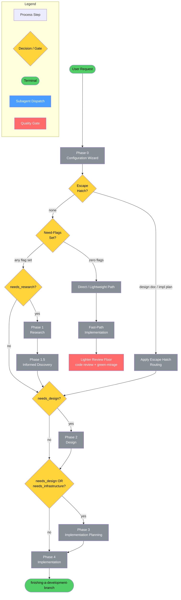
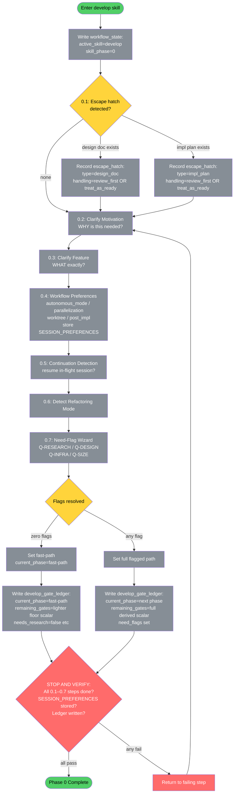
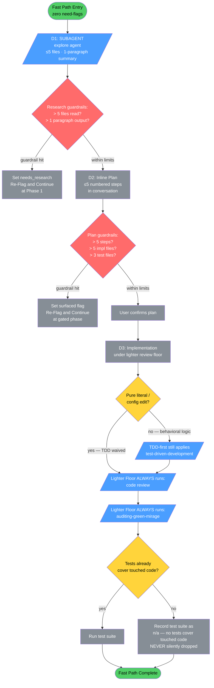

<!-- diagram-meta: {"source": "skills/develop/SKILL.md", "source_hash": "sha256:90fd3572a0247c4d4d24b49828747f8ceb19366f3efe70615622de3f24eaad7a", "generated_at": "2026-05-26T05:38:38Z", "generator": "generate_diagrams.py"} -->
# Diagram: develop

## Overview Diagram



**Cross-reference:** Phase 0 → [Phase 0 Detail](#phase-0-detail) · Phase 1 + 1.5 → [Research & Discovery Detail](#research--discovery-detail) · Phase 2 → [Design Detail](#design-detail) · Phase 3 → [Planning Detail](#planning-detail) · Phase 4 → [Implementation Detail](#implementation-detail)

---

## Phase 0 Detail — Configuration Wizard



---

## Research & Discovery Detail — Phases 1 & 1.5

```mermaid
flowchart TD
    P1_START([Phase 1: Research\nneeds_research=true]) --> P11[1.1: Research Strategy Planning]
    P11 --> P12[/1.2: SUBAGENT\nexplore agent\ncodebase exploration/]
    P12 --> P13[1.3: Ambiguity Extraction\nfrom research findings]
    P13 --> GATE_RQ{GATE 1.4:\nResearch Quality\n= 100%?}
    GATE_RQ -->|fail| P12
    GATE_RQ -->|pass| P15_START

    P15_START([Phase 1.5: Informed Discovery]) --> P150[1.5.0: Disambiguation Session\nresolve ambiguities from 1.3]
    P150 --> P151[1.5.1: Generate 7-Category\nDiscovery Questions]
    P151 --> P152[1.5.2: Discovery Wizard\nAskUserQuestion + ARH]
    P152 --> SCOPE_DRIFT{ARH detects\nscope expansion?}
    SCOPE_DRIFT -->|yes| SET_FLAGS[Set surfaced need-flag\nRe-Flag and Continue]
    SET_FLAGS --> P153
    SCOPE_DRIFT -->|no| P153

    P153[1.5.3: Build Glossary] --> P154[1.5.4: Synthesize design_context]
    P154 --> GATE_CS{GATE 1.5.5:\nCompleteness Score\n= 100% 13/13?}
    GATE_CS -->|fail| P152
    GATE_CS -->|pass| P156[1.5.6: Create Understanding Document\nwrite to understanding/understanding-[feature]-*.md]

    P156 --> P157[/1.5.7: SUBAGENT\ndehallucination skill\nverify all refs real/]
    P157 --> DEHAL_RESULT{Hallucinations\nfound?}
    DEHAL_RESULT -->|yes| FIX_UNDER[Fix Understanding Document\nPropagate to derived artifacts]
    FIX_UNDER --> P16
    DEHAL_RESULT -->|no| P16

    P16[/1.6: SUBAGENT\ndevils-advocate skill\nchallenge understanding doc/]
    P16 --> DA_RESULT{Findings\nidentified?}
    DA_RESULT -->|yes| UPDATE_UNDER[Update Understanding Document\nincorporate critique]
    UPDATE_UNDER --> VERIFY_15
    DA_RESULT -->|no| VERIFY_15

    VERIFY_15{Artifact Verification:\nunderstanding doc exists?\ncompleteness 100%?\ndehallucination done?\ndevils-advocate done?}
    VERIFY_15 -->|all pass| P15_DONE([Phase 1.5 Complete])
    VERIFY_15 -->|any fail| BACK_15[Return to failing step]
    BACK_15 --> P150

    style P1_START fill:#51cf66,color:#000
    style P15_START fill:#51cf66,color:#000
    style P15_DONE fill:#51cf66,color:#000
    style P12 fill:#4a9eff,color:#fff
    style P157 fill:#4a9eff,color:#fff
    style P16 fill:#4a9eff,color:#fff
    style GATE_RQ fill:#ff6b6b,color:#fff
    style GATE_CS fill:#ff6b6b,color:#fff
    style VERIFY_15 fill:#ff6b6b,color:#fff
    style BACK_15 fill:#ff6b6b,color:#fff
    style SCOPE_DRIFT fill:#ffd43b,color:#000
    style DEHAL_RESULT fill:#ffd43b,color:#000
    style DA_RESULT fill:#ffd43b,color:#000
    style P11 fill:#868e96,color:#fff
    style P13 fill:#868e96,color:#fff
    style P150 fill:#868e96,color:#fff
    style P151 fill:#868e96,color:#fff
    style P152 fill:#868e96,color:#fff
    style P153 fill:#868e96,color:#fff
    style P154 fill:#868e96,color:#fff
    style P156 fill:#868e96,color:#fff
    style FIX_UNDER fill:#868e96,color:#fff
    style UPDATE_UNDER fill:#868e96,color:#fff
    style SET_FLAGS fill:#868e96,color:#fff
```

---

## Design Detail — Phase 2

```mermaid
flowchart TD
    P2_START([Phase 2: Design\nneeds_design=true]) --> P21[/2.1: SUBAGENT\ndesign-exploration\nSYNTHESIS MODE/]
    P21 --> P22[/2.2: SUBAGENT\nreviewing-design-docs/]
    P22 --> REVIEW_RESULT{Critical or\nimportant findings?}
    REVIEW_RESULT -->|yes| P24[/2.4: SUBAGENT\nexecuting-plans\nfix design findings/]
    P24 --> P23_GATE
    REVIEW_RESULT -->|no| P23_GATE

    P23_GATE{GATE 2.3:\nautonomous mode?}
    P23_GATE -->|interactive| P23_USER[Present design to user\nAskUserQuestion for approval\nVerify artifact exists\nCheck section numbering\nVerify cited paths exist]
    P23_USER -->|approved| P25
    P23_USER -->|rejected / changes needed| P21
    P23_GATE -->|autonomous| P23_AUTO[Auto-proceed:\n1. ls verify artifact exists\n2. Check section numbering sequential\n3. Verify cited file paths real\n4. Check no dependency cycles]
    P23_AUTO -->|all checks pass| P25
    P23_AUTO -->|check fails| P24

    P25[/2.5: SUBAGENT\nfact-checking skill\nverify UNVALIDATED + IMPLICIT assumptions/]
    P25 --> FACT_RESULT{Assumptions\ninvalidated?}
    FACT_RESULT -->|yes| RECONCILE[Update understanding doc\nUpdate design doc\nRemove/annotate disproven decisions]
    RECONCILE --> VERIFY_2
    FACT_RESULT -->|no| VERIFY_2

    VERIFY_2{Artifact Verification:\ndesign doc exists at plans/YYYY-MM-DD-[feature]-design.md?\nreview dispatched?\ncritical findings fixed?\nassumption verification done?}
    VERIFY_2 -->|all pass| P2_DONE([Phase 2 Complete])
    VERIFY_2 -->|any fail| BACK_2[Return to failing step]
    BACK_2 --> P21

    style P2_START fill:#51cf66,color:#000
    style P2_DONE fill:#51cf66,color:#000
    style P21 fill:#4a9eff,color:#fff
    style P22 fill:#4a9eff,color:#fff
    style P24 fill:#4a9eff,color:#fff
    style P25 fill:#4a9eff,color:#fff
    style P23_GATE fill:#ffd43b,color:#000
    style REVIEW_RESULT fill:#ffd43b,color:#000
    style FACT_RESULT fill:#ffd43b,color:#000
    style VERIFY_2 fill:#ff6b6b,color:#fff
    style BACK_2 fill:#ff6b6b,color:#fff
    style P23_USER fill:#868e96,color:#fff
    style P23_AUTO fill:#868e96,color:#fff
    style RECONCILE fill:#868e96,color:#fff
```

---

## Planning Detail — Phase 3

```mermaid
flowchart TD
    P3_START([Phase 3: Implementation Planning\nneeds_design OR needs_infrastructure]) --> P31[/3.1: SUBAGENT\nwriting-plans skill/]
    P31 --> P32[/3.2: SUBAGENT\nreviewing-impl-plans skill/]
    P32 --> REVIEW_PLAN{Critical or\nimportant findings?}
    REVIEW_PLAN -->|yes| P34[/3.4: SUBAGENT\nexecuting-plans\nfix plan findings/]
    P34 --> P33_GATE
    REVIEW_PLAN -->|no| P33_GATE

    P33_GATE{GATE 3.3:\nautonomous mode?}
    P33_GATE -->|interactive| P33_USER[Present plan to user\nAskUserQuestion for approval\nVerify artifact exists\nCheck section numbering\nVerify dependency graph no cycles]
    P33_USER -->|approved| P345
    P33_USER -->|rejected| P31
    P33_GATE -->|autonomous| P33_AUTO[Auto-proceed:\n1. ls verify artifact exists\n2. Check section numbering\n3. Verify file paths exist\n4. Verify dependency graph no cycles]
    P33_AUTO -->|all checks pass| P345
    P33_AUTO -->|check fails| P34

    P345[3.4.5: Execution Mode Analysis\nparallelization pref + size_estimate\ndirect OR delegated\nNO nested sub-orchestration]
    P345 --> EXEC_MODE{Execution mode\ndetermined}
    EXEC_MODE -->|direct| MODE_DIRECT[direct: single subagent\nper task sequentially]
    EXEC_MODE -->|delegated| MODE_DELEGATED[delegated: batched per-domain\nstill one gate per task\ncheckpoint ledger if too large]

    MODE_DIRECT --> VERIFY_3
    MODE_DELEGATED --> VERIFY_3

    VERIFY_3{Artifact Verification:\nimpl plan exists at plans/YYYY-MM-DD-[feature]-impl.md?\nplan review dispatched?\nexecution mode set?}
    VERIFY_3 -->|all pass| P3_DONE([Phase 3 Complete])
    VERIFY_3 -->|any fail| BACK_3[Return to failing step]
    BACK_3 --> P31

    style P3_START fill:#51cf66,color:#000
    style P3_DONE fill:#51cf66,color:#000
    style P31 fill:#4a9eff,color:#fff
    style P32 fill:#4a9eff,color:#fff
    style P34 fill:#4a9eff,color:#fff
    style P33_GATE fill:#ffd43b,color:#000
    style REVIEW_PLAN fill:#ffd43b,color:#000
    style EXEC_MODE fill:#ffd43b,color:#000
    style VERIFY_3 fill:#ff6b6b,color:#fff
    style BACK_3 fill:#ff6b6b,color:#fff
    style P33_USER fill:#868e96,color:#fff
    style P33_AUTO fill:#868e96,color:#fff
    style P345 fill:#868e96,color:#fff
    style MODE_DIRECT fill:#868e96,color:#fff
    style MODE_DELEGATED fill:#868e96,color:#fff
```

---

## Implementation Detail — Phase 4

```mermaid
flowchart TD
    P4_START([Phase 4: Implementation]) --> P40[4.0: Environment Gate\nprobe redis / docker / psql / etc\nwrite test-limitations.md if absent]
    P40 --> P41[4.1: Worktree Pre-Check\ngit status clean?\ngit log has commits?\nconfirm branch]
    P41 --> WORKTREE{worktree\npreference?}
    WORKTREE -->|per_parallel_track| WT_SETUP[Setup per-track worktrees]
    WORKTREE -->|single / none| NO_WT[Single working directory]
    WT_SETUP --> P42
    NO_WT --> P42

    P42[4.2: Execute Tasks\nper execution mode and worktree strategy]
    P42 --> TASK_LOOP{For each task\nin impl plan}

    TASK_LOOP --> DECL_43[Phase Declaration Block:\nPhase 4.3 / test-driven-development\nsingle artifact: test files]
    DECL_43 --> P43[/4.3: SUBAGENT\ntest-driven-development skill\nper task — separate dispatch/]
    P43 --> VERIFY_43{Verify 4.3:\nSKILL_INVOCATION line present?\ntest artifact exists?}
    VERIFY_43 -->|fail| REDISPATCH_43[Re-dispatch 4.3\nup to 3 attempts then ask user]
    REDISPATCH_43 --> P43
    VERIFY_43 -->|pass| DECL_44

    DECL_44[Phase Declaration Block:\nPhase 4.4 / inline audit\nsingle artifact: audit result]
    DECL_44 --> P44[/4.4: SUBAGENT\nImplementation Completion Verification\ninline audit prompt — no skill/]
    P44 --> VERIFY_44{Verify 4.4:\naudit artifact exists?\nall items COMPLETE?}
    VERIFY_44 -->|fail — items incomplete| P43
    VERIFY_44 -->|pass| DECL_45

    DECL_45[Phase Declaration Block:\nPhase 4.5 / requesting-code-review\nsingle artifact: review report]
    DECL_45 --> P45[/4.5: SUBAGENT\nrequesting-code-review skill\nper task — separate dispatch/]
    P45 --> VERIFY_45{Verify 4.5:\nSKILL_INVOCATION present?\nreview artifact exists?}
    VERIFY_45 -->|fail| REDISPATCH_45[Re-dispatch 4.5]
    REDISPATCH_45 --> P45
    VERIFY_45 -->|pass| DECL_451

    DECL_451[Phase Declaration Block:\nPhase 4.5.1 / fact-checking\nsingle artifact: fact-check report]
    DECL_451 --> P451[/4.5.1: SUBAGENT\nfact-checking skill\nper task — separate dispatch/]
    P451 --> TASK_DONE{Task gates passed?\nAll 4.3–4.5.1 complete?}
    TASK_DONE -->|more tasks| TASK_LOOP
    TASK_DONE -->|all tasks done| P461

    P461[/4.6.1: SUBAGENT\nComprehensive Implementation Audit\ninline audit prompt — no skill/]
    P461 --> P462[4.6.2: Run Test Suite\ninvoke systematic-debugging\nif failures]
    P462 --> TEST_RESULT{All tests\npassing?}
    TEST_RESULT -->|fail| DEBUG[Invoke systematic-debugging\nfix root causes]
    DEBUG --> P462
    TEST_RESULT -->|pass| P463

    P463[/4.6.3: SUBAGENT\nauditing-green-mirage skill/]
    P463 --> GREEN_RESULT{Green mirage\nfindings?}
    GREEN_RESULT -->|issues found| FIX_MIRAGE[Fix underlying issues\nNever skip or suppress tests]
    FIX_MIRAGE --> P463
    GREEN_RESULT -->|clean| P464_GATE

    P464_GATE{needs_research\nOR needs_design?}
    P464_GATE -->|yes| P464[/4.6.4: SUBAGENT\nfact-checking skill\ncomprehensive/]
    P464 --> P465
    P464_GATE -->|no| P465

    P465[/4.6.5: SUBAGENT\nfact-checking skill\npre-PR scope/]
    P465 --> WORKTREE_MERGE{per_parallel_track\nworktrees?}
    WORKTREE_MERGE -->|yes| P425[4.2.5: Smart Merge\nmerge parallel tracks]
    WORKTREE_MERGE -->|no| P47
    P425 --> P47

    P47[/4.7: SUBAGENT\nfinishing-a-development-branch skill/]
    P47 --> P4_DONE([Phase 4 Complete\nFeature Delivered])

    style P4_START fill:#51cf66,color:#000
    style P4_DONE fill:#51cf66,color:#000
    style P43 fill:#4a9eff,color:#fff
    style P44 fill:#4a9eff,color:#fff
    style P45 fill:#4a9eff,color:#fff
    style P451 fill:#4a9eff,color:#fff
    style P461 fill:#4a9eff,color:#fff
    style P463 fill:#4a9eff,color:#fff
    style P464 fill:#4a9eff,color:#fff
    style P465 fill:#4a9eff,color:#fff
    style P47 fill:#4a9eff,color:#fff
    style VERIFY_43 fill:#ff6b6b,color:#fff
    style VERIFY_44 fill:#ff6b6b,color:#fff
    style VERIFY_45 fill:#ff6b6b,color:#fff
    style REDISPATCH_43 fill:#ff6b6b,color:#fff
    style REDISPATCH_45 fill:#ff6b6b,color:#fff
    style TEST_RESULT fill:#ff6b6b,color:#fff
    style GREEN_RESULT fill:#ff6b6b,color:#fff
    style TASK_LOOP fill:#ffd43b,color:#000
    style TASK_DONE fill:#ffd43b,color:#000
    style WORKTREE fill:#ffd43b,color:#000
    style WORKTREE_MERGE fill:#ffd43b,color:#000
    style P464_GATE fill:#ffd43b,color:#000
    style P40 fill:#868e96,color:#fff
    style P41 fill:#868e96,color:#fff
    style P42 fill:#868e96,color:#fff
    style P462 fill:#868e96,color:#fff
    style P425 fill:#868e96,color:#fff
    style WT_SETUP fill:#868e96,color:#fff
    style NO_WT fill:#868e96,color:#fff
    style DEBUG fill:#868e96,color:#fff
    style FIX_MIRAGE fill:#868e96,color:#fff
    style DECL_43 fill:#868e96,color:#fff
    style DECL_44 fill:#868e96,color:#fff
    style DECL_45 fill:#868e96,color:#fff
    style DECL_451 fill:#868e96,color:#fff
```



---

## Fast Path Detail — Direct / Lightweight Path



---

## Cross-Reference Table

| Overview Node | Detail Diagram |
|---|---|
| Phase 0 — Configuration Wizard | Phase 0 Detail |
| Phase 1 — Research | Research & Discovery Detail |
| Phase 1.5 — Informed Discovery | Research & Discovery Detail |
| Phase 2 — Design | Design Detail |
| Phase 3 — Implementation Planning | Planning Detail |
| Phase 4 — Implementation | Implementation Detail |
| Direct / Lightweight Path | Fast Path Detail |

## Subagent Dispatch Summary

| Phase | Dispatch | Skill |
|---|---|---|
| 1.2 | Research | explore agent |
| 1.5.7 | Dehallucination gate | dehallucination |
| 1.6 | Challenge understanding doc | devils-advocate |
| 2.1 | Design creation | design-exploration (SYNTHESIS MODE) |
| 2.2 | Design review | reviewing-design-docs |
| 2.4 | Fix design | executing-plans |
| 2.5 | Assumption verification | fact-checking |
| 3.1 | Plan creation | writing-plans |
| 3.2 | Plan review | reviewing-impl-plans |
| 3.4 | Fix plan | executing-plans |
| 4.3 | Per-task TDD | test-driven-development |
| 4.4 | Completion verification | *(inline audit — no skill)* |
| 4.5 | Per-task code review | requesting-code-review |
| 4.5.1 | Per-task fact-check | fact-checking |
| 4.6.1 | Comprehensive audit | *(inline audit — no skill)* |
| 4.6.3 | Green mirage audit | auditing-green-mirage |
| 4.6.4 | Comprehensive fact-check | fact-checking |
| 4.6.5 | Pre-PR fact-check | fact-checking |
| 4.7 | Finishing | finishing-a-development-branch |
