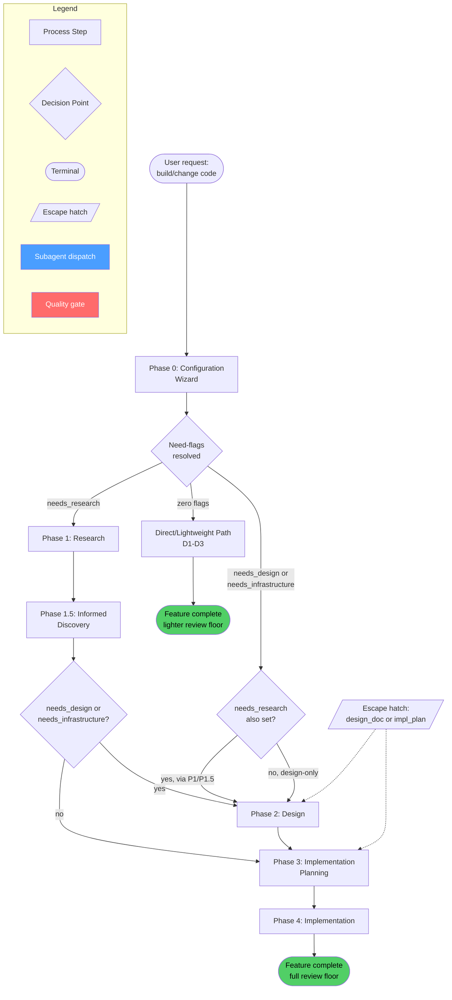
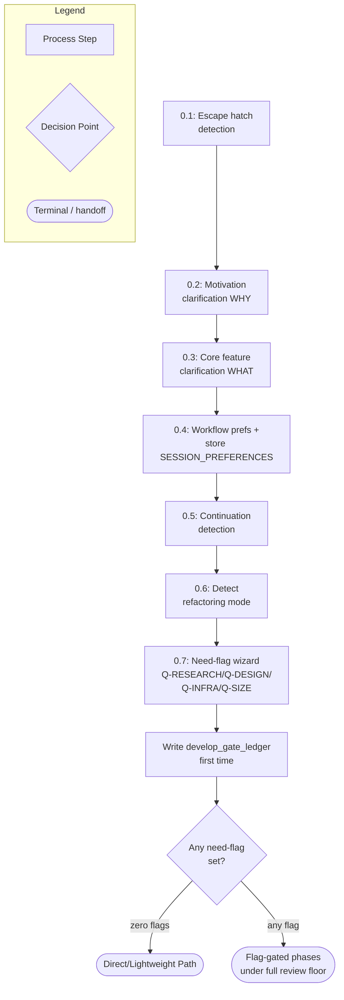
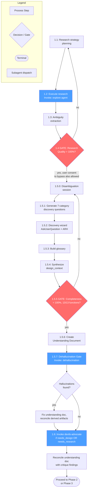
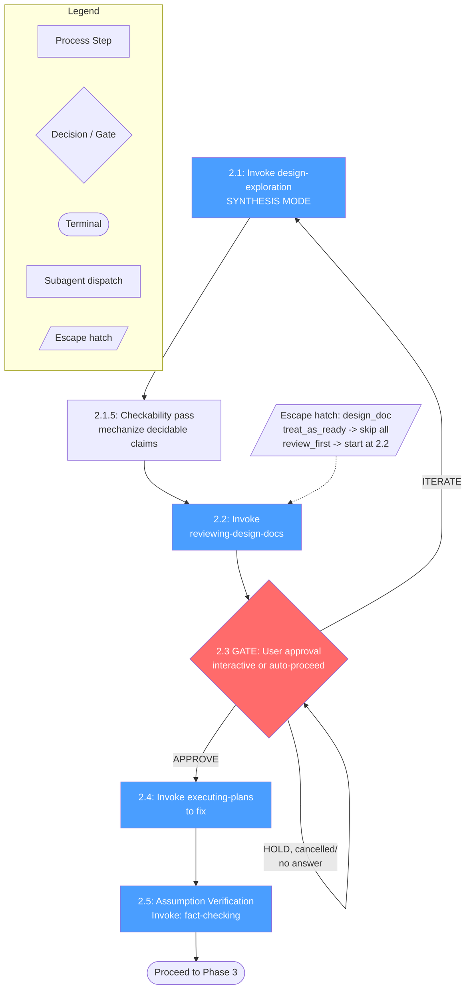
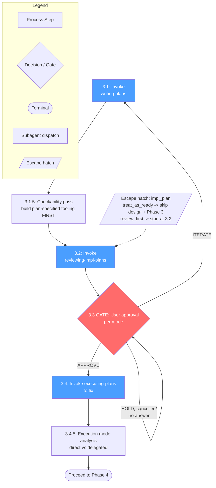
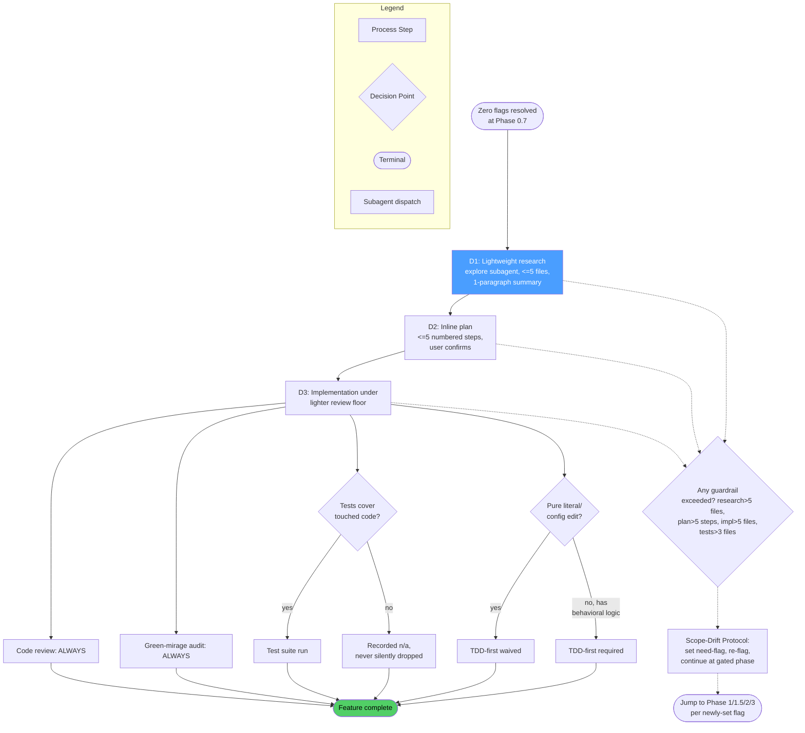

<!-- diagram-meta: {"source": "skills/develop/SKILL.md", "source_hash": "sha256:4c65989e069648199aa843b05e29cb71433a830b98bc9eb3f456220c8391d3e7", "generated_at": "2026-08-05T19:20:19Z", "generator": "generate_diagrams.py"} -->
# Diagram: develop

# Diagram Set: `develop` Skill Workflow

## Diagram 1 — Overview

```mermaid
flowchart TD
    START([User request:<br/>build/change code]) --> P0[Phase 0: Configuration<br/>Wizard]
    P0 --> FLAGCHECK{Need-flags<br/>resolved}
    FLAGCHECK -->|zero flags| FASTPATH[Direct/Lightweight Path<br/>D1-D3]
    FLAGCHECK -->|needs_research| P1[Phase 1: Research]
    FLAGCHECK -->|needs_design or<br/>needs_infrastructure| P2GATE{needs_research<br/>also set?}

    P1 --> P15[Phase 1.5: Informed<br/>Discovery]
    P15 --> DESIGNCHECK{needs_design or<br/>needs_infrastructure?}
    DESIGNCHECK -->|yes| P2[Phase 2: Design]
    DESIGNCHECK -->|no| P3[Phase 3: Implementation<br/>Planning]
    P2GATE -->|yes, via P1/P1.5| P2
    P2GATE -->|no, design-only| P2

    P2 --> P3
    P3 --> P4[Phase 4: Implementation]
    FASTPATH --> DONE_F([Feature complete<br/>lighter review floor])
    P4 --> DONE([Feature complete<br/>full review floor])

    ESCAPE[/Escape hatch:<br/>design_doc or impl_plan/] -.-> P2
    ESCAPE -.-> P3

    subgraph Legend
        L1[Process Step]
        L2{Decision Point}
        L3([Terminal])
        L4[/Escape hatch/]
        L5[Subagent dispatch]
        L6[Quality gate]
    end
    style L5 fill:#4a9eff,color:#fff
    style L6 fill:#ff6b6b,color:#fff
    style DONE fill:#51cf66,color:#000
    style DONE_F fill:#51cf66,color:#000
```

### Cross-Reference Table

| Overview Node | Detail Diagram | Source (SKILL.md lines) |
|---|---|---|
| `P0` | Diagram 2: Phase 0 | 871-878 |
| `P1` / `P15` | Diagram 3: Phase 1 + 1.5 | 883-899 |
| `P2` | Diagram 4: Phase 2 | 900-907 |
| `P3` | Diagram 5: Phase 3 | 908-915 |
| `P4` | Diagram 6: Phase 4 | 916-931 |
| `FASTPATH` | Diagram 7: Fast Path | 932-940 |

---

## Diagram 2 — Phase 0: Configuration Wizard

```mermaid
flowchart TD
    E0[0.1: Escape hatch<br/>detection] --> E1[0.2: Motivation<br/>clarification WHY]
    E1 --> E2[0.3: Core feature<br/>clarification WHAT]
    E2 --> E3[0.4: Workflow prefs +<br/>store SESSION_PREFERENCES]
    E3 --> E4[0.5: Continuation<br/>detection]
    E4 --> E5[0.6: Detect<br/>refactoring mode]
    E5 --> E6[0.7: Need-flag wizard<br/>Q-RESEARCH/Q-DESIGN/<br/>Q-INFRA/Q-SIZE]
    E6 --> LEDGER[Write develop_gate_ledger<br/>first time]
    LEDGER --> DECIDE{Any need-flag<br/>set?}
    DECIDE -->|zero flags| FP([Direct/Lightweight Path])
    DECIDE -->|any flag| GATED([Flag-gated phases<br/>under full review floor])

    subgraph Legend
        LG1[Process Step]
        LG2{Decision Point}
        LG3([Terminal / handoff])
    end
```

---

## Diagram 3 — Phase 1 (Research) + Phase 1.5 (Informed Discovery)

Runs iff `needs_research`.

```mermaid
flowchart TD
    R1[1.1: Research strategy<br/>planning] --> R2[1.2: Execute research<br/>Invoke: explore agent]
    R2 --> R3[1.3: Ambiguity<br/>extraction]
    R3 --> R4{1.4 GATE: Research<br/>Quality = 100%?}
    R4 -->|no| R1
    R4 -->|yes, user consent<br/>to bypass also allowed| D0[1.5.0: Disambiguation<br/>session]

    D0 --> D1[1.5.1: Generate 7-category<br/>discovery questions]
    D1 --> D2[1.5.2: Discovery wizard<br/>AskUserQuestion + ARH]
    D2 --> D3[1.5.3: Build glossary]
    D3 --> D4[1.5.4: Synthesize<br/>design_context]
    D4 --> D5{1.5.5 GATE: Completeness<br/>= 100%, 13/13 functions?}
    D5 -->|no| D0
    D5 -->|yes| D6[1.5.6: Create<br/>Understanding Document]

    D6 --> D7[1.5.7: Dehallucination Gate<br/>Invoke: dehallucination]
    D7 --> D7F{Hallucinations<br/>found?}
    D7F -->|yes| D7FIX[Fix understanding doc,<br/>reconcile derived artifacts]
    D7FIX --> D8
    D7F -->|no| D8[1.6: Invoke devils-advocate<br/>if needs_design OR needs_research]
    D8 --> D8R[Reconcile understanding doc<br/>with critique findings]
    D8R --> NEXT([Proceed to Phase 2<br/>or Phase 3])

    subgraph Legend
        LG1[Process Step]
        LG2{Decision / Gate}
        LG3([Terminal])
        LG4[Subagent dispatch]
    end
    style R2 fill:#4a9eff,color:#fff
    style D7 fill:#4a9eff,color:#fff
    style D8 fill:#4a9eff,color:#fff
    style R4 fill:#ff6b6b,color:#fff
    style D5 fill:#ff6b6b,color:#fff
```

---

## Diagram 4 — Phase 2: Design

Runs iff `needs_design` (implied by `needs_infrastructure`); skipped if escape hatch.

```mermaid
flowchart TD
    G1[2.1: Invoke design-exploration<br/>SYNTHESIS MODE] --> G15[2.1.5: Checkability pass<br/>mechanize decidable claims]
    G15 --> G2[2.2: Invoke<br/>reviewing-design-docs]
    G2 --> G3{2.3 GATE: User approval<br/>interactive or auto-proceed}
    G3 -->|ITERATE| G1
    G3 -->|APPROVE| G4[2.4: Invoke executing-plans<br/>to fix]
    G3 -->|HOLD, cancelled/<br/>no answer| G3
    G4 --> G5[2.5: Assumption Verification<br/>Invoke: fact-checking]
    G5 --> NEXT([Proceed to Phase 3])

    ESC[/Escape hatch: design_doc<br/>treat_as_ready -> skip all<br/>review_first -> start at 2.2/] -.-> G2

    subgraph Legend
        LG1[Process Step]
        LG2{Decision / Gate}
        LG3([Terminal])
        LG4[Subagent dispatch]
        LG5[/Escape hatch/]
    end
    style G1 fill:#4a9eff,color:#fff
    style G2 fill:#4a9eff,color:#fff
    style G4 fill:#4a9eff,color:#fff
    style G5 fill:#4a9eff,color:#fff
    style G3 fill:#ff6b6b,color:#fff
```

Note: gate 2.3's surface honors `decision_surface` — terminal `AskUserQuestion` (default) or `canvas-decision` skill for qualifying context-heavy forks. The APPROVE/ITERATE/HOLD mapping is unchanged by which surface renders it.

---

## Diagram 5 — Phase 3: Implementation Planning

Runs iff `needs_design` OR `needs_infrastructure`; skipped if impl-plan escape hatch.

```mermaid
flowchart TD
    W1[3.1: Invoke<br/>writing-plans] --> W15[3.1.5: Checkability pass<br/>build plan-specified tooling FIRST]
    W15 --> W2[3.2: Invoke<br/>reviewing-impl-plans]
    W2 --> W3{3.3 GATE: User approval<br/>per mode}
    W3 -->|ITERATE| W1
    W3 -->|APPROVE| W4[3.4: Invoke executing-plans<br/>to fix]
    W3 -->|HOLD, cancelled/<br/>no answer| W3
    W4 --> W45[3.4.5: Execution mode analysis<br/>direct vs delegated]
    W45 --> NEXT([Proceed to Phase 4])

    ESC[/Escape hatch: impl_plan<br/>treat_as_ready -> skip design + Phase 3<br/>review_first -> start at 3.2/] -.-> W2

    subgraph Legend
        LG1[Process Step]
        LG2{Decision / Gate}
        LG3([Terminal])
        LG4[Subagent dispatch]
        LG5[/Escape hatch/]
    end
    style W1 fill:#4a9eff,color:#fff
    style W2 fill:#4a9eff,color:#fff
    style W4 fill:#4a9eff,color:#fff
    style W3 fill:#ff6b6b,color:#fff
```

---

## Diagram 6 — Phase 4: Implementation

```mermaid
flowchart TD
    I0[4.0: Pre-implementation<br/>environment probe] --> I1[4.1: Setup worktree/s<br/>per preference]
    I1 --> I2[4.2: Execute tasks<br/>per worktree strategy]
    I2 --> I25{per_parallel_track<br/>worktrees?}
    I25 -->|yes| I25M[4.2.5: Smart merge]
    I25 -->|no| TASKLOOP
    I25M --> TASKLOOP[For each task]

    TASKLOOP --> T3[4.3: Invoke<br/>test-driven-development]
    T3 --> T4[4.4: Completion verification<br/>inline audit prompt]
    T4 --> T5[4.5: Invoke<br/>requesting-code-review]
    T5 --> T51[4.5.1: Invoke<br/>fact-checking]
    T51 --> MORETASKS{More tasks<br/>remaining?}
    MORETASKS -->|yes| TASKLOOP
    MORETASKS -->|no| A1

    A1[4.6.1: Comprehensive<br/>implementation audit] --> A2[4.6.2: Run test suite]
    A2 --> A2F{Test<br/>failures?}
    A2F -->|yes| A2D[Invoke<br/>systematic-debugging]
    A2D --> A2
    A2F -->|no| A3[4.6.3: Invoke<br/>audit-green-mirage]
    A3 --> A4{needs_research OR<br/>needs_design?}
    A4 -->|yes| A41[4.6.4: Comprehensive<br/>fact-checking]
    A4 -->|no| A5
    A41 --> A5[4.6.5: Pre-PR<br/>fact-checking]
    A5 --> A6[4.7: Invoke<br/>finishing-a-development-branch]
    A6 --> DONE([Feature delivered]))

    subgraph Legend
        LG1[Process Step]
        LG2{Decision / Gate}
        LG3([Terminal])
        LG4[Subagent dispatch]
    end
    style T3 fill:#4a9eff,color:#fff
    style T5 fill:#4a9eff,color:#fff
    style T51 fill:#4a9eff,color:#fff
    style A3 fill:#4a9eff,color:#fff
    style A41 fill:#4a9eff,color:#fff
    style A6 fill:#4a9eff,color:#fff
    style A2D fill:#4a9eff,color:#fff
    style DONE fill:#51cf66,color:#000
```

Batching (design-only, no new nodes): task count `< 8` → one dispatch per gate per task; `8–12` → batched per-domain dispatches (still one gate per task); `> 12` or `≥ 2` tracks → batched aggressively, checkpoint `develop_gate_ledger` and hand off to a fresh session if context cannot hold the run.

---

## Diagram 7 — Direct/Lightweight Path (zero flags)

`develop` STAYS RESIDENT on this path — it never exits.

```mermaid
flowchart TD
    FP0([Zero flags resolved<br/>at Phase 0.7]) --> FP1[D1: Lightweight research<br/>explore subagent, <=5 files,<br/>1-paragraph summary]
    FP1 --> FP2[D2: Inline plan<br/><=5 numbered steps,<br/>user confirms]
    FP2 --> FP3[D3: Implementation under<br/>lighter review floor]
    FP3 --> FP3A[Code review: ALWAYS]
    FP3 --> FP3B[Green-mirage audit: ALWAYS]
    FP3 --> FP3C{Tests cover<br/>touched code?}
    FP3C -->|yes| FP3C1[Test suite run]
    FP3C -->|no| FP3C2[Recorded n/a,<br/>never silently dropped]
    FP3 --> FP3D{Pure literal/<br/>config edit?}
    FP3D -->|yes| FP3D1[TDD-first waived]
    FP3D -->|no, has<br/>behavioral logic| FP3D2[TDD-first required]
    FP3A --> DONE([Feature complete])
    FP3B --> DONE
    FP3C1 --> DONE
    FP3C2 --> DONE
    FP3D1 --> DONE
    FP3D2 --> DONE

    GUARD{Any guardrail<br/>exceeded? research>5 files,<br/>plan>5 steps, impl>5 files,<br/>tests>3 files} -.-> REFLAG[Scope-Drift Protocol:<br/>set need-flag, re-flag,<br/>continue at gated phase]
    FP1 -.-> GUARD
    FP2 -.-> GUARD
    FP3 -.-> GUARD
    REFLAG -.-> NEXT([Jump to Phase 1/1.5/2/3<br/>per newly-set flag])

    subgraph Legend
        LG1[Process Step]
        LG2{Decision Point}
        LG3([Terminal])
        LG4[Subagent dispatch]
    end
    style FP1 fill:#4a9eff,color:#fff
    style DONE fill:#51cf66,color:#000
```

Note: fact-checking never runs on this path — there is no research/design/plan artifact for it to challenge. Project-standards discovery is also waived here (design §5.6 / DA MIN-8).
