<!-- diagram-meta: {"source": "skills/devils-advocate/SKILL.md", "source_hash": "sha256:b4fbeda80e235309ced30da67a65e7232618bf5444fe1ff85b760fd1ae7a44b5", "generated_at": "2026-02-19T00:00:00Z", "generator": "generate_diagrams.py"} -->
# Diagram: devils-advocate

Workflow for adversarial review of design documents, architecture decisions, and technical artifacts. Challenges assumptions, surfaces risks, and stress-tests decisions.

```mermaid
flowchart TD
    Start([Start]) --> LoadDocument[Load Document Under Review]
    LoadDocument --> CheckSections{Required Sections Present?}
    CheckSections -->|Missing Sections| FlagCritical[Flag Missing As CRITICAL]
    CheckSections -->|All Present| ChallengeAssumptions[Challenge Assumptions]
    FlagCritical --> ChallengeAssumptions
    ChallengeAssumptions --> ClassifyAssumptions{Classification?}
    ClassifyAssumptions -->|VALIDATED| RecordValidated[Record With Evidence]
    ClassifyAssumptions -->|UNVALIDATED| FlagUnvalidated[Flag: Needs Evidence]
    ClassifyAssumptions -->|IMPLICIT| SurfaceImplicit[Surface Hidden Assumption]
    ClassifyAssumptions -->|CONTRADICTORY| FlagContradiction[Flag: Contradiction Found]
    RecordValidated --> ChallengeScope[Challenge Scope]
    FlagUnvalidated --> ChallengeScope
    SurfaceImplicit --> ChallengeScope
    FlagContradiction --> ChallengeScope
    ChallengeScope --> ChallengeArch[Challenge Architecture]
    ChallengeArch --> ScaleTest[What If 10x Scale?]
    ScaleTest --> FailureTest[What If System Fails?]
    FailureTest --> DepTest[What If Dep Deprecated?]
    DepTest --> ChallengeIntegration[Challenge Integrations]
    ChallengeIntegration --> FailureModes[Document Failure Modes]
    FailureModes --> ChallengeMetrics[Challenge Success Criteria]
    ChallengeMetrics --> HasNumbers{Has Numbers/Baselines?}
    HasNumbers -->|No| FlagVagueMetrics[Flag: Unmeasurable]
    HasNumbers -->|Yes| ChallengeEdgeCases[Challenge Edge Cases]
    FlagVagueMetrics --> ChallengeEdgeCases
    ChallengeEdgeCases --> ChallengeVocab[Challenge Vocabulary]
    ChallengeVocab --> IssueReflection{At Least 3 Issues?}
    IssueReflection -->|No| LookHarder[Look Harder]
    LookHarder --> IssueReflection
    IssueReflection -->|Yes| GenerateReport[Generate Review Report]
    GenerateReport --> AssessReadiness{Readiness Verdict?}
    AssessReadiness -->|READY| VerdictReady[Verdict: READY]
    AssessReadiness -->|NEEDS WORK| VerdictNeedsWork[Verdict: NEEDS WORK]
    AssessReadiness -->|NOT READY| VerdictNotReady[Verdict: NOT READY]
    VerdictReady --> SelfCheck{Self-Check Passed?}
    VerdictNeedsWork --> SelfCheck
    VerdictNotReady --> SelfCheck
    SelfCheck -->|Yes| End([End])
    SelfCheck -->|No| DeepReview[Deepen Review]
    DeepReview --> SelfCheck

    style Start fill:#4CAF50,color:#fff
    style End fill:#4CAF50,color:#fff
    style LoadDocument fill:#2196F3,color:#fff
    style FlagCritical fill:#2196F3,color:#fff
    style ChallengeAssumptions fill:#2196F3,color:#fff
    style RecordValidated fill:#2196F3,color:#fff
    style FlagUnvalidated fill:#2196F3,color:#fff
    style SurfaceImplicit fill:#2196F3,color:#fff
    style FlagContradiction fill:#2196F3,color:#fff
    style ChallengeScope fill:#2196F3,color:#fff
    style ChallengeArch fill:#2196F3,color:#fff
    style ScaleTest fill:#2196F3,color:#fff
    style FailureTest fill:#2196F3,color:#fff
    style DepTest fill:#2196F3,color:#fff
    style ChallengeIntegration fill:#2196F3,color:#fff
    style FailureModes fill:#2196F3,color:#fff
    style ChallengeMetrics fill:#2196F3,color:#fff
    style FlagVagueMetrics fill:#2196F3,color:#fff
    style ChallengeEdgeCases fill:#2196F3,color:#fff
    style ChallengeVocab fill:#2196F3,color:#fff
    style LookHarder fill:#2196F3,color:#fff
    style GenerateReport fill:#2196F3,color:#fff
    style VerdictReady fill:#2196F3,color:#fff
    style VerdictNeedsWork fill:#2196F3,color:#fff
    style VerdictNotReady fill:#2196F3,color:#fff
    style DeepReview fill:#2196F3,color:#fff
    style CheckSections fill:#FF9800,color:#fff
    style ClassifyAssumptions fill:#FF9800,color:#fff
    style HasNumbers fill:#FF9800,color:#fff
    style AssessReadiness fill:#FF9800,color:#fff
    style IssueReflection fill:#f44336,color:#fff
    style SelfCheck fill:#f44336,color:#fff
```

## Legend

| Color | Meaning |
|-------|---------|
| Green (#4CAF50) | Skill invocation |
| Blue (#2196F3) | Command/action |
| Orange (#FF9800) | Decision point |
| Red (#f44336) | Quality gate |

## Cross-Reference

| Node | Source Reference |
|------|----------------|
| Load Document Under Review | Inputs: document_path |
| Required Sections Present? | Review Protocol: Required Sections |
| Flag Missing As CRITICAL | Required Sections: "flag missing as CRITICAL" |
| Challenge Assumptions | Challenge Categories: Assumptions row |
| Classification? | Assumptions: VALIDATED/UNVALIDATED/IMPLICIT/CONTRADICTORY |
| Challenge Scope | Challenge Categories: Scope row |
| Challenge Architecture | Challenge Categories: Architecture row |
| What If 10x Scale? | Architecture: "10x scale?" challenge |
| What If System Fails? | Architecture: "System fails?" challenge |
| What If Dep Deprecated? | Architecture: "Dep deprecated?" challenge |
| Challenge Integrations | Challenge Categories: Integration row |
| Document Failure Modes | Integration: "System down? Unexpected data?" |
| Challenge Success Criteria | Challenge Categories: Success Criteria row |
| Has Numbers/Baselines? | Success Criteria: "Has number? Measurable?" |
| Challenge Edge Cases | Challenge Categories: Edge Cases row |
| Challenge Vocabulary | Challenge Categories: Vocabulary row |
| At Least 3 Issues? | Self-Check: "At least 3 issues found" |
| Readiness Verdict? | Output Format: READY / NEEDS WORK / NOT READY |
| Self-Check Passed? | Self-Check reflection checklist |
