<!-- diagram-meta: {"source": "skills/dispatching-parallel-agents/SKILL.md", "source_hash": "sha256:5c9aa947eaeee4ee17986dbcad6f5255b717f04ae6d6195f648aad967f42fd2f", "generated_at": "2026-02-19T00:00:00Z", "generator": "generate_diagrams.py"} -->
# Diagram: dispatching-parallel-agents

Decision and execution workflow for parallel subagent dispatch. Covers the independence gate, dispatch pattern, and merge verification protocol.

```mermaid
flowchart TD
    Start([Start]) --> IdentifyTasks[Identify Tasks]
    IdentifyTasks --> MultipleTask{Multiple Tasks?}
    MultipleTask -->|No| MainContext[Stay In Main Context]
    MultipleTask -->|Yes| IndependenceGate{Independence Gate}
    MainContext --> End([End])
    IndependenceGate --> SharedState{Shared State?}
    SharedState -->|Yes| Sequential[Sequential Agents]
    SharedState -->|No| FileOverlap{File Overlap?}
    FileOverlap -->|Yes| Sequential
    FileOverlap -->|No| Related{Failures Related?}
    Related -->|Yes| SingleAgent[Single Agent: All Tasks]
    Related -->|No| ParallelDispatch[Parallel Dispatch]
    SingleAgent --> End
    Sequential --> End
    ParallelDispatch --> CreatePrompts[Create Focused Prompts]
    CreatePrompts --> PromptCheck{Self-Contained?}
    PromptCheck -->|No| AddContext[Add Missing Context]
    AddContext --> PromptCheck
    PromptCheck -->|Yes| PromptLength{Prompt > 200 Lines?}
    PromptLength -->|Yes| CompressPrompt[Compress Prompt]
    PromptLength -->|No| SetConstraints[Set Constraints]
    CompressPrompt --> SetConstraints
    SetConstraints --> SelectAgentType[Select Agent Type]
    SelectAgentType --> DispatchAgents[Dispatch All Agents]
    DispatchAgents --> WaitForResults[Wait For Results]
    WaitForResults --> ReviewSummaries[Review Each Summary]
    ReviewSummaries --> ConflictCheck{File Conflicts?}
    ConflictCheck -->|Yes| ResolveConflicts[Resolve Conflicts]
    ConflictCheck -->|No| RunTestSuite[Run Full Test Suite]
    ResolveConflicts --> RunTestSuite
    RunTestSuite --> TestsPass{Tests Green?}
    TestsPass -->|No| DebugIntegration[Debug Integration]
    TestsPass -->|Yes| SpotCheck[Spot Check Fixes]
    DebugIntegration --> RunTestSuite
    SpotCheck --> MergeGate{All Verified?}
    MergeGate -->|Yes| Integrate[Integrate Work]
    MergeGate -->|No| FixIssues[Fix Issues]
    FixIssues --> MergeGate
    Integrate --> End

    style Start fill:#4CAF50,color:#fff
    style End fill:#4CAF50,color:#fff
    style IdentifyTasks fill:#2196F3,color:#fff
    style MainContext fill:#2196F3,color:#fff
    style Sequential fill:#2196F3,color:#fff
    style SingleAgent fill:#2196F3,color:#fff
    style ParallelDispatch fill:#2196F3,color:#fff
    style CreatePrompts fill:#2196F3,color:#fff
    style AddContext fill:#2196F3,color:#fff
    style CompressPrompt fill:#2196F3,color:#fff
    style SetConstraints fill:#2196F3,color:#fff
    style SelectAgentType fill:#2196F3,color:#fff
    style DispatchAgents fill:#2196F3,color:#fff
    style WaitForResults fill:#2196F3,color:#fff
    style ReviewSummaries fill:#2196F3,color:#fff
    style ResolveConflicts fill:#2196F3,color:#fff
    style RunTestSuite fill:#2196F3,color:#fff
    style SpotCheck fill:#2196F3,color:#fff
    style Integrate fill:#2196F3,color:#fff
    style DebugIntegration fill:#2196F3,color:#fff
    style FixIssues fill:#2196F3,color:#fff
    style MultipleTask fill:#FF9800,color:#fff
    style IndependenceGate fill:#FF9800,color:#fff
    style SharedState fill:#FF9800,color:#fff
    style FileOverlap fill:#FF9800,color:#fff
    style Related fill:#FF9800,color:#fff
    style PromptCheck fill:#FF9800,color:#fff
    style PromptLength fill:#FF9800,color:#fff
    style ConflictCheck fill:#FF9800,color:#fff
    style TestsPass fill:#FF9800,color:#fff
    style MergeGate fill:#f44336,color:#fff
```

## Legend

| Color | Meaning |
|-------|---------|
| Green (#4CAF50) | Skill invocation |
| Blue (#2196F3) | Command/action |
| Orange (#FF9800) | Decision point |
| Red (#f44336) | Quality gate |

## Cross-Reference

| Node | Source Reference |
|------|----------------|
| Identify Tasks | Inputs: tasks (list of 2+ tasks) |
| Multiple Tasks? | Decision Heuristics: Subagent vs Main Context |
| Stay In Main Context | Stay in Main Context When table |
| Independence Gate | CRITICAL: Independence verification is the gate |
| Shared State? | analysis: "Will agents edit same files?" |
| File Overlap? | Anti-Patterns: Overlapping file ownership |
| Failures Related? | Don't use when: "Failures are related" |
| Single Agent: All Tasks | When to Use: dot graph, "Single agent investigates all" |
| Parallel Dispatch | The Pattern section |
| Create Focused Prompts | The Pattern, Step 2: Create Focused Agent Prompts |
| Self-Contained? | Agent Prompt Structure: Self-contained |
| Prompt > 200 Lines? | Subagent Prompt Length Verification |
| Set Constraints | Template: Constraints section |
| Select Agent Type | Agent Type Selection table |
| Dispatch All Agents | The Pattern, Step 3: Dispatch in Parallel |
| Review Each Summary | The Pattern, Step 4: Review and Integrate |
| File Conflicts? | reflection: "Check conflict potential" |
| Run Full Test Suite | Verification, Step 3: Run full suite |
| Spot Check Fixes | Verification, Step 4: Spot check |
| All Verified? | Self-Check: merge verification checklist |
