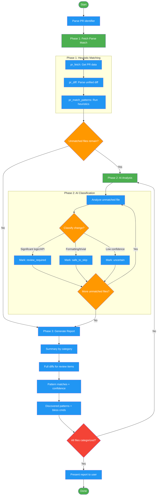

<!-- diagram-meta: {"source": "skills/distilling-prs/SKILL.md", "source_hash": "sha256:43be309eed4d0075b68542b3b1a72d9a265707b1982e0a0d22ffd5ef2361881f", "generated_at": "2026-02-19T00:00:00Z", "generator": "generate_diagrams.py"} -->
# Diagram: distilling-prs

Workflow for the distilling-prs skill. A two-phase execution model: Phase 1 fetches PR data, parses diffs, and runs heuristic pattern matching; Phase 2 applies AI analysis to unmatched files; Phase 3 generates a categorized report. Heuristics always run first before AI analysis.

## Legend

| Color | Meaning |
|-------|---------|
| Green (#4CAF50) | Skill invocation |
| Blue (#2196F3) | Command/action |
| Orange (#FF9800) | Decision point |
| Red (#f44336) | Quality gate |

## Cross-Reference

| Node | Source Reference |
|------|----------------|
| Parse PR identifier | SKILL.md: Execution Flow step 1 - parse number or URL |
| pr_fetch | SKILL.md: MCP Tools - Fetch PR metadata and diff |
| pr_diff | SKILL.md: MCP Tools - Parse unified diff into FileDiff objects |
| pr_match_patterns | SKILL.md: MCP Tools - Match heuristic patterns against file diffs |
| Unmatched files remain? | SKILL.md: Phase 1 output - `match_result["unmatched"]` |
| AI Classification | SKILL.md: Phase 2 - review_required, safe_to_skip, uncertain |
| All files categorized? | SKILL.md: Reflection - "All files categorized (no files missing)" |
| Discovered patterns | SKILL.md: Phase 3 - "Discovered patterns with bless commands" |
| Builtin Patterns | SKILL.md: 15 builtin patterns across 3 confidence levels |
