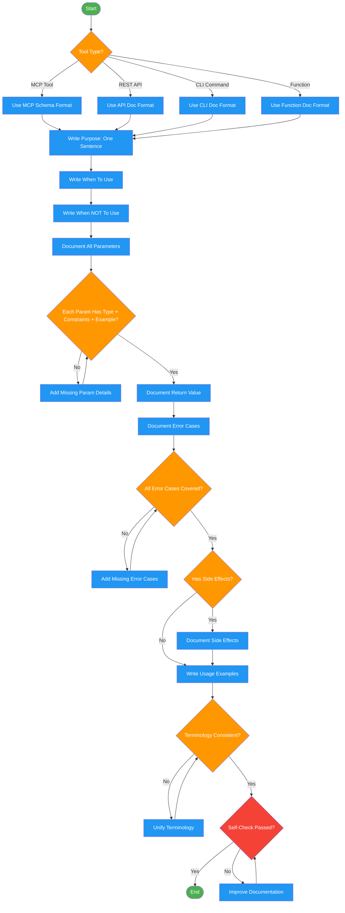

<!-- diagram-meta: {"source": "skills/documenting-tools/SKILL.md", "source_hash": "sha256:b9fe5353ac3fc41f327286818b0f45f6221956824e7dec4ff6fb80cbd49df3f0", "generated_at": "2026-02-19T00:00:00Z", "generator": "generate_diagrams.py"} -->
# Diagram: documenting-tools

Workflow for producing LLM-quality tool documentation. Ensures every tool has purpose, parameters, error cases, and examples documented to prevent model misuse.

## Legend

| Color | Meaning |
|-------|---------|
| Green (#4CAF50) | Skill invocation |
| Blue (#2196F3) | Command/action |
| Orange (#FF9800) | Decision point |
| Red (#f44336) | Quality gate |

## Cross-Reference

| Node | Source Reference |
|------|----------------|
| Tool Type? | Inputs: tool_type (MCP, REST API, CLI, function) |
| Use MCP Schema Format | MCP Tool Schema section |
| Write Purpose: One Sentence | Documentation Checklist: Purpose |
| Write When To Use | Documentation Checklist: When to use |
| Write When NOT To Use | Documentation Checklist: When NOT to use |
| Document All Parameters | Documentation Checklist: Parameters |
| Each Param Has Type + Constraints + Example? | Parameter Documentation Format |
| Document Return Value | Documentation Checklist: Return value |
| Document Error Cases | Error Documentation section |
| All Error Cases Covered? | Error Documentation table (7 error categories) |
| Has Side Effects? | Documentation Checklist: Side effects |
| Write Usage Examples | Documentation Checklist: Examples |
| Terminology Consistent? | Anti-Patterns: Inconsistent terminology |
| Self-Check Passed? | Self-Check checklist |
