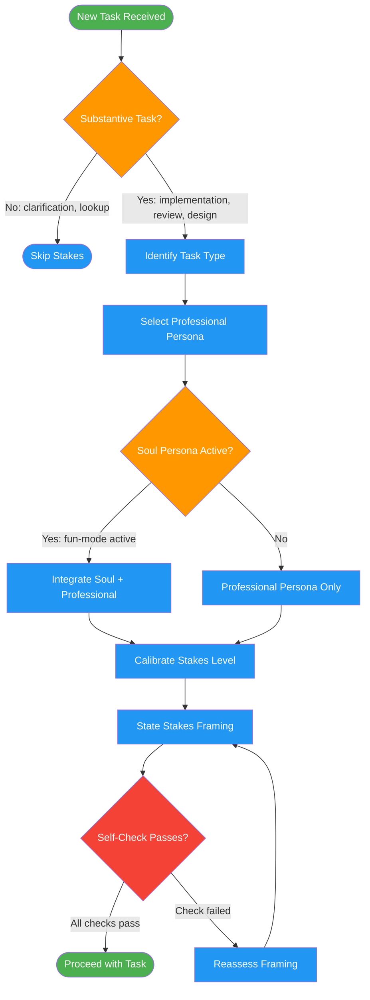

<!-- diagram-meta: {"source": "skills/emotional-stakes/SKILL.md", "source_hash": "sha256:96f43ebb03db87372b17c3259b75c9a64b9531cc14f7108e2fb1894bb87e5d67", "generated_at": "2026-02-19T00:00:00Z", "generator": "generate_diagrams.py"} -->
# Diagram: emotional-stakes

Workflow for applying emotional stakes framing to substantive tasks. Selects a professional persona based on task type, calibrates stakes to risk level, and optionally integrates a soul persona from fun-mode.

## Legend

| Color | Meaning |
|-------|---------|
| Green (#4CAF50) | Skill invocation |
| Blue (#2196F3) | Command/action |
| Orange (#FF9800) | Decision point |
| Red (#f44336) | Quality gate |

## Cross-Reference

| Node | Source Reference |
|------|----------------|
| Substantive Task? | Lines 52-53: TRIGGER/SKIP rules |
| Select Professional Persona | Lines 57-71: Persona selection table |
| Soul Persona Active? | Lines 41, 85-97: Soul persona integration |
| Calibrate Stakes Level | Lines 73-79: Stakes escalation table |
| State Stakes Framing | Line 81: FORMAT rule |
| Self-Check Passes? | Lines 115-123: Self-check checklist |
