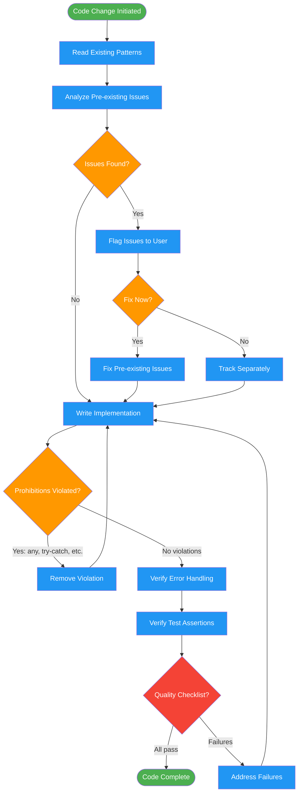

<!-- diagram-meta: {"source": "skills/enforcing-code-quality/SKILL.md", "source_hash": "sha256:e95fba3bbadc1106928ea73e9c3f88f033cd78ed94978cbe5520d940ae620eeb", "generated_at": "2026-02-19T00:00:00Z", "generator": "generate_diagrams.py"} -->
# Diagram: enforcing-code-quality

Continuous quality enforcement workflow applied during code writing. Reads existing patterns first, applies prohibitions during implementation, flags pre-existing issues, and validates against a quality checklist before completion.

## Legend

| Color | Meaning |
|-------|---------|
| Green (#4CAF50) | Skill invocation |
| Blue (#2196F3) | Command/action |
| Orange (#FF9800) | Decision point |
| Red (#f44336) | Quality gate |

## Cross-Reference

| Node | Source Reference |
|------|----------------|
| Read Existing Patterns | Lines 76, 100: "Read existing patterns FIRST" |
| Analyze Pre-existing Issues | Lines 83-95: Pre-existing issues protocol |
| Prohibitions Violated? | Lines 60-70: FORBIDDEN list |
| Verify Error Handling | Lines 78-79: Error branch and assertion requirements |
| Verify Test Assertions | Line 78: "Full assertions in tests" |
| Quality Checklist? | Lines 99-106: Quality checklist |
