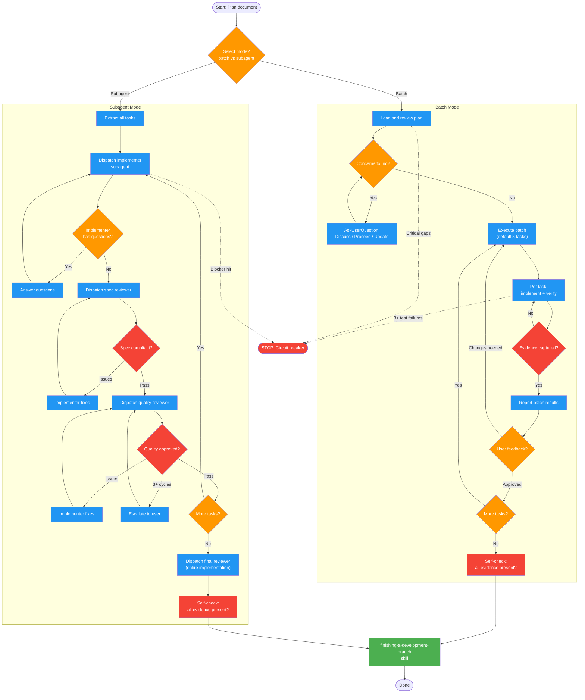

<!-- diagram-meta: {"source": "skills/executing-plans/SKILL.md", "source_hash": "sha256:c47ff55dbb7818e78a21650abcdcc37ab44b57a8bc1355f1048e8369c10c730c", "generated_at": "2026-02-19T00:00:00Z", "generator": "generate_diagrams.py"} -->
# Diagram: executing-plans

Plan execution with two modes (batch and subagent), review loops, evidence requirements, and finishing workflow. Batch mode uses human-in-loop checkpoints; subagent mode uses automated two-stage review.

## Legend

| Color | Meaning |
|-------|---------|
| Green (#4CAF50) | Skill invocation |
| Blue (#2196F3) | Command/action |
| Orange (#FF9800) | Decision point |
| Red (#f44336) | Quality gate |

## Cross-Reference

| Node | Source Reference |
|------|----------------|
| Mode selection (batch/subagent) | Mode Selection table (lines 44-48) |
| Load and review plan | Batch Phase 1 (lines 117-153) |
| Execute batch (3 tasks) | Batch Phase 2 (lines 155-163) |
| Report batch results | Batch Phase 3 (lines 165-169) |
| User feedback loop | Batch Phase 4 (lines 173-177) |
| Dispatch implementer subagent | Subagent Phase 2 step 1 (line 206) |
| Dispatch spec reviewer | Subagent Phase 2 step 4 (line 209) |
| Dispatch quality reviewer | Subagent Phase 2 step 5 (line 212) |
| 3+ review cycle escalation | Handling Review Issues (lines 268-271) |
| Dispatch final reviewer | Subagent Phase 3 (line 219) |
| finishing-a-development-branch | Phase 5 / Phase 4 completion (lines 189-191, 223-224) |
| Circuit breakers (3+ failures) | Autonomous Mode circuit breakers (lines 82-88) |
| Self-check evidence gate | Self-Check section (lines 283-293) |
