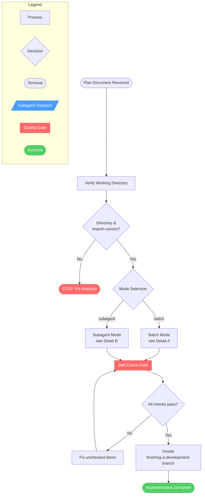
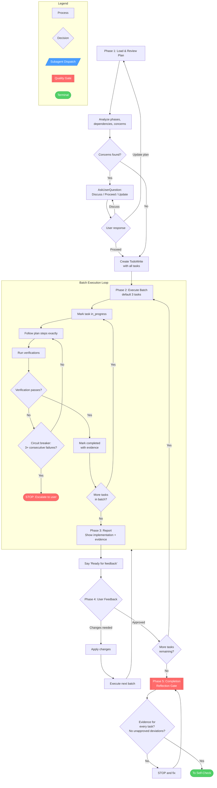
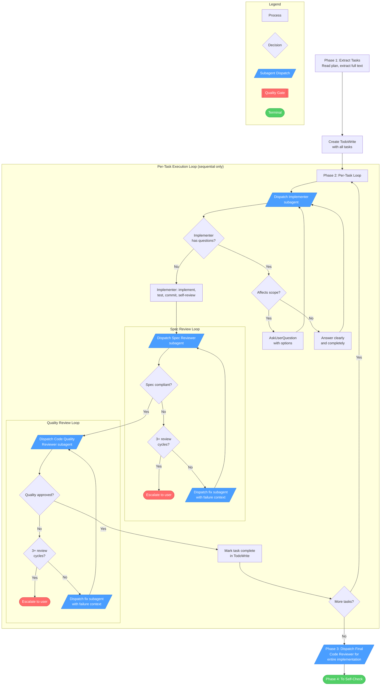
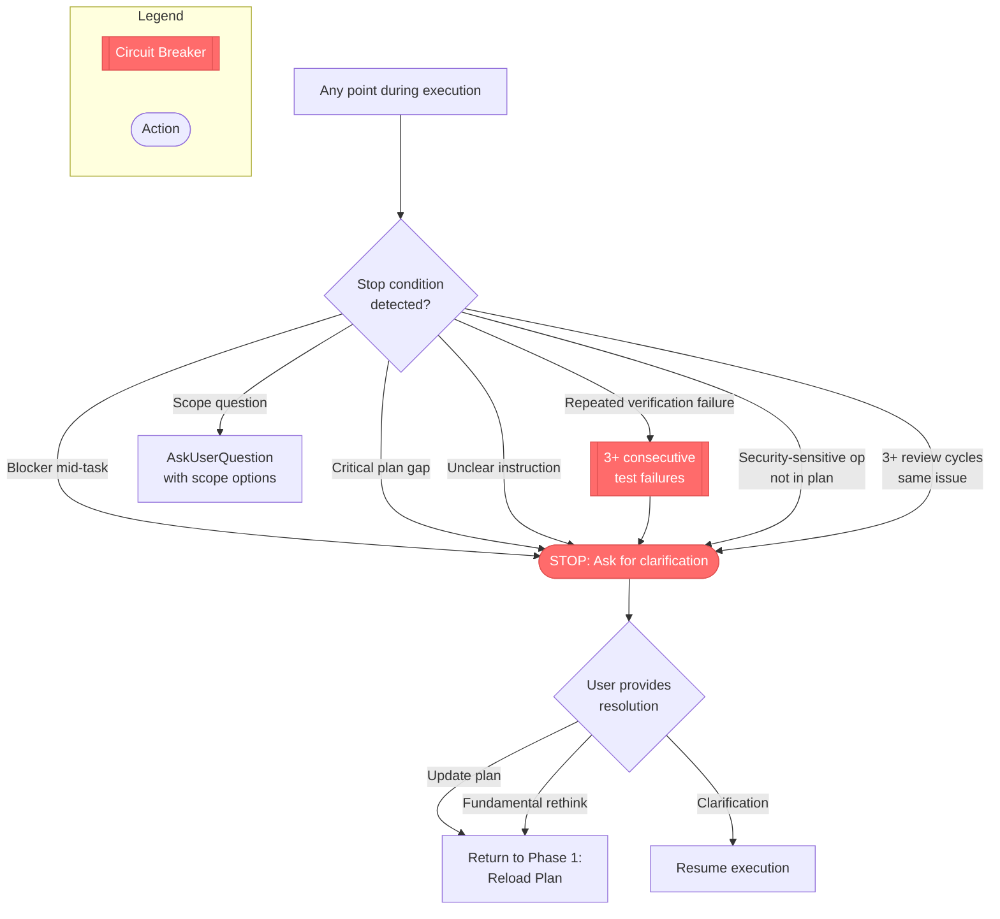
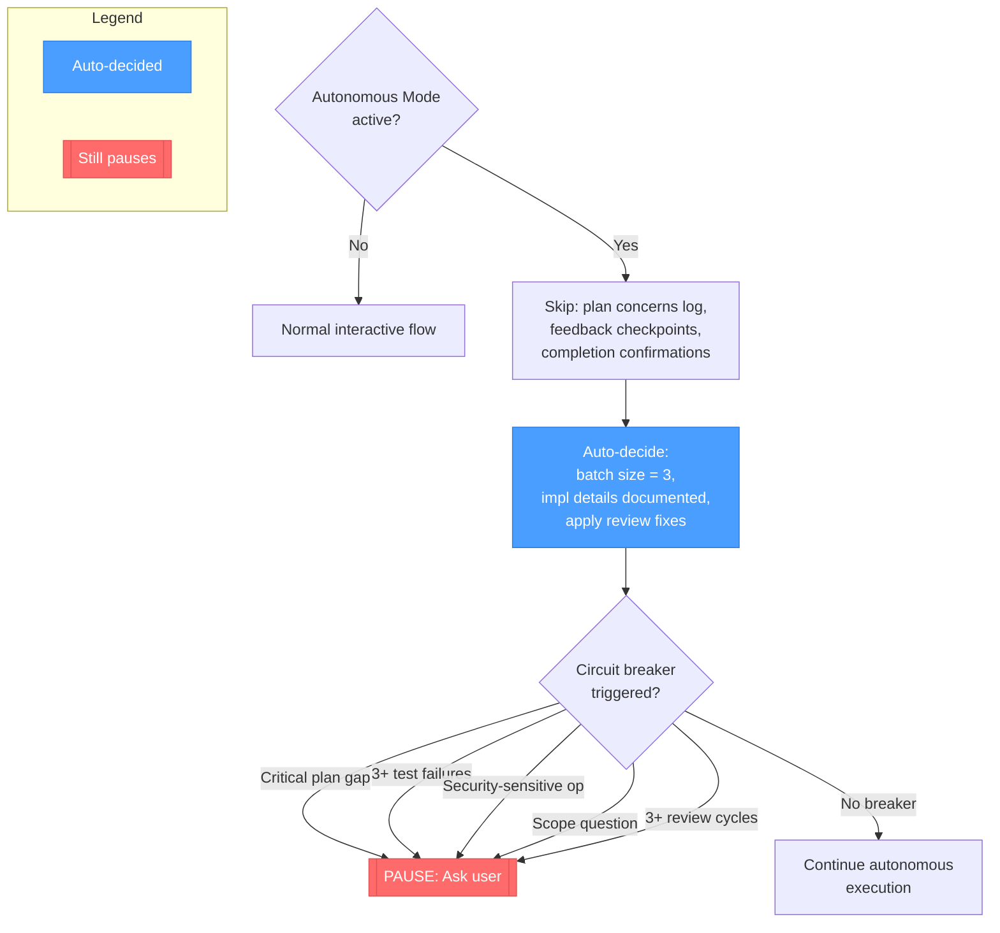

<!-- diagram-meta: {"source": "skills/executing-plans/SKILL.md", "source_hash": "sha256:2be52eba8778723f40151720102eee91e9c17e7105835cd822567cc4913deb6c", "generated_at": "2026-03-21T00:43:47Z", "generator": "generate_diagrams.py"} -->
# Diagram: executing-plans

# Executing Plans - Skill Diagram

## Overview

```mermaid
flowchart TD
    subgraph legend[" Legend "]
        direction LR
        l1[Process]
        l2{Decision}
        l3([Terminal])
        l4[/"Subagent Dispatch"/]:::subagent
        l5[[Quality Gate]]:::gate
        l6([Success]):::success
    end

    START([Plan Document Received]) --> WD[Verify Working Directory]
    WD --> WD_OK{Directory &<br>branch correct?}
    WD_OK -->|No| WD_FAIL([STOP: Fix directory]):::gate
    WD_OK -->|Yes| MODE{Mode Selection}

    MODE -->|batch| BATCH[Batch Mode<br>see Detail A]
    MODE -->|subagent| SUB[Subagent Mode<br>see Detail B]

    BATCH --> SELF[[Self-Check Gate]]:::gate
    SUB --> SELF

    SELF --> SELF_OK{All checks pass?}
    SELF_OK -->|No| FIX[Fix unchecked items] --> SELF
    SELF_OK -->|Yes| FINISH[Invoke<br>finishing-a-development-branch]
    FINISH --> DONE([Implementation Complete]):::success

    classDef subagent fill:#4a9eff,stroke:#2b7de9,color:#fff
    classDef gate fill:#ff6b6b,stroke:#e05252,color:#fff
    classDef success fill:#51cf66,stroke:#3ab554,color:#fff
```

## Cross-Reference

| Overview Node | Detail Diagram |
|---------------|----------------|
| Batch Mode | Detail A: Batch Mode Process |
| Subagent Mode | Detail B: Subagent Mode Process |
| Self-Check Gate | Shared across both modes (shown inline) |

---

## Detail A: Batch Mode Process

```mermaid
flowchart TD
    subgraph legend[" Legend "]
        direction LR
        l1[Process]
        l2{Decision}
        l4[/"Subagent Dispatch"/]:::subagent
        l5[[Quality Gate]]:::gate
        l6([Terminal]):::success
    end

    P1[Phase 1: Load & Review Plan] --> ANALYZE[Analyze phases,<br>dependencies, concerns]
    ANALYZE --> CONCERNS{Concerns found?}

    CONCERNS -->|Yes| ASK[AskUserQuestion:<br>Discuss / Proceed / Update]
    ASK --> ASK_R{User response}
    ASK_R -->|Discuss| ASK
    ASK_R -->|Update plan| P1
    ASK_R -->|Proceed| TODO[Create TodoWrite<br>with all tasks]

    CONCERNS -->|No| TODO

    TODO --> P2[Phase 2: Execute Batch<br>default 3 tasks]

    subgraph batch_loop["Batch Execution Loop"]
        P2 --> TASK[Mark task in_progress]
        TASK --> EXEC[Follow plan steps exactly]
        EXEC --> VERIFY[Run verifications]
        VERIFY --> V_OK{Verification passes?}
        V_OK -->|No| STOP_CHECK{Circuit breaker:<br>3+ consecutive failures?}
        STOP_CHECK -->|Yes| HALT([STOP: Escalate to user]):::gate
        STOP_CHECK -->|No| EXEC
        V_OK -->|Yes| MARK[Mark completed<br>with evidence]
        MARK --> MORE_IN_BATCH{More tasks<br>in batch?}
        MORE_IN_BATCH -->|Yes| TASK
        MORE_IN_BATCH -->|No| P3
    end

    P3[Phase 3: Report<br>Show implementation + evidence]
    P3 --> FEEDBACK[Say 'Ready for feedback']

    FEEDBACK --> P4{Phase 4: User Feedback}
    P4 -->|Changes needed| APPLY[Apply changes] --> P2_NEXT[Execute next batch]
    P4 -->|Approved| MORE{More tasks<br>remaining?}
    P2_NEXT --> batch_loop

    MORE -->|Yes| P2
    MORE -->|No| P5[[Phase 5: Completion<br>Reflection Gate]]:::gate

    P5 --> REFLECT{Evidence for<br>every task?<br>No unapproved deviations?}
    REFLECT -->|No| FIX_IT[STOP and fix] --> P5
    REFLECT -->|Yes| DONE([To Self-Check]):::success

    classDef subagent fill:#4a9eff,stroke:#2b7de9,color:#fff
    classDef gate fill:#ff6b6b,stroke:#e05252,color:#fff
    classDef success fill:#51cf66,stroke:#3ab554,color:#fff
```

---

## Detail B: Subagent Mode Process

```mermaid
flowchart TD
    subgraph legend[" Legend "]
        direction LR
        l1[Process]
        l2{Decision}
        l4[/"Subagent Dispatch"/]:::subagent
        l5[[Quality Gate]]:::gate
        l6([Terminal]):::success
    end

    P1[Phase 1: Extract Tasks<br>Read plan, extract full text] --> TODO[Create TodoWrite<br>with all tasks]
    TODO --> P2[Phase 2: Per-Task Loop]

    subgraph task_loop["Per-Task Execution Loop (sequential only)"]
        P2 --> IMPL[/"Dispatch Implementer<br>subagent"/]:::subagent
        IMPL --> Q{Implementer<br>has questions?}
        Q -->|Yes| SCOPE{Affects scope?}
        SCOPE -->|Yes| ASK_USER[AskUserQuestion<br>with options]
        SCOPE -->|No| ANSWER[Answer clearly<br>and completely]
        ASK_USER --> IMPL
        ANSWER --> IMPL
        Q -->|No| IMPL_DONE[Implementer: implement,<br>test, commit, self-review]

        IMPL_DONE --> SPEC[/"Dispatch Spec Reviewer<br>subagent"/]:::subagent

        subgraph spec_loop["Spec Review Loop"]
            SPEC --> SPEC_OK{Spec compliant?}
            SPEC_OK -->|No| SPEC_CYCLE{3+ review<br>cycles?}
            SPEC_CYCLE -->|Yes| ESCALATE([Escalate to user]):::gate
            SPEC_CYCLE -->|No| SPEC_FIX[/"Dispatch fix subagent<br>with failure context"/]:::subagent
            SPEC_FIX --> SPEC
        end

        SPEC_OK -->|Yes| QUAL[/"Dispatch Code Quality<br>Reviewer subagent"/]:::subagent

        subgraph qual_loop["Quality Review Loop"]
            QUAL --> QUAL_OK{Quality approved?}
            QUAL_OK -->|No| QUAL_CYCLE{3+ review<br>cycles?}
            QUAL_CYCLE -->|Yes| ESCALATE2([Escalate to user]):::gate
            QUAL_CYCLE -->|No| QUAL_FIX[/"Dispatch fix subagent<br>with failure context"/]:::subagent
            QUAL_FIX --> QUAL
        end

        QUAL_OK -->|Yes| COMPLETE[Mark task complete<br>in TodoWrite]
        COMPLETE --> NEXT{More tasks?}
        NEXT -->|Yes| P2
    end

    NEXT -->|No| P3[/"Phase 3: Dispatch Final<br>Code Reviewer for<br>entire implementation"/]:::subagent
    P3 --> P4([Phase 4: To Self-Check]):::success

    classDef subagent fill:#4a9eff,stroke:#2b7de9,color:#fff
    classDef gate fill:#ff6b6b,stroke:#e05252,color:#fff
    classDef success fill:#51cf66,stroke:#3ab554,color:#fff
```

---

## Stop Conditions & Circuit Breakers

```mermaid
flowchart TD
    subgraph legend[" Legend "]
        direction LR
        l5[[Circuit Breaker]]:::gate
        l6([Action])
    end

    ANY[Any point during execution] --> CHECK{Stop condition<br>detected?}

    CHECK -->|Blocker mid-task| STOP([STOP: Ask for clarification]):::gate
    CHECK -->|Critical plan gap| STOP
    CHECK -->|Unclear instruction| STOP
    CHECK -->|Repeated verification failure| CB1[[3+ consecutive<br>test failures]]:::gate --> STOP
    CHECK -->|Security-sensitive op<br>not in plan| STOP
    CHECK -->|Scope question| ASK[AskUserQuestion<br>with scope options]
    CHECK -->|3+ review cycles<br>same issue| STOP

    STOP --> RESUME{User provides<br>resolution}
    RESUME -->|Update plan| RELOAD[Return to Phase 1:<br>Reload Plan]
    RESUME -->|Clarification| CONTINUE[Resume execution]
    RESUME -->|Fundamental rethink| RELOAD

    classDef gate fill:#ff6b6b,stroke:#e05252,color:#fff
```

---

## Autonomous Mode Behavior

```mermaid
flowchart TD
    subgraph legend[" Legend "]
        direction LR
        l1[Auto-decided]:::auto
        l5[[Still pauses]]:::gate
    end

    AUTO{Autonomous Mode<br>active?}
    AUTO -->|No| NORMAL[Normal interactive flow]
    AUTO -->|Yes| SKIP[Skip: plan concerns log,<br>feedback checkpoints,<br>completion confirmations]

    SKIP --> DECIDE[Auto-decide:<br>batch size = 3,<br>impl details documented,<br>apply review fixes]:::auto

    DECIDE --> CB{Circuit breaker<br>triggered?}
    CB -->|Critical plan gap| PAUSE[[PAUSE: Ask user]]:::gate
    CB -->|3+ test failures| PAUSE
    CB -->|Security-sensitive op| PAUSE
    CB -->|Scope question| PAUSE
    CB -->|3+ review cycles| PAUSE
    CB -->|No breaker| CONTINUE[Continue autonomous<br>execution]

    classDef auto fill:#4a9eff,stroke:#2b7de9,color:#fff
    classDef gate fill:#ff6b6b,stroke:#e05252,color:#fff
```
