<!-- diagram-meta: {"source": "skills/fact-checking/SKILL.md", "source_hash": "sha256:a234c2b8c91adbfbaf6768ef16f3ccd14ba92f970da419d9a58691b03de0ea70", "generated_at": "2026-02-19T00:00:00Z", "generator": "generate_diagrams.py"} -->
# Diagram: fact-checking

Multi-phase fact-checking workflow that extracts claims from code/docs, triages them by severity, verifies each claim with evidence, generates a report, and applies approved fixes. Uses subagent dispatch for extraction, verification, and reporting phases.

```mermaid
flowchart TD
    Start([Fact-Check Requested])
    P0[Phase 0: Configuration]
    AutoMode{Autonomous Mode?}
    EnableAll[Enable All Modes]
    ModeSelect[User Selects Modes]
    P1[Phase 1: Scope Selection]
    ScopeChoice{Scope?}
    Branch[Branch Changes]
    Uncommitted[Uncommitted Changes]
    FullRepo[Full Repository]
    P2["Phase 2-3: Extract & Triage"]
    ExtractCmd[/fact-check-extract/]
    P4["Phase 4-5: Verify & Verdict"]
    VerifyCmd[/fact-check-verify/]
    CheckDB{AgentDB Checked?}
    SkipVerify[Use Cached Finding]
    RunVerify[Run Verification]
    P6["Phase 6-7: Report & Learn"]
    ReportCmd[/fact-check-report/]
    P8[Phase 8: Fixes]
    HasFixes{Non-verified Claims?}
    PresentFix[Present Fix Plan]
    ApproveGate{User Approves Fix?}
    ApplyFix[Apply Fix]
    SkipFix[Skip Fix]
    MoreFixes{More Fixes?}
    ReVerify{Re-verify?}
    Complete([Fact-Check Complete])

    Start --> P0
    P0 --> AutoMode
    AutoMode -- "Yes" --> EnableAll
    AutoMode -- "No" --> ModeSelect
    EnableAll --> P1
    ModeSelect --> P1
    P1 --> ScopeChoice
    ScopeChoice -- "A" --> Branch
    ScopeChoice -- "B" --> Uncommitted
    ScopeChoice -- "C" --> FullRepo
    Branch --> P2
    Uncommitted --> P2
    FullRepo --> P2
    P2 --> ExtractCmd
    ExtractCmd --> P4
    P4 --> CheckDB
    CheckDB -- "Cached" --> SkipVerify
    CheckDB -- "Not cached" --> RunVerify
    SkipVerify --> VerifyCmd
    RunVerify --> VerifyCmd
    VerifyCmd --> P6
    P6 --> ReportCmd
    ReportCmd --> P8
    P8 --> HasFixes
    HasFixes -- "Yes" --> PresentFix
    HasFixes -- "No" --> Complete
    PresentFix --> ApproveGate
    ApproveGate -- "Approved" --> ApplyFix
    ApproveGate -- "Rejected" --> SkipFix
    ApplyFix --> MoreFixes
    SkipFix --> MoreFixes
    MoreFixes -- "Yes" --> PresentFix
    MoreFixes -- "No" --> ReVerify
    ReVerify -- "Yes" --> P4
    ReVerify -- "No" --> Complete

    style Start fill:#4CAF50,color:#fff
    style AutoMode fill:#FF9800,color:#fff
    style ScopeChoice fill:#FF9800,color:#fff
    style CheckDB fill:#FF9800,color:#fff
    style HasFixes fill:#FF9800,color:#fff
    style MoreFixes fill:#FF9800,color:#fff
    style ReVerify fill:#FF9800,color:#fff
    style ApproveGate fill:#f44336,color:#fff
    style ExtractCmd fill:#4CAF50,color:#fff
    style VerifyCmd fill:#4CAF50,color:#fff
    style ReportCmd fill:#4CAF50,color:#fff
    style P0 fill:#2196F3,color:#fff
    style P1 fill:#2196F3,color:#fff
    style P2 fill:#2196F3,color:#fff
    style P4 fill:#2196F3,color:#fff
    style P6 fill:#2196F3,color:#fff
    style P8 fill:#2196F3,color:#fff
    style EnableAll fill:#2196F3,color:#fff
    style ModeSelect fill:#2196F3,color:#fff
    style Branch fill:#2196F3,color:#fff
    style Uncommitted fill:#2196F3,color:#fff
    style FullRepo fill:#2196F3,color:#fff
    style SkipVerify fill:#2196F3,color:#fff
    style RunVerify fill:#2196F3,color:#fff
    style PresentFix fill:#2196F3,color:#fff
    style ApplyFix fill:#2196F3,color:#fff
    style SkipFix fill:#2196F3,color:#fff
    style Complete fill:#4CAF50,color:#fff
```

## Legend

| Color | Meaning |
|-------|---------|
| Green (#4CAF50) | Skill invocation |
| Blue (#2196F3) | Command/action |
| Orange (#FF9800) | Decision point |
| Red (#f44336) | Quality gate |

## Cross-Reference

| Node | Source Reference |
|------|----------------|
| Phase 0: Configuration | Lines 88-95: Configuration wizard and modes |
| Autonomous Mode? | Line 95: Autonomous mode detection |
| Phase 1: Scope Selection | Lines 97-105: Scope selection options |
| Phase 2-3: Extract & Triage | Lines 107-110: Subagent dispatch to fact-check-extract |
| Phase 4-5: Verify & Verdict | Lines 112-115: Subagent dispatch to fact-check-verify |
| AgentDB Checked? | Lines 19, 164-166: AgentDB deduplication |
| Phase 6-7: Report & Learn | Lines 117-120: Subagent dispatch to fact-check-report |
| Phase 8: Fixes | Lines 122-129: Fix approval flow |
| User Approves Fix? | Line 124: NEVER apply fixes without explicit per-fix approval |
