<!-- diagram-meta: {"source": "skills/finding-dead-code/SKILL.md", "source_hash": "sha256:5c8efb0256bb19a8e381f96e3fe4979b42351d7769fa2ca82c7d8da52771a1fe", "generated_at": "2026-02-19T00:00:00Z", "generator": "generate_diagrams.py"} -->
# Diagram: finding-dead-code

Workflow for the finding-dead-code skill. Orchestrates dead code analysis through 4 sequential commands: setup (git safety and scope), analyze (extract, triage, verify, rescan), report (document findings), and implement (apply deletions). Iterative re-scanning continues until no new dead code is found.

```mermaid
flowchart TD
    Start([Start]) --> P0["/dead-code-setup"]
    P0 --> GitCheck["Check git status"]
    GitCheck --> Uncommitted{Uncommitted changes?}
    Uncommitted -->|Yes| OfferCommit["Offer to commit"]
    Uncommitted -->|No| OfferWorktree
    OfferCommit --> OfferWorktree["Offer worktree isolation"]
    OfferWorktree --> ScopeSelect{Select scope?}
    ScopeSelect -->|Branch changes| SetScope["Set scope"]
    ScopeSelect -->|Uncommitted only| SetScope
    ScopeSelect -->|Specific files| SetScope
    ScopeSelect -->|Full repo| SetScope

    SetScope --> P2["/dead-code-analyze"]
    P2 --> Extract["Extract code items"]
    Extract --> PresentItems["Present items for triage"]
    PresentItems --> VerifyLoop["Verify each item"]
    VerifyLoop --> SearchCallers["Search entire codebase"]
    SearchCallers --> WriteOnly{Write-only dead?}
    WriteOnly -->|Yes| MarkWriteOnly["Mark write-only dead"]
    WriteOnly -->|No| HasCallers{Has live callers?}
    HasCallers -->|Yes| MarkAlive["Mark alive"]
    HasCallers -->|No| MarkDead["Mark dead"]
    MarkWriteOnly --> TransitiveCheck
    MarkAlive --> TransitiveCheck
    MarkDead --> TransitiveCheck{Transitive dead?}
    TransitiveCheck -->|Callers all dead| MarkTransitive["Mark transitive dead"]
    TransitiveCheck -->|Has live callers| NextItem
    MarkTransitive --> NextItem{More items?}
    NextItem -->|Yes| VerifyLoop
    NextItem -->|No| Rescan{New dead code found?}
    Rescan -->|Yes| VerifyLoop
    Rescan -->|No| GateEvidence{Evidence for all verdicts?}

    GateEvidence -->|No| VerifyLoop
    GateEvidence -->|Yes| P3["/dead-code-report"]
    P3 --> GenReport["Generate findings report"]
    GenReport --> GenPlan["Generate removal plan"]
    GenPlan --> AskImpl{User wants removals?}

    AskImpl -->|No| Done([Done])
    AskImpl -->|Yes| P4["/dead-code-implement"]
    P4 --> ApplyDeletions["Apply deletions"]
    ApplyDeletions --> RunTests["Run tests"]
    RunTests --> TestPass{Tests pass?}
    TestPass -->|Yes| Done
    TestPass -->|No| Revert["Revert and investigate"]
    Revert --> Done

    style Start fill:#4CAF50,color:#fff
    style Done fill:#4CAF50,color:#fff
    style P0 fill:#2196F3,color:#fff
    style P2 fill:#2196F3,color:#fff
    style P3 fill:#2196F3,color:#fff
    style P4 fill:#2196F3,color:#fff
    style GitCheck fill:#2196F3,color:#fff
    style OfferCommit fill:#2196F3,color:#fff
    style OfferWorktree fill:#2196F3,color:#fff
    style SetScope fill:#2196F3,color:#fff
    style Extract fill:#2196F3,color:#fff
    style PresentItems fill:#2196F3,color:#fff
    style VerifyLoop fill:#2196F3,color:#fff
    style SearchCallers fill:#2196F3,color:#fff
    style MarkWriteOnly fill:#2196F3,color:#fff
    style MarkAlive fill:#2196F3,color:#fff
    style MarkDead fill:#2196F3,color:#fff
    style MarkTransitive fill:#2196F3,color:#fff
    style GenReport fill:#2196F3,color:#fff
    style GenPlan fill:#2196F3,color:#fff
    style ApplyDeletions fill:#2196F3,color:#fff
    style RunTests fill:#2196F3,color:#fff
    style Revert fill:#2196F3,color:#fff
    style Uncommitted fill:#FF9800,color:#fff
    style ScopeSelect fill:#FF9800,color:#fff
    style WriteOnly fill:#FF9800,color:#fff
    style HasCallers fill:#FF9800,color:#fff
    style TransitiveCheck fill:#FF9800,color:#fff
    style NextItem fill:#FF9800,color:#fff
    style Rescan fill:#FF9800,color:#fff
    style AskImpl fill:#FF9800,color:#fff
    style TestPass fill:#FF9800,color:#fff
    style GateEvidence fill:#f44336,color:#fff
```

## Legend

| Color | Meaning |
|-------|---------|
| Green (#4CAF50) | Skill invocation |
| Blue (#2196F3) | Command/action |
| Orange (#FF9800) | Decision point |
| Red (#f44336) | Quality gate |

## Cross-Reference

| Node | Source Reference |
|------|----------------|
| /dead-code-setup | `commands/dead-code-setup.md` - Phase 0-1: Git safety, scope selection |
| /dead-code-analyze | `commands/dead-code-analyze.md` - Phase 2-5: Extract, triage, verify, rescan |
| /dead-code-report | `commands/dead-code-report.md` - Phase 6: Generate findings report |
| /dead-code-implement | `commands/dead-code-implement.md` - Phase 7: Apply deletions |
| Check git status | SKILL.md Phase 0: `git status --porcelain` |
| Offer worktree isolation | SKILL.md Phase 0: Git Safety First principle |
| Search entire codebase | SKILL.md: Full-Graph Verification principle |
| Write-only dead? | SKILL.md: Pattern 6 - Write-Only Dead Code |
| Transitive dead? | SKILL.md: Pattern 3 - Transitive Dead Code |
| Rescan loop | SKILL.md: Pattern 7 - Single-Pass Verification forbidden, iterative re-scan |
| Evidence gate | SKILL.md: Evidence Over Confidence principle |
