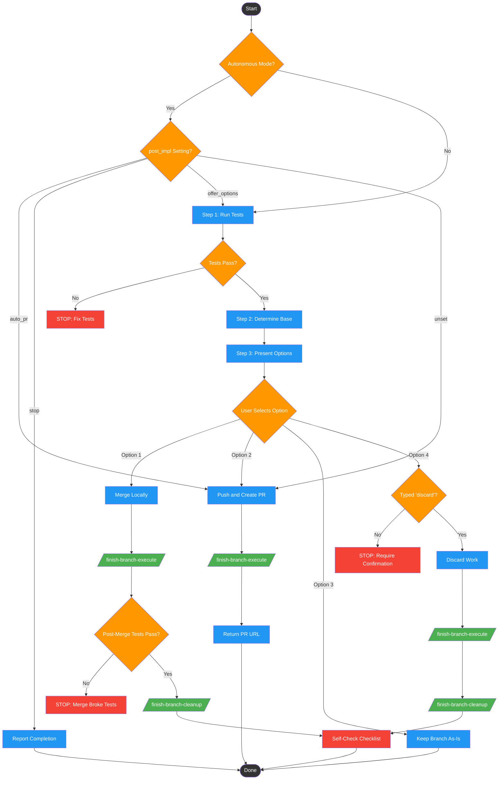

<!-- diagram-meta: {"source": "skills/finishing-a-development-branch/SKILL.md", "source_hash": "sha256:64ccbee8f97f9519b1cd8e86c0ea74640af27f7896b3b2b86e6a1104f6837058", "generated_at": "2026-02-19T00:00:00Z", "generator": "generate_diagrams.py"} -->
# Diagram: finishing-a-development-branch

Workflow for completing a development branch: verifies tests pass, determines base branch, presents 4 structured integration options (merge, PR, keep, discard), executes the chosen option, and performs worktree cleanup where applicable.

## Legend

| Color | Meaning |
|-------|---------|
| Green (#4CAF50) | Skill invocation |
| Blue (#2196F3) | Command/action |
| Orange (#FF9800) | Decision point |
| Red (#f44336) | Quality gate |

## Cross-Reference

| Node | Source Reference |
|------|----------------|
| Step 1: Run Tests | Step 1: Verify Tests (line 90) |
| Tests Pass? | If tests fail / If tests pass (lines 104-115) |
| Step 2: Determine Base | Step 2: Determine Base Branch (line 117) |
| Step 3: Present Options | Step 3: Present Options (line 126) |
| User Selects Option | Options 1-4 (lines 131-138) |
| Typed 'discard'? | Destruction Requires Proof, Invariant 3 (line 18) |
| /finish-branch-execute/ | Step 4: Execute Choice (line 144) |
| Post-Merge Tests Pass? | Tests Gate Everything, Invariant 1 (line 16) |
| /finish-branch-cleanup/ | Step 5: Cleanup Worktree (line 149) |
| Autonomous Mode? | Autonomous Mode section (lines 42-59) |
| post_impl Setting? | post_impl preference table (lines 48-53) |
| Self-Check Checklist | Self-Check section (lines 182-193) |
