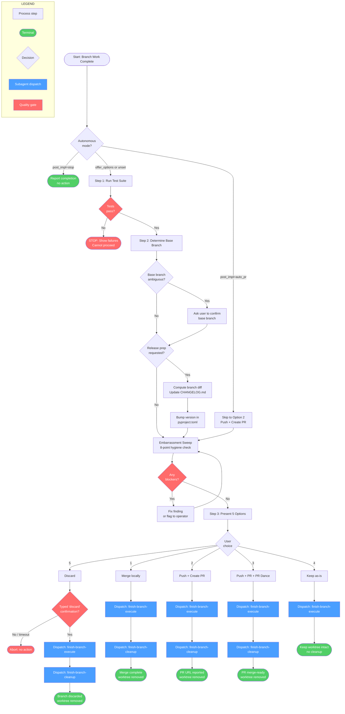
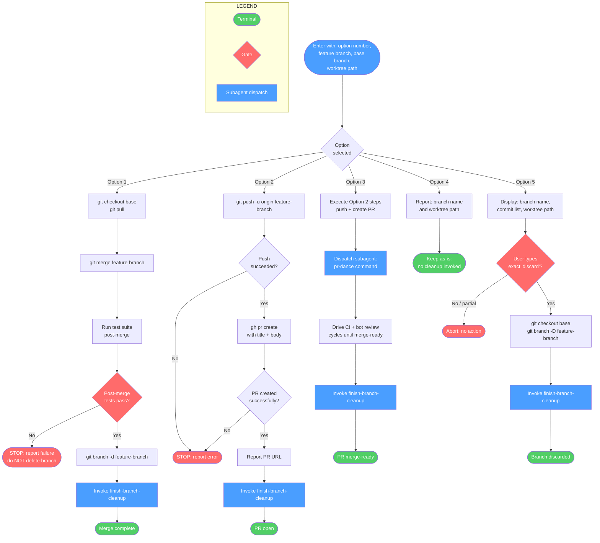
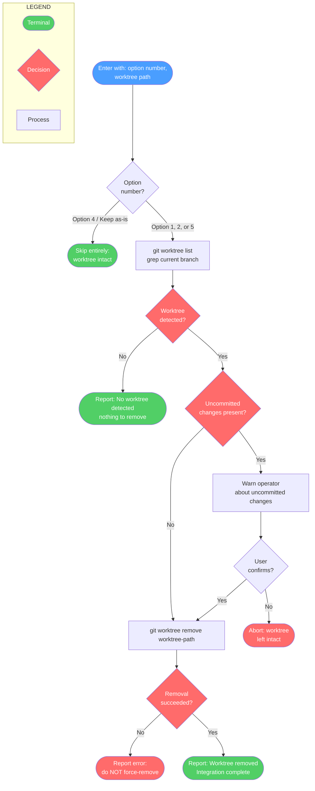
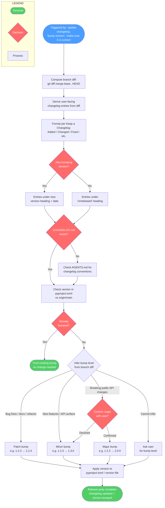

<!-- diagram-meta: {"source": "skills/finishing-a-development-branch/SKILL.md", "source_hash": "sha256:ffb95a05657333be702e119c363f6cec1849529bd5da256583b77083cdf6ef1a", "generated_at": "2026-06-06T22:54:55Z", "generator": "generate_diagrams.py"} -->
# Diagram: finishing-a-development-branch

## Overview: finishing-a-development-branch Skill

```mermaid
flowchart TD
    START([Start: Branch Work Complete]) --> AUTOCHECK{Autonomous\nmode?}

    AUTOCHECK -->|post_impl=stop| STOP_REPORT([Report completion\nno action])
    AUTOCHECK -->|post_impl=auto_pr| EXEC_PR[Skip to Option 2\nPush + Create PR]
    AUTOCHECK -->|offer_options or unset| S1

    S1[Step 1: Run Test Suite] --> TESTQ{Tests\npass?}
    TESTQ -->|No| FAIL([STOP: Show failures\nCannot proceed])
    TESTQ -->|Yes| S2

    S2[Step 2: Determine Base Branch] --> BASE_Q{Base branch\nambiguous?}
    BASE_Q -->|Yes| ASK_BASE[Ask user to confirm\nbase branch]
    BASE_Q -->|No| PREP
    ASK_BASE --> PREP

    PREP{Release prep\nrequested?}
    PREP -->|Yes| CHANGELOG[Compute branch diff\nUpdate CHANGELOG.md]
    PREP -->|No| SWEEP
    CHANGELOG --> VBUMP[Bump version in\npyproject.toml]
    VBUMP --> SWEEP

    SWEEP[Embarrassment Sweep\n8-point hygiene check]
    SWEEP --> SWEEP_Q{Any\nblockers?}
    SWEEP_Q -->|Yes| FIX_OR_FLAG[Fix finding\nor flag to operator]
    FIX_OR_FLAG --> SWEEP
    SWEEP_Q -->|No| S3

    EXEC_PR --> SWEEP

    S3[Step 3: Present 5 Options]
    S3 --> CHOICE{User\nchoice}

    CHOICE -->|1| OPT1[Merge locally]
    CHOICE -->|2| OPT2[Push + Create PR]
    CHOICE -->|3| OPT3[Push + PR + PR Dance]
    CHOICE -->|4| OPT4[Keep as-is]
    CHOICE -->|5| OPT5[Discard]

    OPT1 --> S4A[Dispatch: finish-branch-execute]
    OPT2 --> S4B[Dispatch: finish-branch-execute]
    OPT3 --> S4C[Dispatch: finish-branch-execute]
    OPT4 --> S4D[Dispatch: finish-branch-execute]
    OPT5 --> CONFIRM{Typed 'discard'\nconfirmation?}
    CONFIRM -->|No / timeout| ABORT([Abort: no action])
    CONFIRM -->|Yes| S4E[Dispatch: finish-branch-execute]

    S4A --> S5A[Dispatch: finish-branch-cleanup]
    S4B --> S5B[Dispatch: finish-branch-cleanup]
    S4C --> S5C[Dispatch: finish-branch-cleanup]
    S4D --> KEEP([Keep worktree intact\nno cleanup])
    S4E --> S5E[Dispatch: finish-branch-cleanup]

    S5A --> DONE1([Merge complete\nworktree removed])
    S5B --> DONE2([PR URL reported\nworktree removed])
    S5C --> DONE3([PR merge-ready\nworktree removed])
    S5E --> DONE5([Branch discarded\nworktree removed])

    subgraph LEGEND
        direction LR
        L1[Process step]
        L2([Terminal])
        L3{Decision}
        L4[Subagent dispatch]
        L5[Quality gate]
        style L4 fill:#4a9eff,color:#fff
        style L5 fill:#ff6b6b,color:#fff
        style L2 fill:#51cf66,color:#fff
    end

    style S4A fill:#4a9eff,color:#fff
    style S4B fill:#4a9eff,color:#fff
    style S4C fill:#4a9eff,color:#fff
    style S4D fill:#4a9eff,color:#fff
    style S4E fill:#4a9eff,color:#fff
    style S5A fill:#4a9eff,color:#fff
    style S5B fill:#4a9eff,color:#fff
    style S5C fill:#4a9eff,color:#fff
    style S5E fill:#4a9eff,color:#fff
    style TESTQ fill:#ff6b6b,color:#fff
    style CONFIRM fill:#ff6b6b,color:#fff
    style SWEEP_Q fill:#ff6b6b,color:#fff
    style FAIL fill:#ff6b6b,color:#fff
    style ABORT fill:#ff6b6b,color:#fff
    style DONE1 fill:#51cf66,color:#fff
    style DONE2 fill:#51cf66,color:#fff
    style DONE3 fill:#51cf66,color:#fff
    style DONE5 fill:#51cf66,color:#fff
    style KEEP fill:#51cf66,color:#fff
    style STOP_REPORT fill:#51cf66,color:#fff
```

---

## Detail: Embarrassment Sweep (pre-push hygiene gate)

```mermaid
flowchart TD
    IN([Enter: before any push or PR]) --> DIFF[Compute branch diff\ngit diff merge-base...HEAD]

    DIFF --> C1{1. Debug leftovers\nprint / console.log /\ndebugger / breakpoints?}
    C1 -->|Found| B1[BLOCKER: remove\ndebug statements]
    C1 -->|Clean| C2

    B1 --> C2{2. Stray work markers\nTODO / FIXME / XXX /\nHACK with no follow-up?}
    C2 -->|Found| B2[BLOCKER: resolve or\ndelete markers]
    C2 -->|Clean| C3

    B2 --> C3{3. Commented-out code\ndead blocks left behind?}
    C3 -->|Found| B3[BLOCKER: delete\ndead code]
    C3 -->|Clean| C4

    B3 --> C4{4. Accidental inclusions\nswap files / .DS_Store /\nbuild artifacts?}
    C4 -->|Found| B4[BLOCKER: remove\naccidental files]
    C4 -->|Clean| C5

    B4 --> C5{5. AI-attribution violations\nCo-Authored-By / Generated\nwith / bot signatures?}
    C5 -->|Found| B5[BLOCKER: strip\nattributions]
    C5 -->|Clean| C6

    B5 --> C6{6. Issue-ref violations\n'#N' references that\nauto-link?}
    C6 -->|Found| B6[BLOCKER: remove\nissue refs]
    C6 -->|Clean| C7

    B6 --> C7{7. Out-of-scope paths\nfiles the feature has\nno business touching?}
    C7 -->|Found| B7[BLOCKER: remove or\nexplicitly flag ride-along]
    C7 -->|Clean| C8

    B7 --> C8{8. Repo consistency\nversion bump present /\nchangelog added /\nmirrors in sync?}
    C8 -->|Found gap| B8[BLOCKER: fix\nconsistency issue]
    C8 -->|All consistent| PASS

    B8 --> PASS([Sweep clean: proceed\nto push / PR])

    subgraph LEGEND
        direction LR
        La([Terminal])
        Lb{Gate check}
        Lc[Fix action]
        style La fill:#51cf66,color:#fff
        style Lb fill:#ff6b6b,color:#fff
    end

    style IN fill:#4a9eff,color:#fff
    style PASS fill:#51cf66,color:#fff
    style C1 fill:#ff6b6b,color:#fff
    style C2 fill:#ff6b6b,color:#fff
    style C3 fill:#ff6b6b,color:#fff
    style C4 fill:#ff6b6b,color:#fff
    style C5 fill:#ff6b6b,color:#fff
    style C6 fill:#ff6b6b,color:#fff
    style C7 fill:#ff6b6b,color:#fff
    style C8 fill:#ff6b6b,color:#fff
```

---

## Detail: finish-branch-execute (Step 4)

```mermaid
flowchart TD
    IN([Enter with: option number,\nfeature branch, base branch,\nworktree path]) --> OQ{Option\nselected}

    OQ -->|Option 1| O1_PULL[git checkout base\ngit pull]
    O1_PULL --> O1_MERGE[git merge feature-branch]
    O1_MERGE --> O1_TEST[Run test suite\npost-merge]
    O1_TEST --> O1_TQ{Post-merge\ntests pass?}
    O1_TQ -->|No| O1_FAIL([STOP: report failure\ndo NOT delete branch])
    O1_TQ -->|Yes| O1_DEL[git branch -d feature-branch]
    O1_DEL --> O1_CLEANUP[Invoke finish-branch-cleanup]
    O1_CLEANUP --> O1_DONE([Merge complete])

    OQ -->|Option 2| O2_PUSH[git push -u origin feature-branch]
    O2_PUSH --> O2_PQ{Push\nsucceeded?}
    O2_PQ -->|No| O2_FAIL([STOP: report error])
    O2_PQ -->|Yes| O2_PR[gh pr create\nwith title + body]
    O2_PR --> O2_PRQ{PR created\nsuccessfully?}
    O2_PRQ -->|No| O2_FAIL
    O2_PRQ -->|Yes| O2_URL[Report PR URL]
    O2_URL --> O2_CLEANUP[Invoke finish-branch-cleanup]
    O2_CLEANUP --> O2_DONE([PR open])

    OQ -->|Option 3| O3_PUSH[Execute Option 2 steps\npush + create PR]
    O3_PUSH --> O3_DANCE[Dispatch subagent:\npr-dance command]
    O3_DANCE --> O3_WAIT[Drive CI + bot review\ncycles until merge-ready]
    O3_WAIT --> O3_CLEANUP[Invoke finish-branch-cleanup]
    O3_CLEANUP --> O3_DONE([PR merge-ready])

    OQ -->|Option 4| O4_REPORT[Report: branch name\nand worktree path]
    O4_REPORT --> O4_DONE([Keep as-is:\nno cleanup invoked])

    OQ -->|Option 5| O5_SHOW[Display: branch name,\ncommit list, worktree path]
    O5_SHOW --> O5_CONFIRM{User types\nexact 'discard'?}
    O5_CONFIRM -->|No / partial| O5_ABORT([Abort: no action])
    O5_CONFIRM -->|Yes| O5_DEL[git checkout base\ngit branch -D feature-branch]
    O5_DEL --> O5_CLEANUP[Invoke finish-branch-cleanup]
    O5_CLEANUP --> O5_DONE([Branch discarded])

    subgraph LEGEND
        direction LR
        La([Terminal])
        Lb{Gate}
        Lc[Subagent dispatch]
        style La fill:#51cf66,color:#fff
        style Lb fill:#ff6b6b,color:#fff
        style Lc fill:#4a9eff,color:#fff
    end

    style IN fill:#4a9eff,color:#fff
    style O3_DANCE fill:#4a9eff,color:#fff
    style O1_CLEANUP fill:#4a9eff,color:#fff
    style O2_CLEANUP fill:#4a9eff,color:#fff
    style O3_CLEANUP fill:#4a9eff,color:#fff
    style O5_CLEANUP fill:#4a9eff,color:#fff
    style O1_TQ fill:#ff6b6b,color:#fff
    style O5_CONFIRM fill:#ff6b6b,color:#fff
    style O1_FAIL fill:#ff6b6b,color:#fff
    style O2_FAIL fill:#ff6b6b,color:#fff
    style O5_ABORT fill:#ff6b6b,color:#fff
    style O1_DONE fill:#51cf66,color:#fff
    style O2_DONE fill:#51cf66,color:#fff
    style O3_DONE fill:#51cf66,color:#fff
    style O4_DONE fill:#51cf66,color:#fff
    style O5_DONE fill:#51cf66,color:#fff
```

---

## Detail: finish-branch-cleanup (Step 5)

```mermaid
flowchart TD
    IN([Enter with: option number,\nworktree path]) --> OQ{Option\nnumber?}

    OQ -->|Option 4 / Keep as-is| SKIP([Skip entirely:\nworktree intact])

    OQ -->|Option 1, 2, or 5| DETECT[git worktree list\ngrep current branch]
    DETECT --> DQ{Worktree\ndetected?}

    DQ -->|No| REPORT_NONE([Report: No worktree detected\nnothing to remove])

    DQ -->|Yes| UNCOMMIT{Uncommitted\nchanges present?}
    UNCOMMIT -->|Yes| WARN[Warn operator\nabout uncommitted changes]
    UNCOMMIT -->|No| REMOVE

    WARN --> CONFIRM{User\nconfirms?}
    CONFIRM -->|No| ABORT([Abort: worktree\nleft intact])
    CONFIRM -->|Yes| REMOVE

    REMOVE[git worktree remove worktree-path]
    REMOVE --> RQ{Removal\nsucceeded?}
    RQ -->|No| ERR([Report error:\ndo NOT force-remove])
    RQ -->|Yes| DONE([Report: Worktree removed\nIntegration complete])

    subgraph LEGEND
        direction LR
        La([Terminal])
        Lb{Decision}
        Lc[Process]
        style La fill:#51cf66,color:#fff
        style Lb fill:#ff6b6b,color:#fff
    end

    style IN fill:#4a9eff,color:#fff
    style SKIP fill:#51cf66,color:#fff
    style REPORT_NONE fill:#51cf66,color:#fff
    style ABORT fill:#ff6b6b,color:#fff
    style ERR fill:#ff6b6b,color:#fff
    style DONE fill:#51cf66,color:#fff
    style DQ fill:#ff6b6b,color:#fff
    style UNCOMMIT fill:#ff6b6b,color:#fff
    style RQ fill:#ff6b6b,color:#fff
```

---

## Detail: Release Prep (Changelog + Version Bump)

```mermaid
flowchart TD
    TRIGGER([Triggered by: 'update changelog',\n'bump version', 'make sure X is correct']) --> DIFF[Compute branch diff:\ngit diff merge-base...HEAD]

    DIFF --> CL_START[Derive user-facing\nchangelog entries from diff]
    CL_START --> CL_FORMAT[Format per Keep a Changelog:\nAdded / Changed / Fixed / etc.]
    CL_FORMAT --> BUMP_Q{Also bumping\nversion?}

    BUMP_Q -->|Yes| CL_VERSIONED[Entries under new\nversion heading + date]
    BUMP_Q -->|No| CL_UNRELEASED[Entries under\n'Unreleased' heading]

    CL_VERSIONED --> CL_FILE{CHANGELOG.md\nexists?}
    CL_UNRELEASED --> CL_FILE
    CL_FILE -->|No| CL_AGENTS[Check AGENTS.md for\nchangelog conventions]
    CL_FILE -->|Yes| VB_START
    CL_AGENTS --> VB_START

    VB_START[Check version in pyproject.toml\nvs origin/main]
    VB_START --> ALREADY_Q{Already\nbumped?}
    ALREADY_Q -->|Yes| TRUST([Trust existing bump\nno change needed])

    ALREADY_Q -->|No| INFER{Infer bump level\nfrom branch diff}
    INFER -->|Bug fixes / docs / refactor| PATCH[Patch bump\ne.g. 1.2.3 → 1.2.4]
    INFER -->|New features / API surface| MINOR[Minor bump\ne.g. 1.2.3 → 1.3.0]
    INFER -->|Breaking public API changes| MAJOR_Q{Confirm major\nwith user?}
    INFER -->|Cannot infer| ASK_USER[Ask user\nfor bump level]

    MAJOR_Q -->|Confirmed| MAJOR[Major bump\ne.g. 1.2.3 → 2.0.0]
    MAJOR_Q -->|Declined| MINOR

    PATCH --> APPLY[Apply version to\npyproject.toml / version file]
    MINOR --> APPLY
    MAJOR --> APPLY
    ASK_USER --> APPLY

    APPLY --> DONE([Release prep complete:\nchangelog updated + version bumped])

    subgraph LEGEND
        direction LR
        La([Terminal])
        Lb{Decision}
        Lc[Process]
        style La fill:#51cf66,color:#fff
        style Lb fill:#ff6b6b,color:#fff
    end

    style TRIGGER fill:#4a9eff,color:#fff
    style TRUST fill:#51cf66,color:#fff
    style DONE fill:#51cf66,color:#fff
    style BUMP_Q fill:#ff6b6b,color:#fff
    style ALREADY_Q fill:#ff6b6b,color:#fff
    style MAJOR_Q fill:#ff6b6b,color:#fff
    style CL_FILE fill:#ff6b6b,color:#fff
```

---

## Cross-Reference: Overview Nodes → Detail Diagrams

| Overview Node | Detail Diagram |
|---|---|
| `SWEEP` (Embarrassment Sweep) | Detail: Embarrassment Sweep |
| `S4A–S4E` (finish-branch-execute dispatches) | Detail: finish-branch-execute (Step 4) |
| `S5A–S5E` (finish-branch-cleanup dispatches) | Detail: finish-branch-cleanup (Step 5) |
| `CHANGELOG + VBUMP` (Release prep) | Detail: Release Prep |
