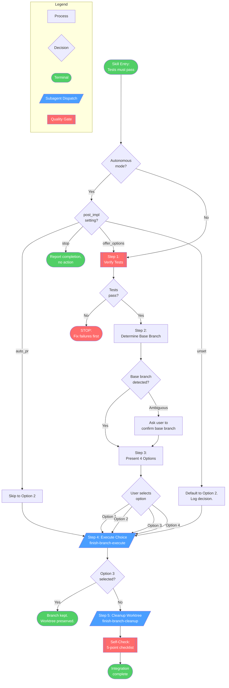
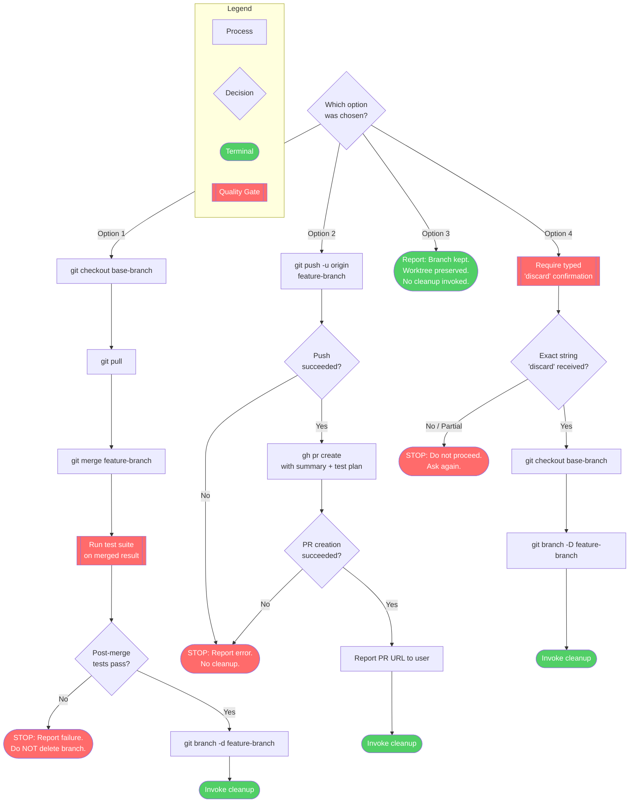
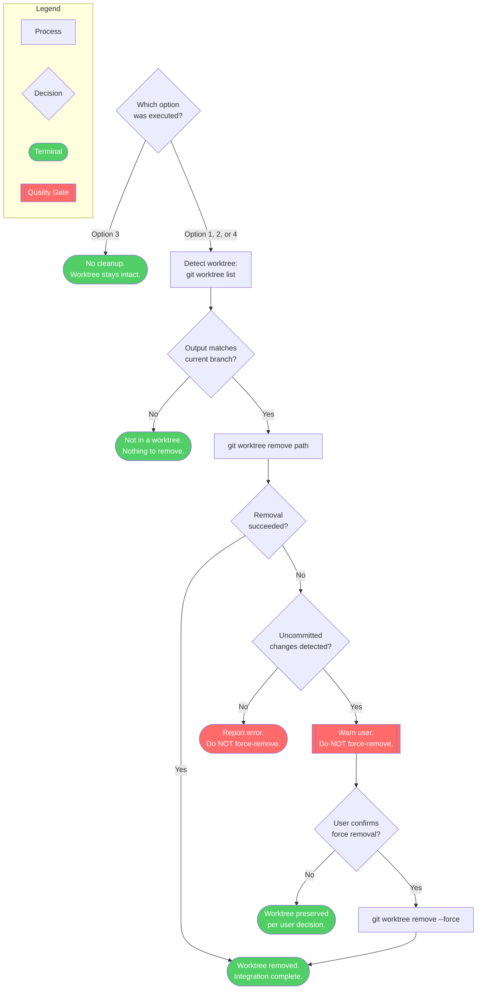

<!-- diagram-meta: {"source": "skills/finishing-a-development-branch/SKILL.md", "source_hash": "sha256:724357d4426b30488947d5a5251d5fa67aab5b180caec4b2a310f6f219e7b9e0", "generator": "stamp", "stamped_at": "2026-03-29T17:31:57Z"} -->
# Finishing a Development Branch - Diagrams

Workflow for completing a development branch: verifies tests pass, determines base branch, presents 4 structured integration options (merge, PR, keep, discard), executes the chosen option via subagent, and performs worktree cleanup where applicable.

## Overview Diagram

High-level flow from entry through the 5 steps to terminal states.

```mermaid
flowchart TD
    subgraph Legend
        L1[Process]
        L2{Decision}
        L3([Terminal])
        L4[/Subagent Dispatch/]
        L5[[Quality Gate]]
    end

    style L4 fill:#4a9eff,color:#fff
    style L5 fill:#ff6b6b,color:#fff
    style L3 fill:#51cf66,color:#fff

    Entry([Skill Entry:<br>Tests must pass]) --> AutoCheck{Autonomous<br>mode?}

    AutoCheck -->|Yes| PostImpl{post_impl<br>setting?}
    AutoCheck -->|No| Step1

    PostImpl -->|auto_pr| DirectPR[Skip to Option 2]
    PostImpl -->|stop| StopReport([Report completion,<br>no action])
    PostImpl -->|offer_options| Step1
    PostImpl -->|unset| DefaultPR[Default to Option 2.<br>Log decision.]

    DirectPR --> Step4
    DefaultPR --> Step4

    Step1[[Step 1:<br>Verify Tests]] --> TestResult{Tests<br>pass?}
    TestResult -->|No| TestFail([STOP:<br>Fix failures first])
    TestResult -->|Yes| Step2

    Step2[Step 2:<br>Determine Base Branch] --> MergeBase{Base branch<br>detected?}
    MergeBase -->|Yes| Step3
    MergeBase -->|Ambiguous| AskBase[Ask user to<br>confirm base branch] --> Step3

    Step3[Step 3:<br>Present 4 Options] --> UserChoice{User selects<br>option}

    UserChoice -->|Option 1| Step4
    UserChoice -->|Option 2| Step4
    UserChoice -->|Option 3| Step4
    UserChoice -->|Option 4| Step4

    Step4[/Step 4: Execute Choice<br>finish-branch-execute/] --> Step5{Option 3<br>selected?}

    Step5 -->|Yes| KeepDone([Branch kept.<br>Worktree preserved.])
    Step5 -->|No| Step5Cleanup[/Step 5: Cleanup Worktree<br>finish-branch-cleanup/]

    Step5Cleanup --> SelfCheck[[Self-Check:<br>5-point checklist]]
    SelfCheck --> Done([Integration<br>complete])

    style Entry fill:#51cf66,color:#fff
    style StopReport fill:#51cf66,color:#fff
    style TestFail fill:#ff6b6b,color:#fff
    style KeepDone fill:#51cf66,color:#fff
    style Done fill:#51cf66,color:#fff
    style Step1 fill:#ff6b6b,color:#fff
    style SelfCheck fill:#ff6b6b,color:#fff
    style Step4 fill:#4a9eff,color:#fff
    style Step5Cleanup fill:#4a9eff,color:#fff
```

## Detail: Step 4 - Execute Choice (finish-branch-execute)

Decision tree for each of the four integration options dispatched as a subagent.

```mermaid
flowchart TD
    subgraph Legend
        L1[Process]
        L2{Decision}
        L3([Terminal])
        L4[[Quality Gate]]
    end

    style L4 fill:#ff6b6b,color:#fff
    style L3 fill:#51cf66,color:#fff

    Entry{Which option<br>was chosen?} -->|Option 1| O1_Checkout
    Entry -->|Option 2| O2_Push
    Entry -->|Option 3| O3_Report
    Entry -->|Option 4| O4_Confirm

    %% Option 1: Merge Locally
    O1_Checkout[git checkout base-branch] --> O1_Pull[git pull]
    O1_Pull --> O1_Merge[git merge feature-branch]
    O1_Merge --> O1_Test[[Run test suite<br>on merged result]]
    O1_Test --> O1_TestResult{Post-merge<br>tests pass?}
    O1_TestResult -->|No| O1_Fail([STOP: Report failure.<br>Do NOT delete branch.])
    O1_TestResult -->|Yes| O1_Delete[git branch -d feature-branch]
    O1_Delete --> O1_Done([Invoke cleanup])

    %% Option 2: Push and Create PR
    O2_Push[git push -u origin<br>feature-branch] --> O2_PushOK{Push<br>succeeded?}
    O2_PushOK -->|No| O2_Fail([STOP: Report error.<br>No cleanup.])
    O2_PushOK -->|Yes| O2_PR[gh pr create<br>with summary + test plan]
    O2_PR --> O2_PROK{PR creation<br>succeeded?}
    O2_PROK -->|No| O2_Fail
    O2_PROK -->|Yes| O2_Report[Report PR URL to user]
    O2_Report --> O2_Done([Invoke cleanup])

    %% Option 3: Keep As-Is
    O3_Report([Report: Branch kept.<br>Worktree preserved.<br>No cleanup invoked.])

    %% Option 4: Discard
    O4_Confirm[[Require typed<br>'discard' confirmation]] --> O4_Check{Exact string<br>'discard' received?}
    O4_Check -->|No / Partial| O4_Reject([STOP: Do not proceed.<br>Ask again.])
    O4_Check -->|Yes| O4_Checkout[git checkout base-branch]
    O4_Checkout --> O4_Delete[git branch -D feature-branch]
    O4_Delete --> O4_Done([Invoke cleanup])

    style O1_Test fill:#ff6b6b,color:#fff
    style O4_Confirm fill:#ff6b6b,color:#fff
    style O1_Fail fill:#ff6b6b,color:#fff
    style O2_Fail fill:#ff6b6b,color:#fff
    style O4_Reject fill:#ff6b6b,color:#fff
    style O3_Report fill:#51cf66,color:#fff
    style O1_Done fill:#51cf66,color:#fff
    style O2_Done fill:#51cf66,color:#fff
    style O4_Done fill:#51cf66,color:#fff
```

## Detail: Step 5 - Cleanup Worktree (finish-branch-cleanup)

Worktree detection and removal logic, gated by option selection.

```mermaid
flowchart TD
    subgraph Legend
        L1[Process]
        L2{Decision}
        L3([Terminal])
        L4[[Quality Gate]]
    end

    style L4 fill:#ff6b6b,color:#fff
    style L3 fill:#51cf66,color:#fff

    Entry{Which option<br>was executed?} -->|Option 3| Skip([No cleanup.<br>Worktree stays intact.])

    Entry -->|Option 1, 2, or 4| Detect[Detect worktree:<br>git worktree list]

    Detect --> InWorktree{Output matches<br>current branch?}
    InWorktree -->|No| NoWT([Not in a worktree.<br>Nothing to remove.])
    InWorktree -->|Yes| Remove[git worktree remove path]

    Remove --> RemoveOK{Removal<br>succeeded?}
    RemoveOK -->|Yes| Done([Worktree removed.<br>Integration complete.])
    RemoveOK -->|No| CheckDirty{Uncommitted<br>changes detected?}
    CheckDirty -->|Yes| WarnUser[[Warn user.<br>Do NOT force-remove.]]
    CheckDirty -->|No| OtherError([Report error.<br>Do NOT force-remove.])

    WarnUser --> AskForce{User confirms<br>force removal?}
    AskForce -->|Yes| ForceRemove[git worktree remove --force]
    AskForce -->|No| Preserve([Worktree preserved<br>per user decision.])

    ForceRemove --> Done

    style Skip fill:#51cf66,color:#fff
    style NoWT fill:#51cf66,color:#fff
    style Done fill:#51cf66,color:#fff
    style Preserve fill:#51cf66,color:#fff
    style OtherError fill:#ff6b6b,color:#fff
    style WarnUser fill:#ff6b6b,color:#fff
```

## Legend

| Color | Meaning |
|-------|---------|
| Blue (`#4a9eff`) | Subagent dispatch |
| Red (`#ff6b6b`) | Quality gate / stop condition |
| Green (`#51cf66`) | Success terminal |

## Cross-Reference Table

| Overview Node | Detail Diagram | Source Reference |
|---|---|---|
| Step 1: Verify Tests | Overview only (single gate) | SKILL.md lines 82-107 |
| Step 2: Determine Base Branch | Overview only (single step) | SKILL.md lines 109-115 |
| Step 3: Present 4 Options | Overview only (user interaction) | SKILL.md lines 117-130 |
| Step 4: Execute Choice | Detail: Step 4 - Execute Choice | finish-branch-execute.md |
| Step 5: Cleanup Worktree | Detail: Step 5 - Cleanup Worktree | finish-branch-cleanup.md |
| Autonomous Mode | Overview (AutoCheck / PostImpl nodes) | SKILL.md lines 44-59 |
| Self-Check | Overview (SelfCheck node) | SKILL.md lines 173-184 |
