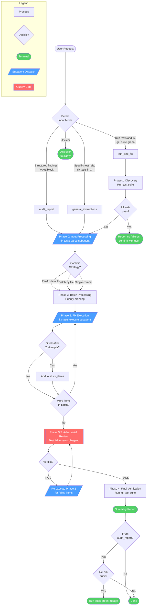
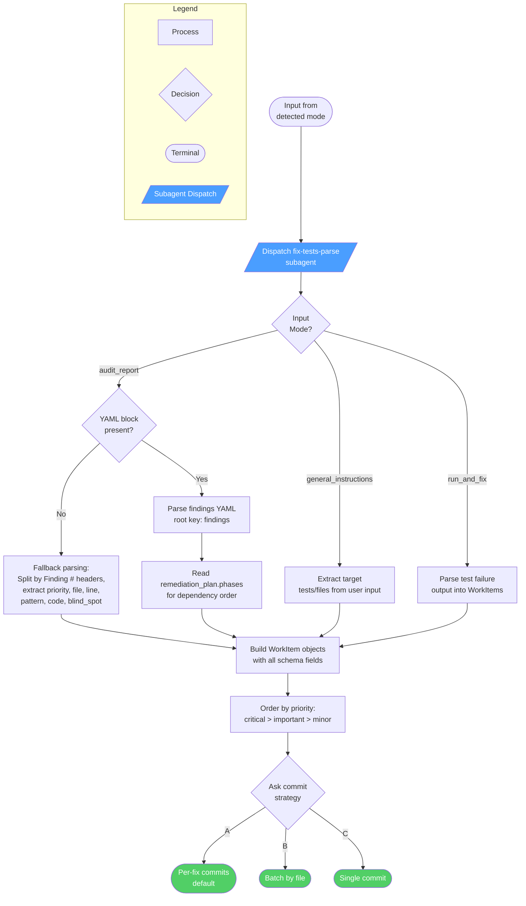
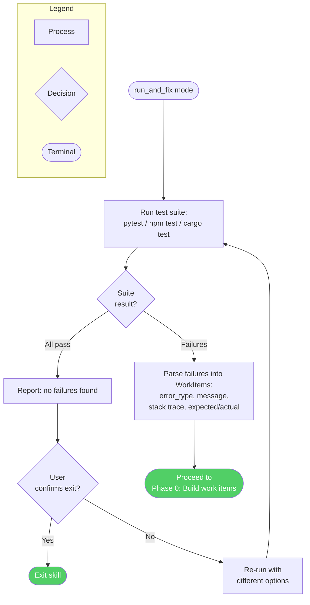
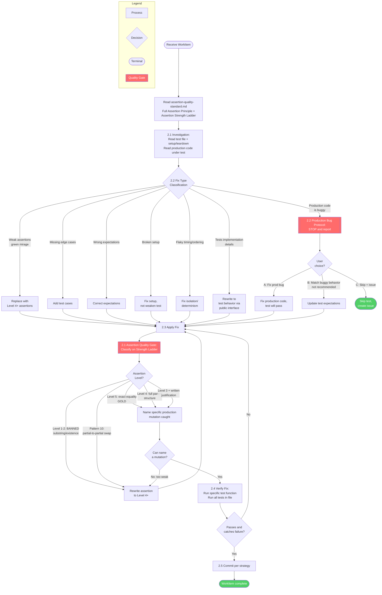
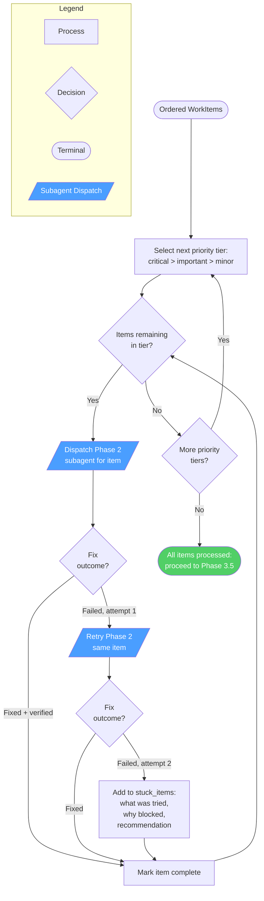
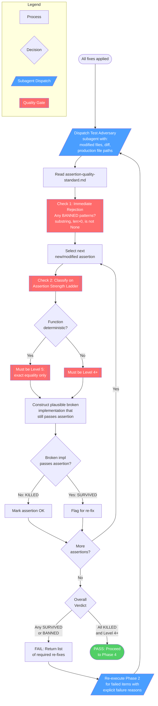
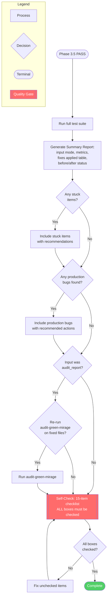

<!-- diagram-meta: {"source": "skills/fixing-tests/SKILL.md","source_hash": "sha256:d19b43156dc865c1cf4cae358bb72cb870b33f579db74bfe0f82752a5bc0c074","generator": "stamp"} -->
# Fixing Tests - Skill Diagrams

Three-mode test fixing workflow: audit reports, general instructions, or run-and-fix cycles. Includes subagent dispatch for parsing and execution, assertion quality gates, adversarial review, production bug detection, priority-based batch processing, and a stuck-items circuit breaker.

## Overview Diagram

High-level phase flow showing three input modes converging into a shared fix-verify-review pipeline.

```mermaid
flowchart TD
    subgraph Legend
        L1[Process]
        L2{Decision}
        L3([Terminal])
        L4[/Subagent Dispatch/]
        L5[[Quality Gate]]
    end

    style L4 fill:#4a9eff,color:#fff
    style L5 fill:#ff6b6b,color:#fff
    style L3 fill:#51cf66,color:#fff

    START([User Request]) --> DETECT{Detect<br>Input Mode}

    DETECT -->|Structured findings,<br>YAML block| AUDIT[audit_report]
    DETECT -->|Specific test refs,<br>fix tests in X| GENERAL[general_instructions]
    DETECT -->|Run tests and fix,<br>get suite green| RUNFIX[run_and_fix]
    DETECT -->|Unclear| ASK([Ask user<br>to clarify])

    AUDIT --> P0[/Phase 0: Input Processing<br>fix-tests-parse subagent/]
    GENERAL --> P0
    RUNFIX --> P1

    style P0 fill:#4a9eff,color:#fff

    P1[Phase 1: Discovery<br>Run test suite] --> P1_CHECK{All tests<br>pass?}
    P1_CHECK -->|Yes| P1_CONFIRM([Report no failures,<br>confirm with user])
    P1_CHECK -->|No| P0

    P0 --> COMMIT{Commit<br>Strategy?}
    COMMIT -->|Per-fix default| P3
    COMMIT -->|Batch by file| P3
    COMMIT -->|Single commit| P3

    P3[Phase 3: Batch Processing<br>Priority ordering] --> P2[/Phase 2: Fix Execution<br>fix-tests-execute subagent/]

    style P2 fill:#4a9eff,color:#fff

    P2 --> P2_STUCK{Stuck after<br>2 attempts?}
    P2_STUCK -->|Yes| STUCK[Add to stuck_items]
    P2_STUCK -->|No| P2_DONE{More items<br>in batch?}
    STUCK --> P2_DONE
    P2_DONE -->|Yes| P2
    P2_DONE -->|No| P35

    P35[[Phase 3.5: Adversarial Review<br>Test Adversary subagent]]

    style P35 fill:#ff6b6b,color:#fff

    P35 --> P35_V{Verdict?}
    P35_V -->|FAIL| P2_REFIX[/Re-execute Phase 2<br>for failed items/]
    style P2_REFIX fill:#4a9eff,color:#fff
    P2_REFIX --> P35
    P35_V -->|PASS| P4

    P4[Phase 4: Final Verification<br>Run full test suite] --> REPORT([Summary Report])

    style REPORT fill:#51cf66,color:#fff

    REPORT --> REAUDIT{From<br>audit_report?}
    REAUDIT -->|Yes| REAUDIT_Q{Re-run<br>audit?}
    REAUDIT -->|No| DONE([Done])
    REAUDIT_Q -->|Yes| REAUDIT_RUN([Run audit-green-mirage])
    REAUDIT_Q -->|No| DONE

    style DONE fill:#51cf66,color:#fff
    style REAUDIT_RUN fill:#51cf66,color:#fff
    style P1_CONFIRM fill:#51cf66,color:#fff
    style ASK fill:#51cf66,color:#fff
```

### Cross-Reference Table

| Overview Node | Detail Diagram |
|---------------|----------------|
| Phase 0: Input Processing | [Phase 0 Detail](#phase-0-input-processing) |
| Phase 1: Discovery | [Phase 1 Detail](#phase-1-discovery) |
| Phase 2: Fix Execution | [Phase 2 Detail](#phase-2-fix-execution) |
| Phase 3: Batch Processing | [Phase 3 Detail](#phase-3-batch-processing) |
| Phase 3.5: Adversarial Review | [Phase 3.5 Detail](#phase-35-adversarial-review) |
| Phase 4: Final Verification | [Phase 4 Detail](#phase-4-final-verification) |

---

## Phase 0: Input Processing

Subagent dispatched with `/fix-tests-parse` command. Parses input into WorkItems depending on mode, then determines commit strategy.

```mermaid
flowchart TD
    subgraph Legend
        L1[Process]
        L2{Decision}
        L3([Terminal])
        L4[/Subagent Dispatch/]
    end

    style L4 fill:#4a9eff,color:#fff

    START([Input from<br>detected mode]) --> DISPATCH[/Dispatch fix-tests-parse<br>subagent/]
    style DISPATCH fill:#4a9eff,color:#fff

    DISPATCH --> MODE{Input<br>Mode?}

    MODE -->|audit_report| YAML{YAML block<br>present?}
    MODE -->|general_instructions| EXTRACT[Extract target<br>tests/files from user input]
    MODE -->|run_and_fix| FAILURES[Parse test failure<br>output into WorkItems]

    YAML -->|Yes| PARSE_YAML[Parse findings YAML<br>root key: findings]
    YAML -->|No| FALLBACK[Fallback parsing:<br>Split by Finding # headers,<br>extract priority, file, line,<br>pattern, code, blind_spot]

    PARSE_YAML --> REMED[Read remediation_plan.phases<br>for dependency order]
    FALLBACK --> BUILD

    REMED --> BUILD
    EXTRACT --> BUILD
    FAILURES --> BUILD

    BUILD[Build WorkItem objects<br>with all schema fields] --> ORDER[Order by priority:<br>critical > important > minor]

    ORDER --> COMMIT{Ask commit<br>strategy}
    COMMIT -->|A| PERFIX([Per-fix commits<br>default])
    COMMIT -->|B| BATCH([Batch by file])
    COMMIT -->|C| SINGLE([Single commit])

    style PERFIX fill:#51cf66,color:#fff
    style BATCH fill:#51cf66,color:#fff
    style SINGLE fill:#51cf66,color:#fff
```

---

## Phase 1: Discovery

Only executed for `run_and_fix` mode. Skipped for `audit_report` and `general_instructions`.

```mermaid
flowchart TD
    subgraph Legend
        L1[Process]
        L2{Decision}
        L3([Terminal])
    end

    START([run_and_fix mode]) --> RUN[Run test suite:<br>pytest / npm test / cargo test]

    RUN --> RESULT{Suite<br>result?}

    RESULT -->|All pass| REPORT[Report: no failures found]
    REPORT --> CONFIRM{User<br>confirms exit?}
    CONFIRM -->|Yes| EXIT([Exit skill])
    CONFIRM -->|No| RERUN[Re-run with<br>different options]
    RERUN --> RUN

    RESULT -->|Failures| PARSE[Parse failures into WorkItems:<br>error_type, message,<br>stack trace, expected/actual]

    PARSE --> P0([Proceed to<br>Phase 0: Build work items])

    style EXIT fill:#51cf66,color:#fff
    style P0 fill:#51cf66,color:#fff
```

---

## Phase 2: Fix Execution

Subagent dispatched with `fix-tests-execute` command. Per-item investigation, classification, fix application, quality gate, and verification.

```mermaid
flowchart TD
    subgraph Legend
        L1[Process]
        L2{Decision}
        L3([Terminal])
        L5[[Quality Gate]]
    end

    style L5 fill:#ff6b6b,color:#fff

    START([Receive WorkItem]) --> READ_STD[Read assertion-quality-standard.md<br>Full Assertion Principle +<br>Assertion Strength Ladder]

    READ_STD --> INVESTIGATE[2.1 Investigation:<br>Read test file + setup/teardown<br>Read production code under test]

    INVESTIGATE --> CLASSIFY{2.2 Fix Type<br>Classification}

    CLASSIFY -->|Weak assertions<br>green mirage| FIX_ASSERT[Replace with<br>Level 4+ assertions]
    CLASSIFY -->|Missing edge cases| FIX_EDGE[Add test cases]
    CLASSIFY -->|Wrong expectations| FIX_EXPECT[Correct expectations]
    CLASSIFY -->|Broken setup| FIX_SETUP[Fix setup,<br>not weaken test]
    CLASSIFY -->|Flaky timing/ordering| FIX_FLAKY[Fix isolation/<br>determinism]
    CLASSIFY -->|Tests implementation<br>details| FIX_IMPL[Rewrite to<br>test behavior via<br>public interface]
    CLASSIFY -->|Production code<br>is buggy| PROD_BUG

    PROD_BUG[[2.2 Production Bug Protocol:<br>STOP and report]]
    style PROD_BUG fill:#ff6b6b,color:#fff

    PROD_BUG --> PROD_OPTS{User<br>choice?}
    PROD_OPTS -->|A: Fix prod bug| FIX_PROD[Fix production code,<br>test will pass]
    PROD_OPTS -->|B: Match buggy behavior<br>not recommended| FIX_MATCH[Update test expectations]
    PROD_OPTS -->|C: Skip + issue| SKIP([Skip test,<br>create issue])
    style SKIP fill:#51cf66,color:#fff

    FIX_ASSERT --> WRITE_FIX
    FIX_EDGE --> WRITE_FIX
    FIX_EXPECT --> WRITE_FIX
    FIX_SETUP --> WRITE_FIX
    FIX_FLAKY --> WRITE_FIX
    FIX_IMPL --> WRITE_FIX
    FIX_PROD --> WRITE_FIX
    FIX_MATCH --> WRITE_FIX

    WRITE_FIX[2.3 Apply Fix] --> GATE[[2.1 Assertion Quality Gate:<br>Classify on Strength Ladder]]
    style GATE fill:#ff6b6b,color:#fff

    GATE --> GATE_CHECK{Assertion<br>Level?}
    GATE_CHECK -->|Level 5: exact equality<br>GOLD| MUTATION
    GATE_CHECK -->|Level 4: full parsed<br>structure| MUTATION
    GATE_CHECK -->|Level 3 + written<br>justification| MUTATION
    GATE_CHECK -->|Level 1-2: BANNED<br>substring/existence| REWRITE[Rewrite assertion<br>to Level 4+]
    GATE_CHECK -->|Pattern 10:<br>partial-to-partial swap| REWRITE

    REWRITE --> WRITE_FIX

    MUTATION[Name specific production<br>mutation caught] --> MUT_CHECK{Can name<br>a mutation?}
    MUT_CHECK -->|No: too weak| REWRITE
    MUT_CHECK -->|Yes| VERIFY

    VERIFY[2.4 Verify Fix:<br>Run specific test function<br>Run all tests in file] --> VERIFY_CHECK{Passes and<br>catches failure?}

    VERIFY_CHECK -->|Yes| COMMIT[2.5 Commit per strategy]
    VERIFY_CHECK -->|No| WRITE_FIX

    COMMIT --> DONE([WorkItem complete])
    style DONE fill:#51cf66,color:#fff
```

---

## Phase 3: Batch Processing

Iterates through work items by priority tier with a 2-attempt circuit breaker per item.

```mermaid
flowchart TD
    subgraph Legend
        L1[Process]
        L2{Decision}
        L3([Terminal])
        L4[/Subagent Dispatch/]
    end

    style L4 fill:#4a9eff,color:#fff

    START([Ordered WorkItems]) --> PRIO[Select next priority tier:<br>critical > important > minor]

    PRIO --> ITEM{Items remaining<br>in tier?}

    ITEM -->|Yes| DISPATCH[/Dispatch Phase 2<br>subagent for item/]
    style DISPATCH fill:#4a9eff,color:#fff

    DISPATCH --> RESULT{Fix<br>outcome?}

    RESULT -->|Fixed + verified| NEXT[Mark item complete]
    RESULT -->|Failed, attempt 1| RETRY[/Retry Phase 2<br>same item/]
    style RETRY fill:#4a9eff,color:#fff

    RETRY --> RETRY_RESULT{Fix<br>outcome?}
    RETRY_RESULT -->|Fixed| NEXT
    RETRY_RESULT -->|Failed, attempt 2| STUCK[Add to stuck_items:<br>what was tried,<br>why blocked,<br>recommendation]

    STUCK --> NEXT
    NEXT --> ITEM

    ITEM -->|No| MORE_TIERS{More priority<br>tiers?}
    MORE_TIERS -->|Yes| PRIO
    MORE_TIERS -->|No| DONE([All items processed:<br>proceed to Phase 3.5])
    style DONE fill:#51cf66,color:#fff
```

---

## Phase 3.5: Adversarial Review

Mandatory quality gate. Dispatches a Test Adversary subagent to verify all new/modified assertions. Loops back to Phase 2 on failure.

```mermaid
flowchart TD
    subgraph Legend
        L1[Process]
        L2{Decision}
        L4[/Subagent Dispatch/]
        L5[[Quality Gate]]
    end

    style L4 fill:#4a9eff,color:#fff
    style L5 fill:#ff6b6b,color:#fff

    START([All fixes applied]) --> DISPATCH[/Dispatch Test Adversary<br>subagent with:<br>modified files, diff,<br>production file paths/]
    style DISPATCH fill:#4a9eff,color:#fff

    DISPATCH --> READ[Read assertion-quality-standard.md]

    READ --> CHECK1[[Check 1: Immediate Rejection<br>Any BANNED patterns?<br>substring, len>0, is not None]]
    style CHECK1 fill:#ff6b6b,color:#fff

    CHECK1 --> NEXT_ASSERT[Select next<br>new/modified assertion]

    NEXT_ASSERT --> CHECK2[[Check 2: Classify on<br>Assertion Strength Ladder]]
    style CHECK2 fill:#ff6b6b,color:#fff

    CHECK2 --> DETERM{Function<br>deterministic?}
    DETERM -->|Yes| EXACT[[Must be Level 5:<br>exact equality only]]
    style EXACT fill:#ff6b6b,color:#fff
    DETERM -->|No| LEVEL4[[Must be Level 4+]]
    style LEVEL4 fill:#ff6b6b,color:#fff

    EXACT --> MUTANT[Construct plausible broken<br>implementation that<br>still passes assertion]
    LEVEL4 --> MUTANT

    MUTANT --> MUTANT_V{Broken impl<br>passes assertion?}
    MUTANT_V -->|No: KILLED| MARK_PASS[Mark assertion OK]
    MUTANT_V -->|Yes: SURVIVED| MARK_FAIL[Flag for re-fix]

    MARK_PASS --> MORE{More<br>assertions?}
    MARK_FAIL --> MORE
    MORE -->|Yes| NEXT_ASSERT
    MORE -->|No| VERDICT{Overall<br>Verdict}

    VERDICT -->|Any SURVIVED<br>or BANNED| FAIL[FAIL: Return list<br>of required re-fixes]
    VERDICT -->|All KILLED<br>and Level 4+| PASS([PASS: Proceed<br>to Phase 4])
    style PASS fill:#51cf66,color:#fff

    FAIL --> REFIX[/Re-execute Phase 2<br>for failed items with<br>explicit failure reasons/]
    style REFIX fill:#4a9eff,color:#fff

    REFIX --> DISPATCH
```

---

## Phase 4: Final Verification

Run the full test suite, generate summary report, offer re-audit for audit_report mode, and execute the 15-item self-check.

```mermaid
flowchart TD
    subgraph Legend
        L1[Process]
        L2{Decision}
        L3([Terminal])
        L5[[Quality Gate]]
    end

    style L5 fill:#ff6b6b,color:#fff

    START([Phase 3.5 PASS]) --> RUN[Run full test suite]

    RUN --> REPORT[Generate Summary Report:<br>input mode, metrics,<br>fixes applied table,<br>before/after status]

    REPORT --> STUCK_Q{Any stuck<br>items?}
    STUCK_Q -->|Yes| STUCK_RPT[Include stuck items<br>with recommendations]
    STUCK_Q -->|No| PROD_Q

    STUCK_RPT --> PROD_Q{Any production<br>bugs found?}
    PROD_Q -->|Yes| PROD_RPT[Include production bugs<br>with recommended actions]
    PROD_Q -->|No| AUDIT_Q

    PROD_RPT --> AUDIT_Q{Input was<br>audit_report?}
    AUDIT_Q -->|Yes| REAUDIT{Re-run<br>audit-green-mirage<br>on fixed files?}
    AUDIT_Q -->|No| SELFCHECK

    REAUDIT -->|Yes| RUN_AUDIT[Run audit-green-mirage]
    REAUDIT -->|No| SELFCHECK

    RUN_AUDIT --> SELFCHECK

    SELFCHECK[[Self-Check: 15-item checklist<br>ALL boxes must be checked]]
    style SELFCHECK fill:#ff6b6b,color:#fff

    SELFCHECK --> CHECK{All boxes<br>checked?}
    CHECK -->|No| FIX[Fix unchecked items]
    FIX --> SELFCHECK

    CHECK -->|Yes| DONE([Complete])
    style DONE fill:#51cf66,color:#fff
```

## Source Cross-Reference

| Diagram Element | Source Location |
|----------------|----------------|
| Input Mode detection | `SKILL.md` lines 37-44: Input Modes table |
| audit_report mode | Detection: structured findings with patterns 1-10, YAML block |
| general_instructions mode | Detection: "Fix tests in X", specific test references |
| run_and_fix mode | Detection: "Run tests and fix failures", "get suite green" |
| WorkItem schema | `SKILL.md` lines 49-66: TypeScript interface |
| Phase 0: Input Processing | `SKILL.md` lines 73-75, command `fix-tests-parse.md` |
| YAML parsing | `fix-tests-parse.md` lines 19-37: root key `findings:` |
| Fallback parsing | `fix-tests-parse.md` lines 41-46: split by `Finding #` headers |
| Commit strategy | `fix-tests-parse.md` lines 49-55: per-fix / batch / single |
| Phase 1: Discovery | `SKILL.md` lines 77-85: run_and_fix only |
| Phase 2: Fix Execution | `SKILL.md` lines 87-128, command `fix-tests-execute.md` |
| Assertion Quality Gate | `SKILL.md` lines 131-143, `fix-tests-execute.md` lines 19-52 |
| Fix Type Classification | `fix-tests-execute.md` lines 83-91 |
| Production Bug Protocol | `SKILL.md` lines 147-168 |
| Phase 3: Batch Processing | `SKILL.md` lines 170-179: priority loop with 2-attempt limit |
| Stuck Items Report | `SKILL.md` lines 183-189 |
| Phase 3.5: Adversarial Review | `SKILL.md` lines 192-233: mandatory, Test Adversary subagent |
| KILLED/SURVIVED verdicts | `SKILL.md` lines 222-224: mutation testing metaphor |
| FAIL re-fix loop | `SKILL.md` line 233: re-execute Phase 2, do NOT skip re-review |
| Phase 4: Final Verification | `SKILL.md` lines 235-239 |
| Summary Report | `SKILL.md` lines 243-271: metrics, fixes, status, stuck, prod bugs |
| Re-audit option | `SKILL.md` lines 273-279: audit_report mode only |
| Self-Check checklist | `SKILL.md` lines 315-333: 15 items, all must pass |
| Special Cases | `SKILL.md` lines 283-289: flaky, impl-coupled, missing, slow tests |
| Anti-Patterns | `SKILL.md` lines 291-313: over-engineering, under-testing, scope creep, blind fixes |
