<!-- diagram-meta: {"source": "skills/fixing-tests/SKILL.md", "source_hash": "sha256:50710b36446069a103f45743493ccfb35386d4d9bd44be3f3b003a2b5ac52706", "generated_at": "2026-03-01T00:00:00Z", "generator": "generate_diagrams.py"} -->
# Diagram: fixing-tests

Three-mode test fixing workflow that processes audit reports, general instructions, or run-and-fix cycles. Includes production bug detection, priority-based batch processing, and a stuck-items circuit breaker.

```mermaid
flowchart TD
    Start([Start]) --> DetectMode{Detect Input Mode}

    DetectMode -->|Structured YAML Findings| AuditMode[Mode: audit_report]
    DetectMode -->|Specific Test References| GeneralMode[Mode: general_instructions]
    DetectMode -->|Run Tests and Fix| RunFixMode[Mode: run_and_fix]

    AuditMode --> LoadAQS[Load Assertion Quality Standard]
    LoadAQS --> P0[Phase 0: Parse Input]
    GeneralMode --> P0
    RunFixMode --> P1[Phase 1: Discovery]

    P0 --> P0_Sub[/fix-tests-parse/]
    P0_Sub --> WorkItems[Build WorkItem List]

    P1 --> RunTests[Run Test Suite]
    RunTests --> ParseFails[Parse Failures]
    ParseFails --> WorkItems

    WorkItems --> P3[Phase 3: Batch Processing]

    P3 --> PriorityLoop{Next Priority Batch}
    PriorityLoop -->|Critical| ProcessItem[Process WorkItem]
    PriorityLoop -->|Important| ProcessItem
    PriorityLoop -->|Minor| ProcessItem
    PriorityLoop -->|All Done| P4[Phase 4: Final Verification]

    ProcessItem --> P2[Phase 2: Fix Execution]
    P2 --> P2_Sub[/fix-tests-execute/]
    P2_Sub --> Investigate[Read Test and Prod Code]
    Investigate --> Classify{Production Bug?}

    Classify -->|Yes| ProdBug[Production Bug Protocol]
    ProdBug --> ProdChoice{User Choice}
    ProdChoice -->|Fix Prod Bug| FixProd[Fix Production Code]
    ProdChoice -->|Update Test| UpdateTest[Update Test to Match]
    ProdChoice -->|Skip + Issue| SkipTest[Skip Test, Create Issue]
    FixProd --> VerifyFix
    UpdateTest --> VerifyFix
    SkipTest --> NextItem

    Classify -->|No| ApplyFix[Apply Test Fix]
    ApplyFix --> VerifyFix[Verify Fix Passes]
    VerifyFix --> AQGate{Assertion Level 4+?}
    AQGate -->|No| StrengthenAssert[Strengthen Assertions]
    StrengthenAssert --> ApplyFix
    AQGate -->|Yes| CatchGate{Fix Catches Failures?}
    CatchGate -->|Yes| Commit[Commit Fix]
    CatchGate -->|No| RetryFix{Attempts < 2?}
    RetryFix -->|Yes| Investigate
    RetryFix -->|No| StuckItem[Add to Stuck Items]

    Commit --> NextItem[Next WorkItem]
    StuckItem --> NextItem
    NextItem --> PriorityLoop

    P4 --> RunFull[Run Full Test Suite]
    RunFull --> SummaryReport[Generate Summary Report]
    SummaryReport --> FromAudit{From audit_report?}
    FromAudit -->|Yes| ReauditOffer{Re-audit Offered}
    ReauditOffer -->|Yes| AuditGM[/auditing-green-mirage/]
    ReauditOffer -->|No| SelfCheck
    FromAudit -->|No| SelfCheck
    AuditGM --> SelfCheck[Self-Check Checklist]
    SelfCheck --> End([End])

    style Start fill:#4CAF50,color:#fff
    style End fill:#4CAF50,color:#fff
    style DetectMode fill:#FF9800,color:#fff
    style Classify fill:#FF9800,color:#fff
    style ProdChoice fill:#FF9800,color:#fff
    style PriorityLoop fill:#FF9800,color:#fff
    style LoadAQS fill:#2196F3,color:#fff
    style AQGate fill:#f44336,color:#fff
    style StrengthenAssert fill:#2196F3,color:#fff
    style CatchGate fill:#f44336,color:#fff
    style RetryFix fill:#FF9800,color:#fff
    style FromAudit fill:#FF9800,color:#fff
    style ReauditOffer fill:#FF9800,color:#fff
    style AuditMode fill:#2196F3,color:#fff
    style GeneralMode fill:#2196F3,color:#fff
    style RunFixMode fill:#2196F3,color:#fff
    style P0 fill:#2196F3,color:#fff
    style P1 fill:#2196F3,color:#fff
    style RunTests fill:#2196F3,color:#fff
    style ParseFails fill:#2196F3,color:#fff
    style WorkItems fill:#2196F3,color:#fff
    style P3 fill:#2196F3,color:#fff
    style ProcessItem fill:#2196F3,color:#fff
    style P2 fill:#2196F3,color:#fff
    style Investigate fill:#2196F3,color:#fff
    style ProdBug fill:#2196F3,color:#fff
    style FixProd fill:#2196F3,color:#fff
    style UpdateTest fill:#2196F3,color:#fff
    style SkipTest fill:#2196F3,color:#fff
    style ApplyFix fill:#2196F3,color:#fff
    style VerifyFix fill:#2196F3,color:#fff
    style Commit fill:#2196F3,color:#fff
    style NextItem fill:#2196F3,color:#fff
    style StuckItem fill:#2196F3,color:#fff
    style P4 fill:#2196F3,color:#fff
    style RunFull fill:#2196F3,color:#fff
    style SummaryReport fill:#2196F3,color:#fff
    style SelfCheck fill:#2196F3,color:#fff
    style P0_Sub fill:#4CAF50,color:#fff
    style P2_Sub fill:#4CAF50,color:#fff
    style AuditGM fill:#4CAF50,color:#fff
```

## Legend

| Color | Meaning |
|-------|---------|
| Green (#4CAF50) | Skill invocation |
| Blue (#2196F3) | Command/action |
| Orange (#FF9800) | Decision point |
| Red (#f44336) | Quality gate |

## Cross-Reference

| Node | Source Reference |
|------|----------------|
| Detect Input Mode | Input Modes table (lines 36-42) |
| Mode: audit_report | Detection: "Structured findings with patterns 1-8" (line 39) |
| Mode: general_instructions | Detection: "Fix tests in X, specific test references" (line 40) |
| Mode: run_and_fix | Detection: "Run tests and fix failures" (line 41) |
| Phase 0: Parse Input | Phase 0 (lines 71-73) |
| /fix-tests-parse/ | Command dispatch (line 73) |
| Phase 1: Discovery | Phase 1 (lines 75-81) |
| Build WorkItem List | WorkItem Schema (lines 47-65) |
| Phase 2: Fix Execution | Phase 2 (lines 83-87) |
| /fix-tests-execute/ | Command dispatch (line 87) |
| Production Bug? | Section 2.3 Production Bug Protocol (lines 89-112) |
| Production Bug Protocol | Lines 94-109: "PRODUCTION BUG DETECTED" |
| Fix Catches Failures? | Quality gate from Invariant Principle 1 (line 18) |
| Attempts < 2? | Stuck rule (lines 119-121): "IF stuck after 2 attempts" |
| Add to Stuck Items | Stuck Items Report (lines 125-134) |
| Phase 3: Batch Processing | Phase 3 (lines 114-123), priority ordering |
| Phase 4: Final Verification | Phase 4 (lines 136-143) |
| Generate Summary Report | Summary Report template (lines 146-174) |
| Re-audit Offered | Re-audit Option (lines 176-182) |
| /auditing-green-mirage/ | Re-audit invocation (line 179) |
| Load Assertion Quality Standard | Assertion Quality Gate (lines 89-100): audit_report mode loads patterns/assertion-quality-standard.md |
| Assertion Level 4+? | Quality gate: REJECT Level 2 (bare substring) or Level 1 (length/existence) |
| Strengthen Assertions | Level 3 requires justification; must name specific mutation caught |
| Self-Check Checklist | Self-Check (lines 229-241) |
