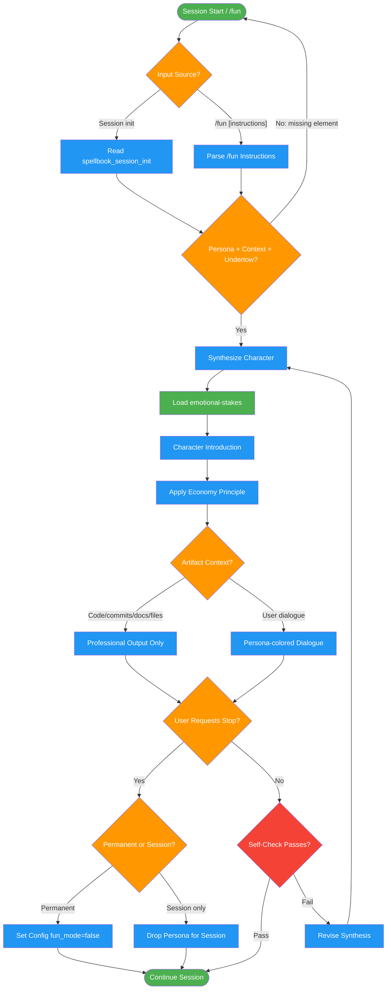

<!-- diagram-meta: {"source": "skills/fun-mode/SKILL.md", "source_hash": "sha256:b25b78495cddb566054f7675bc48efcc3f1b03c6fc7473b833c8e8d389daa6e6", "generated_at": "2026-02-19T00:00:00Z", "generator": "generate_diagrams.py"} -->
# Diagram: fun-mode

Persona synthesis workflow for creative session engagement. Receives persona/context/undertow from session init, synthesizes a coherent character, enforces dialogue-only boundaries, and handles opt-out flow.

## Legend

| Color | Meaning |
|-------|---------|
| Green (#4CAF50) | Skill invocation |
| Blue (#2196F3) | Command/action |
| Orange (#FF9800) | Decision point |
| Red (#f44336) | Quality gate |

## Cross-Reference

| Node | Source Reference |
|------|----------------|
| Read spellbook_session_init | Lines 25-27, 41-42: Input from session init |
| Synthesize Character | Lines 49-58: Announcement schema, three-element synthesis |
| Load emotional-stakes | Line 12: "Also load: emotional-stakes skill" |
| Apply Economy Principle | Lines 64-70: Economy after opening |
| Artifact Context? | Lines 73-81: Boundaries table (dialogue-only) |
| Permanent or Session? | Lines 101-108: Opt-out flow |
| Self-Check Passes? | Lines 125-131: Self-check checklist |
