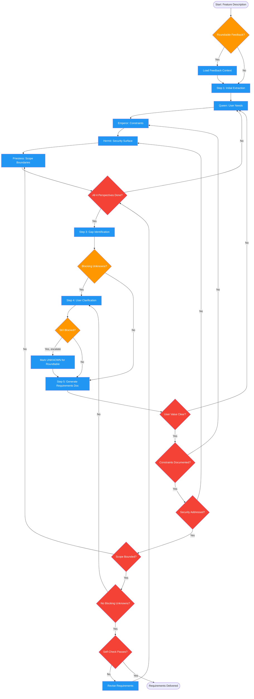

<!-- diagram-meta: {"source": "skills/gathering-requirements/SKILL.md", "source_hash": "sha256:d694f075ec79fb4bd6865786cb466f38817bf2d333e02eca53b2840ccdd9c4e1", "generated_at": "2026-02-19T00:00:00Z", "generator": "generate_diagrams.py"} -->
# Diagram: gathering-requirements

Elicits comprehensive requirements through four archetype perspectives: Queen (user needs), Emperor (constraints), Hermit (security surface), and Priestess (scope boundaries). Produces a structured requirements document with functional requirements, open questions, and blocking/non-blocking classification.

## Legend

| Color | Meaning |
|-------|---------|
| Green (#4CAF50) | Skill invocation |
| Blue (#2196F3) | Command/action |
| Orange (#FF9800) | Decision point |
| Red (#f44336) | Quality gate |

## Cross-Reference

| Node | Source Reference |
|------|----------------|
| Roundtable Feedback? | Input: feedback_to_address (line 31) |
| Step 1: Initial Extraction | Elicitation Process step 1 (line 58) |
| Queen: User Needs | The Four Perspectives: Queen (lines 42-43) |
| Emperor: Constraints | The Four Perspectives: Emperor (lines 45-46) |
| Hermit: Security Surface | The Four Perspectives: Hermit (lines 48-49) |
| Priestess: Scope Boundaries | The Four Perspectives: Priestess (lines 51-52) |
| All 4 Perspectives Done? | Invariant 1: Four Perspectives Mandatory (line 20) |
| Step 3: Gap Identification | Elicitation Process step 3 (line 60) |
| Step 4: User Clarification | Elicitation Process step 4 (line 61) |
| Mark UNKNOWN for Roundtable | Elicitation Process step 4: flag UNKNOWN (line 61) |
| Step 5: Generate Requirements Doc | Elicitation Process step 5 (line 62) |
| User Value Clear? | Quality Gate (line 126) |
| Constraints Documented? | Quality Gate (line 127) |
| Security Addressed? | Quality Gate (line 128) |
| Scope Bounded? | Quality Gate (line 129) |
| No Blocking Unknowns? | Quality Gate (line 130) |
| Self-Check Passes? | Self-Check checklist (lines 144-152) |
