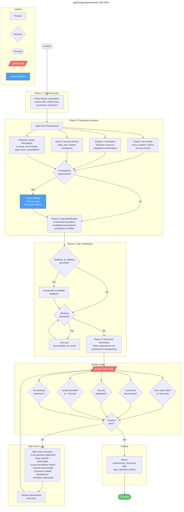

<!-- diagram-meta: {"source": "skills/gathering-requirements/SKILL.md","source_hash": "sha256:ef28b46f6c9b5945b6a701d462131537b4ea1090f225d2a3bffc5abf646b9603","generated_at": "2026-03-19T06:05:51Z","generator": "generate_diagrams.py"} -->
# Diagram: gathering-requirements

## Overview Diagram

The gathering-requirements skill follows a linear elicitation process with one conditional branch (feedback handling) and a self-check loop. It's compact enough for a single diagram.

```mermaid
---
title: "gathering-requirements Skill Flow"
---
flowchart TD
    subgraph Legend
        L1[Process]
        L2{Decision}
        L3([Terminal])
        L4[/"Quality Gate"/]:::gate
        L5[Fractal Dispatch]:::subagent
    end

    START([Invoked]) --> PARSE_INPUTS

    subgraph Phase1["Phase 1: Initial Extraction"]
        PARSE_INPUTS["Parse feature_description:<br>explicit reqs, implicit reqs,<br>constraints, unknowns"]
    end

    PARSE_INPUTS --> PERSPECTIVE_ANALYSIS

    subgraph Phase2["Phase 2: Perspective Analysis"]
        PERSPECTIVE_ANALYSIS["Apply Four Perspectives"]
        PERSPECTIVE_ANALYSIS --> QUEEN["Queen: User Needs<br>Users, problem, stories,<br>success criteria"]
        PERSPECTIVE_ANALYSIS --> EMPEROR["Emperor: Constraints<br>Technical, resource,<br>integration, performance"]
        PERSPECTIVE_ANALYSIS --> HERMIT["Hermit: Security Surface<br>Data, auth, threats,<br>compliance"]
        PERSPECTIVE_ANALYSIS --> PRIESTESS["Priestess: Scope Boundaries<br>In-scope, out-of-scope,<br>edge cases, assumptions"]

        QUEEN --> CONTRADICTIONS
        EMPEROR --> CONTRADICTIONS
        HERMIT --> CONTRADICTIONS
        PRIESTESS --> CONTRADICTIONS

        CONTRADICTIONS{Contradictory<br>requirements?}
        CONTRADICTIONS -->|Yes| FRACTAL["fractal-thinking<br>intensity: pulse<br>Reconcile conflicts"]:::subagent
        CONTRADICTIONS -->|No| GAP_ID
        FRACTAL --> GAP_ID
    end

    GAP_ID["Phase 3: Gap Identification<br>Unanswered questions,<br>unvalidated assumptions,<br>perspective conflicts"]

    GAP_ID --> HAS_FEEDBACK

    subgraph Phase4["Phase 4: User Clarification"]
        HAS_FEEDBACK{feedback_to_address<br>provided?}
        HAS_FEEDBACK -->|Yes| INCORPORATE["Incorporate roundtable<br>feedback"]
        HAS_FEEDBACK -->|No| EVAL_UNKNOWNS
        INCORPORATE --> EVAL_UNKNOWNS

        EVAL_UNKNOWNS{Blocking<br>unknowns?}
        EVAL_UNKNOWNS -->|Yes| ASK_USER["Ask user<br>(one question at a time)"]
        EVAL_UNKNOWNS -->|No| DOC_GEN
        ASK_USER --> EVAL_UNKNOWNS
    end

    DOC_GEN["Phase 5: Document Generation<br>Write requirements.md<br>covering all 4 perspectives"]

    DOC_GEN --> QUALITY_GATE

    subgraph QualityGates["Quality Gates"]
        QUALITY_GATE[/"Quality Gate Check"/]:::gate
        QUALITY_GATE --> QG1{User value clear?<br>≥1 user story}
        QUALITY_GATE --> QG2{Constraints<br>documented?}
        QUALITY_GATE --> QG3{Security<br>addressed?}
        QUALITY_GATE --> QG4{Scope bounded?<br>In + Out lists}
        QUALITY_GATE --> QG5{No blocking<br>unknowns?}

        QG1 --> GATE_RESULT
        QG2 --> GATE_RESULT
        QG3 --> GATE_RESULT
        QG4 --> GATE_RESULT
        QG5 --> GATE_RESULT
    end

    GATE_RESULT{All gates<br>pass?}
    GATE_RESULT -->|No| SELF_CHECK_LOOP

    subgraph SelfCheck["Self-Check Loop"]
        SELF_CHECK_LOOP["Self-Check Checklist:<br>- 4 perspectives addressed<br>- Reqs specific + measurable<br>- Scope boundaries explicit<br>- Security documented<br>- Questions marked blocking/non<br>- Feedback addressed"]
        SELF_CHECK_LOOP --> REVISE["Revise requirements<br>document"]
        REVISE --> QUALITY_GATE
    end

    GATE_RESULT -->|Yes| OUTPUT

    subgraph Outputs["Outputs"]
        OUTPUT["Return:<br>requirements_document (file)<br>open_questions (inline)"]
    end

    OUTPUT --> DONE([Complete]):::success

    classDef gate fill:#ff6b6b,stroke:#333,color:#fff
    classDef subagent fill:#4a9eff,stroke:#333,color:#fff
    classDef success fill:#51cf66,stroke:#333,color:#fff
```

## Cross-Reference: Source Traceability

| Diagram Node | Source (SKILL.md) |
|---|---|
| PARSE_INPUTS | Line 58: Step 1 "Initial Extraction" |
| QUEEN / EMPEROR / HERMIT / PRIESTESS | Lines 42-53: "The Four Perspectives" |
| CONTRADICTIONS / FRACTAL | Line 54: "Fractal exploration (optional)" |
| GAP_ID | Line 60: Step 3 "Gap Identification" |
| HAS_FEEDBACK / INCORPORATE | Line 61: Step 4 "If feedback_to_address provided, incorporate before step 5" |
| EVAL_UNKNOWNS / ASK_USER | Line 61: "For blocking unknowns: ask user (one question at a time)" |
| DOC_GEN | Line 62: Step 5 "Document Generation" |
| QUALITY_GATE / QG1-QG5 | Lines 118-124: "Quality Gates" table |
| SELF_CHECK_LOOP / REVISE | Lines 134-143: "Self-Check" checklist + "If ANY unchecked: revise" |
| OUTPUT | Lines 37-38: Outputs table (requirements_document, open_questions) |

## Key Observations

- **Single conditional branch**: The only true fork is whether `feedback_to_address` is provided (roundtable feedback loop from develop/Forge workflow)
- **Blocking unknown loop**: The ask-user loop in Phase 4 repeats until all blocking unknowns are resolved, one question at a time
- **Self-check is a revision loop**: Failed quality gates trigger revision and re-evaluation, not termination
- **Fractal dispatch is optional**: Only triggered when perspectives produce contradictory requirements
