<!-- diagram-meta: {"source": "skills/generating-diagrams/SKILL.md", "source_hash": "sha256:ad49ddb300475cfa52aec3a91b4ff241fbf82a20ee4206f9fe0ffaae575f0dca", "generated_at": "2026-02-19T00:00:00Z", "generator": "generate_diagrams.py"} -->
# Diagram: generating-diagrams

Workflow for the generating-diagrams skill. A 4-phase process: Analysis (identify subject, scope traversal, select format, plan decomposition), Content Extraction (systematic depth-first traversal with completeness check), Diagram Generation (code generation, legend, cross-reference table), and Verification (syntax, renderability, completeness). Incomplete results loop back to extraction.

```mermaid
flowchart TD
    Start([Start]) --> Phase1["Phase 1: Analysis"]

    subgraph P1["Phase 1: Analysis"]
        IdentifySubject["Identify diagram subject"]
        ClassifyType{Diagram type?}
        Flowchart["Flowchart"]
        Sequence["Sequence"]
        State["State"]
        ER["ER"]
        ClassDiag["Class"]
        DepGraph["Dependency graph"]
        ScopeTraversal["Scope the traversal"]
        SelectFormat{Node count?}
        UseMermaid["Use Mermaid"]
        UseGraphviz["Use Graphviz"]
        Decompose["Plan decomposition"]
        IdentifySubject --> ClassifyType
        ClassifyType --> Flowchart
        ClassifyType --> Sequence
        ClassifyType --> State
        ClassifyType --> ER
        ClassifyType --> ClassDiag
        ClassifyType --> DepGraph
        Flowchart --> ScopeTraversal
        Sequence --> ScopeTraversal
        State --> ScopeTraversal
        ER --> ScopeTraversal
        ClassDiag --> ScopeTraversal
        DepGraph --> ScopeTraversal
        ScopeTraversal --> SelectFormat
        SelectFormat -->|"< 50"| UseMermaid
        SelectFormat -->|"50-150"| UseGraphviz
        SelectFormat -->|"> 150"| Decompose
        Decompose --> UseMermaid
        Decompose --> UseGraphviz
    end

    Phase1 --> IdentifySubject
    UseMermaid --> Phase2
    UseGraphviz --> Phase2

    Phase2["Phase 2: Content Extraction"]

    subgraph P2["Phase 2: Extraction"]
        InitQueue["Init queue with ROOT"]
        PopEntity["Pop next entity"]
        ReadSource["Read source material"]
        ExtractNode["Extract node + metadata"]
        ExtractEdges["Extract outgoing edges"]
        QueueRefs["Queue unvisited refs"]
        MoreQueue{Queue empty?}
        InitQueue --> PopEntity
        PopEntity --> ReadSource
        ReadSource --> ExtractNode
        ExtractNode --> ExtractEdges
        ExtractEdges --> QueueRefs
        QueueRefs --> MoreQueue
        MoreQueue -->|No| PopEntity
    end

    Phase2 --> InitQueue
    MoreQueue -->|Yes| GateComplete{Completeness check?}

    GateComplete -->|"Orphan nodes/missing branches"| Phase2
    GateComplete -->|Pass| Phase3["Phase 3: Generation"]

    subgraph P3["Phase 3: Diagram Generation"]
        GenCode["Generate diagram code"]
        ApplyLayout["Apply layout rules"]
        GenLegend["Generate legend"]
        GenXRef["Generate cross-ref table"]
        GenCode --> ApplyLayout
        ApplyLayout --> GenLegend
        GenLegend --> GenXRef
    end

    Phase3 --> GenCode

    GenXRef --> Phase4["Phase 4: Verification"]

    subgraph P4["Phase 4: Verification"]
        SyntaxCheck["Syntax check"]
        SyntaxOK{Syntax valid?}
        RenderCheck["Renderability check"]
        RenderOK{Renders cleanly?}
        FinalComplete{Source completeness?}
        SyntaxCheck --> SyntaxOK
        SyntaxOK -->|No| FixSyntax["Fix syntax errors"]
        FixSyntax --> SyntaxCheck
        SyntaxOK -->|Yes| RenderCheck
        RenderCheck --> RenderOK
        RenderOK -->|No| FixRender["Fix render issues"]
        FixRender --> RenderCheck
        RenderOK -->|Yes| FinalComplete
    end

    Phase4 --> SyntaxCheck
    FinalComplete -->|Missing content| Phase2
    FinalComplete -->|Complete| Done([Done])

    style Start fill:#4CAF50,color:#fff
    style Done fill:#4CAF50,color:#fff
    style Phase1 fill:#4CAF50,color:#fff
    style Phase2 fill:#4CAF50,color:#fff
    style Phase3 fill:#4CAF50,color:#fff
    style Phase4 fill:#4CAF50,color:#fff
    style IdentifySubject fill:#2196F3,color:#fff
    style Flowchart fill:#2196F3,color:#fff
    style Sequence fill:#2196F3,color:#fff
    style State fill:#2196F3,color:#fff
    style ER fill:#2196F3,color:#fff
    style ClassDiag fill:#2196F3,color:#fff
    style DepGraph fill:#2196F3,color:#fff
    style ScopeTraversal fill:#2196F3,color:#fff
    style UseMermaid fill:#2196F3,color:#fff
    style UseGraphviz fill:#2196F3,color:#fff
    style Decompose fill:#2196F3,color:#fff
    style InitQueue fill:#2196F3,color:#fff
    style PopEntity fill:#2196F3,color:#fff
    style ReadSource fill:#2196F3,color:#fff
    style ExtractNode fill:#2196F3,color:#fff
    style ExtractEdges fill:#2196F3,color:#fff
    style QueueRefs fill:#2196F3,color:#fff
    style GenCode fill:#2196F3,color:#fff
    style ApplyLayout fill:#2196F3,color:#fff
    style GenLegend fill:#2196F3,color:#fff
    style GenXRef fill:#2196F3,color:#fff
    style SyntaxCheck fill:#2196F3,color:#fff
    style FixSyntax fill:#2196F3,color:#fff
    style RenderCheck fill:#2196F3,color:#fff
    style FixRender fill:#2196F3,color:#fff
    style ClassifyType fill:#FF9800,color:#fff
    style SelectFormat fill:#FF9800,color:#fff
    style MoreQueue fill:#FF9800,color:#fff
    style SyntaxOK fill:#FF9800,color:#fff
    style RenderOK fill:#FF9800,color:#fff
    style GateComplete fill:#f44336,color:#fff
    style FinalComplete fill:#f44336,color:#fff
```

## Legend

| Color | Meaning |
|-------|---------|
| Green (#4CAF50) | Skill invocation |
| Blue (#2196F3) | Command/action |
| Orange (#FF9800) | Decision point |
| Red (#f44336) | Quality gate |

## Cross-Reference

| Node | Source Reference |
|------|----------------|
| Identify diagram subject | SKILL.md: Phase 1 - 1.1 Identify Diagram Subject |
| Diagram type classification | SKILL.md: Phase 1 - Subject Type table (Flowchart, Sequence, State, ER, Class, Dependency) |
| Scope the traversal | SKILL.md: Phase 1 - 1.2 ROOT/DEPTH/BOUNDARY/EXCLUSIONS |
| Node count format selection | SKILL.md: Phase 1 - 1.3 Decision matrix (<50 Mermaid, 50-150 Graphviz, >150 decompose) |
| Plan decomposition | SKILL.md: Phase 1 - 1.4 Level 0/1/2 decomposition |
| Systematic traversal | SKILL.md: Phase 2 - 2.1 Depth-first traversal protocol (QUEUE/VISITED/NODES/EDGES) |
| Completeness check | SKILL.md: Phase 2 - 2.2 No orphan nodes, all branches, all loops |
| Generate diagram code | SKILL.md: Phase 3 - 3.1 Layout rules (TD/LR, subgraphs, shapes) |
| Generate legend | SKILL.md: Phase 3 - 3.2 Every diagram MUST include legend |
| Generate cross-ref table | SKILL.md: Phase 3 - 3.3 Node-to-detail mapping |
| Syntax check | SKILL.md: Phase 4 - 4.1 Bracket matching, subgraph/end pairs, node ID validation |
| Renderability check | SKILL.md: Phase 4 - 4.2 Node overflow, label collision, subgraph escape |
| Source completeness | SKILL.md: Phase 4 - 4.3 Compare diagram against source material |
