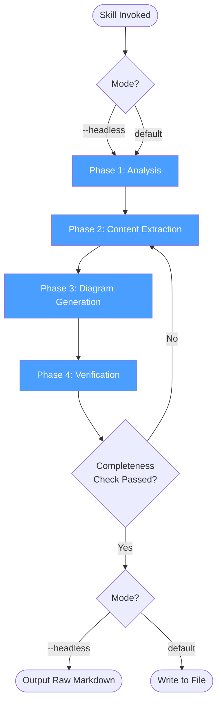
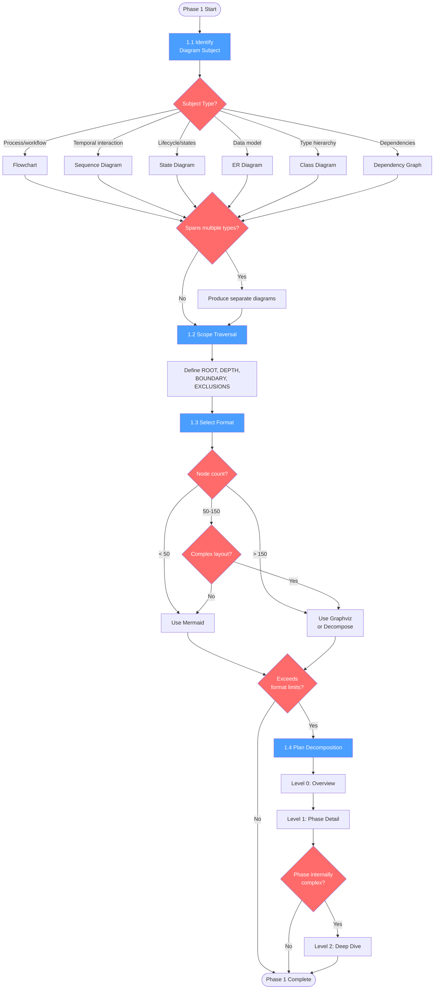
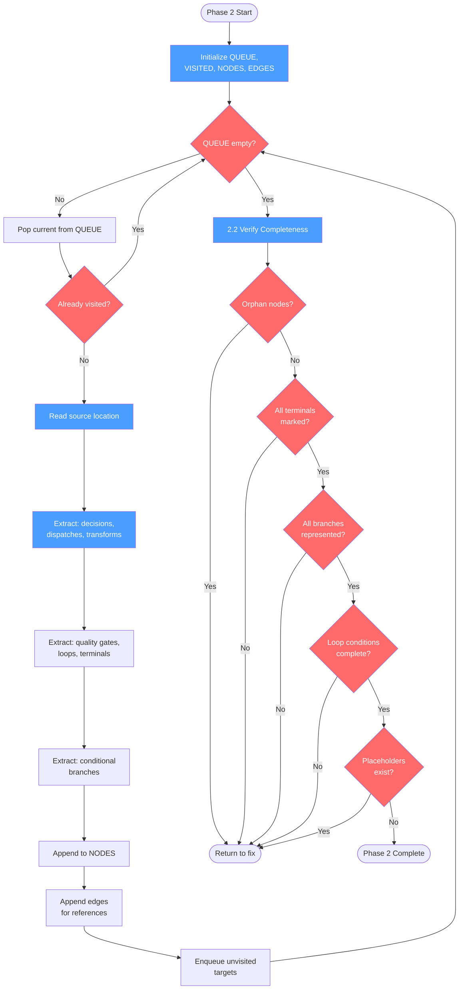
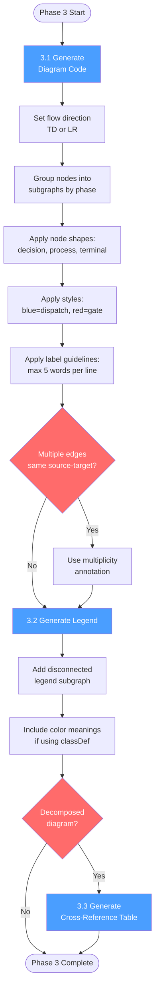
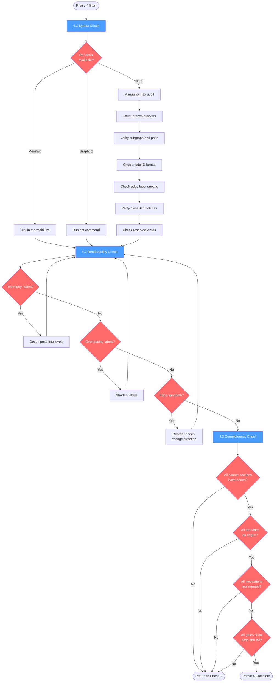
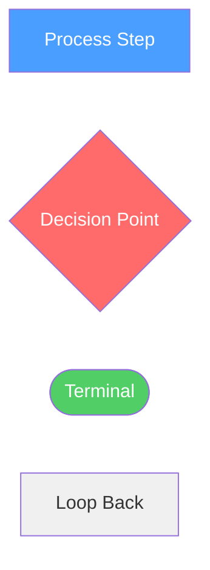

<!-- diagram-meta: {"source": "skills/generating-diagrams/SKILL.md", "source_hash": "sha256:4fafc3fbe817dcf922eefea67e81fdbfbeb9325f98c50416dfd391b60fc6aa0c", "generated_at": "2026-03-10T06:24:08Z", "generator": "generate_diagrams.py"} -->
# Diagram: generating-diagrams

## Overview

```mermaid
flowchart TD
    START([Skill Invoked]) --> MODE{Mode?}
    MODE -->|"--headless"| P1[Phase 1: Analysis]
    MODE -->|"default"| P1
    P1 --> P2[Phase 2: Content Extraction]
    P2 --> P3[Phase 3: Diagram Generation]
    P3 --> P4[Phase 4: Verification]
    P4 --> COMPLETE{Completeness<br>Check Passed?}
    COMPLETE -->|No| P2
    COMPLETE -->|Yes| OUTPUT{Mode?}
    OUTPUT -->|"--headless"| RAW([Output Raw Markdown])
    OUTPUT -->|"default"| WRITE([Write to File])

    style P1 fill:#4a9eff,color:#fff
    style P2 fill:#4a9eff,color:#fff
    style P3 fill:#4a9eff,color:#fff
    style P4 fill:#4a9eff,color:#fff
```

## Phase 1: Analysis

```mermaid
flowchart TD
    P1_START([Phase 1 Start]) --> SUBJ[1.1 Identify<br>Diagram Subject]
    SUBJ --> SUBJ_TYPE{Subject Type?}
    SUBJ_TYPE -->|"Process/workflow"| FC_FLOW[Flowchart]
    SUBJ_TYPE -->|"Temporal interaction"| FC_SEQ[Sequence Diagram]
    SUBJ_TYPE -->|"Lifecycle/states"| FC_STATE[State Diagram]
    SUBJ_TYPE -->|"Data model"| FC_ER[ER Diagram]
    SUBJ_TYPE -->|"Type hierarchy"| FC_CLASS[Class Diagram]
    SUBJ_TYPE -->|"Dependencies"| FC_DEP[Dependency Graph]
    FC_FLOW --> MULTI{Spans multiple types?}
    FC_SEQ --> MULTI
    FC_STATE --> MULTI
    FC_ER --> MULTI
    FC_CLASS --> MULTI
    FC_DEP --> MULTI
    MULTI -->|Yes| SEP[Produce separate diagrams]
    MULTI -->|No| SCOPE
    SEP --> SCOPE[1.2 Scope Traversal]
    SCOPE --> SCOPE_DEF[Define ROOT, DEPTH,<br>BOUNDARY, EXCLUSIONS]
    SCOPE_DEF --> FORMAT[1.3 Select Format]
    FORMAT --> FMT_DEC{Node count?}
    FMT_DEC -->|"< 50"| MERMAID[Use Mermaid]
    FMT_DEC -->|"50-150"| FMT_RISK{Complex layout?}
    FMT_DEC -->|"> 150"| GRAPHVIZ[Use Graphviz<br>or Decompose]
    FMT_RISK -->|Yes| GRAPHVIZ
    FMT_RISK -->|No| MERMAID
    MERMAID --> DECOMP{Exceeds<br>format limits?}
    GRAPHVIZ --> DECOMP
    DECOMP -->|No| P1_END([Phase 1 Complete])
    DECOMP -->|Yes| PLAN[1.4 Plan Decomposition]
    PLAN --> L0[Level 0: Overview]
    L0 --> L1[Level 1: Phase Detail]
    L1 --> L2_DEC{Phase internally<br>complex?}
    L2_DEC -->|Yes| L2[Level 2: Deep Dive]
    L2_DEC -->|No| P1_END
    L2 --> P1_END

    style SUBJ fill:#4a9eff,color:#fff
    style SCOPE fill:#4a9eff,color:#fff
    style FORMAT fill:#4a9eff,color:#fff
    style PLAN fill:#4a9eff,color:#fff
    classDef decision fill:#ff6b6b,color:#fff
    class SUBJ_TYPE,MULTI,FMT_DEC,FMT_RISK,DECOMP,L2_DEC decision
```

## Phase 2: Content Extraction

```mermaid
flowchart TD
    P2_START([Phase 2 Start]) --> INIT[Initialize QUEUE,<br>VISITED, NODES, EDGES]
    INIT --> LOOP{QUEUE empty?}
    LOOP -->|Yes| VERIFY[2.2 Verify Completeness]
    LOOP -->|No| POP[Pop current from QUEUE]
    POP --> VISITED_CHK{Already visited?}
    VISITED_CHK -->|Yes| LOOP
    VISITED_CHK -->|No| READ[Read source location]
    READ --> EXTRACT[Extract: decisions,<br>dispatches, transforms]
    EXTRACT --> EXTRACT2[Extract: quality gates,<br>loops, terminals]
    EXTRACT2 --> EXTRACT3[Extract: conditional<br>branches]
    EXTRACT3 --> ADD_NODE[Append to NODES]
    ADD_NODE --> ADD_EDGES[Append edges<br>for references]
    ADD_EDGES --> ENQUEUE[Enqueue unvisited<br>targets]
    ENQUEUE --> LOOP
    VERIFY --> CHK1{Orphan nodes?}
    CHK1 -->|Yes| FAIL([Return to fix])
    CHK1 -->|No| CHK2{All terminals<br>marked?}
    CHK2 -->|No| FAIL
    CHK2 -->|Yes| CHK3{All branches<br>represented?}
    CHK3 -->|No| FAIL
    CHK3 -->|Yes| CHK4{Loop conditions<br>complete?}
    CHK4 -->|No| FAIL
    CHK4 -->|Yes| CHK5{Placeholders<br>exist?}
    CHK5 -->|Yes| FAIL
    CHK5 -->|No| P2_END([Phase 2 Complete])

    style INIT fill:#4a9eff,color:#fff
    style READ fill:#4a9eff,color:#fff
    style EXTRACT fill:#4a9eff,color:#fff
    style VERIFY fill:#4a9eff,color:#fff
    classDef decision fill:#ff6b6b,color:#fff
    class LOOP,VISITED_CHK,CHK1,CHK2,CHK3,CHK4,CHK5 decision
```

## Phase 3: Diagram Generation

```mermaid
flowchart TD
    P3_START([Phase 3 Start]) --> GEN[3.1 Generate<br>Diagram Code]
    GEN --> APPLY_DIR[Set flow direction<br>TD or LR]
    APPLY_DIR --> GROUP[Group nodes into<br>subgraphs by phase]
    GROUP --> SHAPES[Apply node shapes:<br>decision, process, terminal]
    SHAPES --> STYLES[Apply styles:<br>blue=dispatch, red=gate]
    STYLES --> LABELS[Apply label guidelines:<br>max 5 words per line]
    LABELS --> MULT{Multiple edges<br>same source-target?}
    MULT -->|Yes| ANNOT[Use multiplicity<br>annotation]
    MULT -->|No| LEGEND
    ANNOT --> LEGEND[3.2 Generate Legend]
    LEGEND --> LEG_SUB[Add disconnected<br>legend subgraph]
    LEG_SUB --> LEG_COLOR[Include color meanings<br>if using classDef]
    LEG_COLOR --> XREF{Decomposed<br>diagram?}
    XREF -->|Yes| TABLE[3.3 Generate<br>Cross-Reference Table]
    XREF -->|No| P3_END([Phase 3 Complete])
    TABLE --> P3_END

    style GEN fill:#4a9eff,color:#fff
    style LEGEND fill:#4a9eff,color:#fff
    style TABLE fill:#4a9eff,color:#fff
    classDef decision fill:#ff6b6b,color:#fff
    class MULT,XREF decision
```

## Phase 4: Verification

```mermaid
flowchart TD
    P4_START([Phase 4 Start]) --> SYNTAX[4.1 Syntax Check]
    SYNTAX --> RENDER_AVAIL{Renderer<br>available?}
    RENDER_AVAIL -->|"Mermaid"| MERM_LIVE[Test in mermaid.live]
    RENDER_AVAIL -->|"Graphviz"| DOT_RUN[Run dot command]
    RENDER_AVAIL -->|"None"| MANUAL[Manual syntax audit]
    MANUAL --> BRACE[Count braces/brackets]
    BRACE --> SUB_END[Verify subgraph/end pairs]
    SUB_END --> NODE_ID[Check node ID format]
    NODE_ID --> EDGE_Q[Check edge label quoting]
    EDGE_Q --> CLASS_REF[Verify classDef matches]
    CLASS_REF --> RESERVED[Check reserved words]
    MERM_LIVE --> RENDER[4.2 Renderability Check]
    DOT_RUN --> RENDER
    RESERVED --> RENDER
    RENDER --> R_NODES{Too many nodes?}
    R_NODES -->|Yes| FIX_DECOMP[Decompose into levels]
    R_NODES -->|No| R_LABELS{Overlapping labels?}
    FIX_DECOMP --> RENDER
    R_LABELS -->|Yes| FIX_LABELS[Shorten labels]
    R_LABELS -->|No| R_EDGES{Edge spaghetti?}
    FIX_LABELS --> RENDER
    R_EDGES -->|Yes| FIX_EDGES[Reorder nodes,<br>change direction]
    R_EDGES -->|No| COMPLETE[4.3 Completeness Check]
    FIX_EDGES --> RENDER
    COMPLETE --> C1{All source sections<br>have nodes?}
    C1 -->|No| RETRAVERSE([Return to Phase 2])
    C1 -->|Yes| C2{All branches<br>as edges?}
    C2 -->|No| RETRAVERSE
    C2 -->|Yes| C3{All invocations<br>represented?}
    C3 -->|No| RETRAVERSE
    C3 -->|Yes| C4{All gates show<br>pass and fail?}
    C4 -->|No| RETRAVERSE
    C4 -->|Yes| P4_END([Phase 4 Complete])

    style SYNTAX fill:#4a9eff,color:#fff
    style RENDER fill:#4a9eff,color:#fff
    style COMPLETE fill:#4a9eff,color:#fff
    classDef decision fill:#ff6b6b,color:#fff
    class RENDER_AVAIL,R_NODES,R_LABELS,R_EDGES,C1,C2,C3,C4 decision
```

## Cross-Reference

| Overview Node | Detail Section | Source |
|---|---|---|
| P1 | Phase 1: Analysis | `skills/generating-diagrams/SKILL.md:47-99` |
| P2 | Phase 2: Content Extraction | `skills/generating-diagrams/SKILL.md:101-156` |
| P3 | Phase 3: Diagram Generation | `skills/generating-diagrams/SKILL.md:158-203` |
| P4 | Phase 4: Verification | `skills/generating-diagrams/SKILL.md:205-237` |

## Legend

```mermaid
flowchart LR
    L1[Process Step]
    L2{Decision Point}
    L3([Terminal])
    L4[Loop Back]
    style L1 fill:#4a9eff,color:#fff
    style L2 fill:#ff6b6b,color:#fff
    style L3 fill:#51cf66,color:#fff
    style L4 fill:#f0f0f0,color:#333
```
