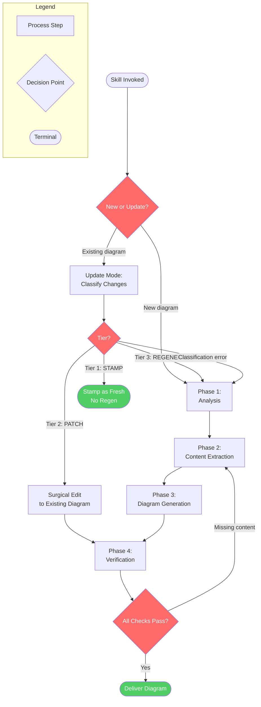
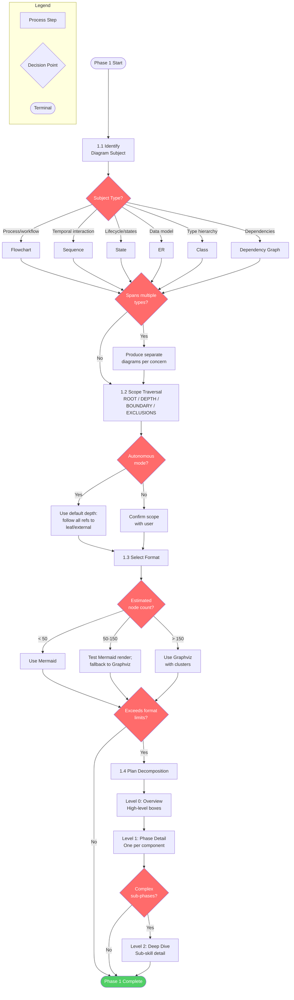
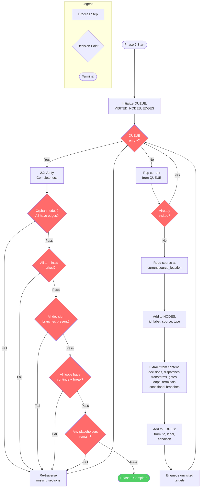
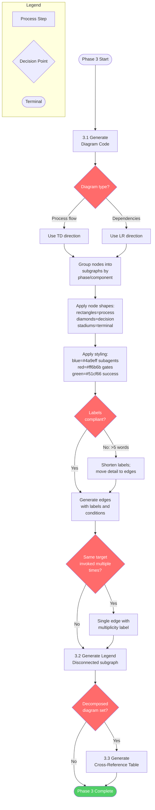
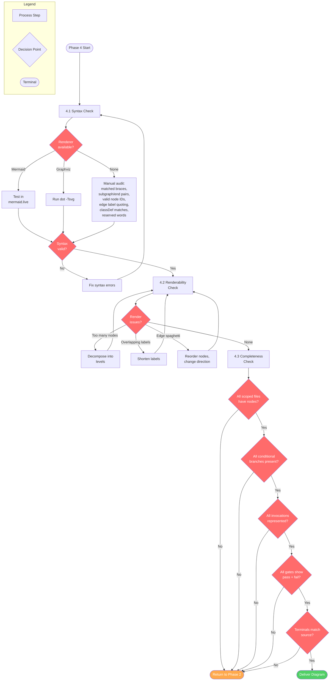
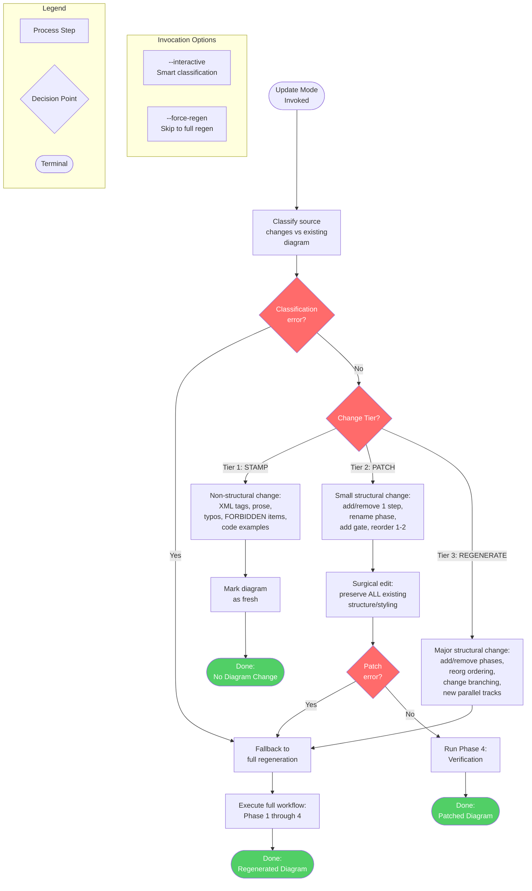

<!-- diagram-meta: {"source": "skills/generating-diagrams/SKILL.md","source_hash": "sha256:3daa551984375dcf4ae53c97e8692c92b58b97d768a87230aed0959b7a2ff821","generated_at": "2026-03-15T08:56:29Z","generator": "generate_diagrams.py"} -->
# Diagram: generating-diagrams

# Generating Diagrams - Skill Workflow Diagrams

## Overview Diagram

High-level flow showing the two entry paths (new generation vs update mode) and the four core phases.

```mermaid
flowchart TD
    START([Skill Invoked]) --> MODE{New or Update?}

    MODE -->|"New diagram"| P1[Phase 1:<br>Analysis]
    MODE -->|"Existing diagram"| UM[Update Mode:<br>Classify Changes]

    UM --> T1{Tier?}
    T1 -->|"Tier 1: STAMP"| STAMP([Stamp as Fresh<br>No Regen])
    T1 -->|"Tier 2: PATCH"| PATCH[Surgical Edit<br>to Existing Diagram]
    T1 -->|"Tier 3: REGENERATE"| P1
    T1 -->|"Classification error"| P1

    PATCH --> P4
    P1 --> P2[Phase 2:<br>Content Extraction]
    P2 --> P3[Phase 3:<br>Diagram Generation]
    P3 --> P4[Phase 4:<br>Verification]

    P4 --> VPASS{All Checks Pass?}
    VPASS -->|"Yes"| DONE([Deliver Diagram])
    VPASS -->|"Missing content"| P2

    subgraph Legend
        L1[Process Step]
        L2{Decision Point}
        L3([Terminal])
    end

    classDef gate fill:#ff6b6b,color:#fff
    classDef success fill:#51cf66,color:#fff

    class MODE,T1,VPASS gate
    class DONE,STAMP success
```

## Cross-Reference Table

| Node in Overview | Detail Diagram | Source Lines |
|-----------------|----------------|--------------|
| `P1` Phase 1 | Diagram 2: Analysis | SKILL.md:47-99 |
| `P2` Phase 2 | Diagram 3: Content Extraction | SKILL.md:101-156 |
| `P3` Phase 3 | Diagram 4: Diagram Generation | SKILL.md:158-203 |
| `P4` Phase 4 | Diagram 5: Verification | SKILL.md:205-237 |
| `UM` Update Mode | Diagram 6: Update Mode | SKILL.md:346-378 |

---

## Diagram 2: Phase 1 - Analysis

Steps 1.1 through 1.4: subject identification, scope definition, format selection, and optional decomposition planning.

```mermaid
flowchart TD
    P1_START([Phase 1 Start]) --> IDENT["1.1 Identify<br>Diagram Subject"]

    IDENT --> STYPE{Subject Type?}
    STYPE -->|"Process/workflow"| FMT_FC["Flowchart"]
    STYPE -->|"Temporal interaction"| FMT_SEQ["Sequence"]
    STYPE -->|"Lifecycle/states"| FMT_ST["State"]
    STYPE -->|"Data model"| FMT_ER["ER"]
    STYPE -->|"Type hierarchy"| FMT_CL["Class"]
    STYPE -->|"Dependencies"| FMT_DEP["Dependency Graph"]

    FMT_FC & FMT_SEQ & FMT_ST & FMT_ER & FMT_CL & FMT_DEP --> MULTI{Spans multiple<br>types?}
    MULTI -->|"Yes"| SEP["Produce separate<br>diagrams per concern"]
    MULTI -->|"No"| SCOPE

    SEP --> SCOPE["1.2 Scope Traversal<br>ROOT / DEPTH /<br>BOUNDARY / EXCLUSIONS"]

    SCOPE --> CONFIRM{Autonomous<br>mode?}
    CONFIRM -->|"Yes"| DEFAULT["Use default depth:<br>follow all refs to<br>leaf/external"]
    CONFIRM -->|"No"| ASK["Confirm scope<br>with user"]

    DEFAULT & ASK --> FORMAT["1.3 Select Format"]

    FORMAT --> NODES{Estimated<br>node count?}
    NODES -->|"< 50"| MERMAID["Use Mermaid"]
    NODES -->|"50-150"| TEST["Test Mermaid render;<br>fallback to Graphviz"]
    NODES -->|"> 150"| GRAPHVIZ["Use Graphviz<br>with clusters"]

    MERMAID & TEST & GRAPHVIZ --> DECOMP{Exceeds format<br>limits?}
    DECOMP -->|"No"| P1_END([Phase 1 Complete])
    DECOMP -->|"Yes"| PLAN["1.4 Plan Decomposition"]

    PLAN --> L0["Level 0: Overview<br>High-level boxes"]
    L0 --> L1D["Level 1: Phase Detail<br>One per component"]
    L1D --> L2{Complex<br>sub-phases?}
    L2 -->|"Yes"| L2D["Level 2: Deep Dive<br>Sub-skill detail"]
    L2 -->|"No"| P1_END

    L2D --> P1_END

    subgraph Legend
        LL1[Process Step]
        LL2{Decision Point}
        LL3([Terminal])
    end

    classDef gate fill:#ff6b6b,color:#fff
    classDef success fill:#51cf66,color:#fff

    class STYPE,MULTI,CONFIRM,NODES,DECOMP,L2 gate
    class P1_END success
```

---

## Diagram 3: Phase 2 - Content Extraction

The systematic traversal protocol (BFS queue) and completeness verification.

```mermaid
flowchart TD
    P2_START([Phase 2 Start]) --> INIT["Initialize QUEUE,<br>VISITED, NODES, EDGES"]

    INIT --> LOOP{QUEUE<br>empty?}
    LOOP -->|"Yes"| VERIFY["2.2 Verify<br>Completeness"]
    LOOP -->|"No"| POP["Pop current<br>from QUEUE"]

    POP --> SKIP{Already<br>visited?}
    SKIP -->|"Yes"| LOOP
    SKIP -->|"No"| READ["Read source at<br>current.source_location"]

    READ --> ADD_NODE["Add to NODES:<br>id, label, source, type"]

    ADD_NODE --> EXTRACT["Extract from content:<br>decisions, dispatches,<br>transforms, gates,<br>loops, terminals,<br>conditional branches"]

    EXTRACT --> ADD_EDGES["Add to EDGES:<br>from, to, label,<br>condition"]

    ADD_EDGES --> ENQUEUE["Enqueue unvisited<br>targets"]

    ENQUEUE --> LOOP

    VERIFY --> CHK_ORPHAN{Orphan nodes?<br>All have edges?}
    CHK_ORPHAN -->|"Fail"| FIX["Re-traverse<br>missing sections"]
    CHK_ORPHAN -->|"Pass"| CHK_TERM{All terminals<br>marked?}

    CHK_TERM -->|"Fail"| FIX
    CHK_TERM -->|"Pass"| CHK_BRANCH{All decision<br>branches present?}

    CHK_BRANCH -->|"Fail"| FIX
    CHK_BRANCH -->|"Pass"| CHK_LOOP{All loops have<br>continue + break?}

    CHK_LOOP -->|"Fail"| FIX
    CHK_LOOP -->|"Pass"| CHK_PLACEHOLDER{Any placeholders<br>remain?}

    CHK_PLACEHOLDER -->|"Fail"| FIX
    CHK_PLACEHOLDER -->|"Pass"| P2_END([Phase 2 Complete])

    FIX --> LOOP

    subgraph Legend
        LL1[Process Step]
        LL2{Decision Point}
        LL3([Terminal])
    end

    classDef gate fill:#ff6b6b,color:#fff
    classDef success fill:#51cf66,color:#fff

    class LOOP,SKIP,CHK_ORPHAN,CHK_TERM,CHK_BRANCH,CHK_LOOP,CHK_PLACEHOLDER gate
    class P2_END success
```

---

## Diagram 4: Phase 3 - Diagram Generation

Code generation, legend, and optional cross-reference table.

```mermaid
flowchart TD
    P3_START([Phase 3 Start]) --> GEN["3.1 Generate<br>Diagram Code"]

    GEN --> DIR{Diagram type?}
    DIR -->|"Process flow"| TD_DIR["Use TD direction"]
    DIR -->|"Dependencies"| LR_DIR["Use LR direction"]

    TD_DIR & LR_DIR --> GROUP["Group nodes into<br>subgraphs by<br>phase/component"]

    GROUP --> SHAPES["Apply node shapes:<br>rectangles=process<br>diamonds=decision<br>stadiums=terminal"]

    SHAPES --> STYLE["Apply styling:<br>blue=#4a9eff subagents<br>red=#ff6b6b gates<br>green=#51cf66 success"]

    STYLE --> LABELS{Labels<br>compliant?}
    LABELS -->|"No: >5 words"| SHORTEN["Shorten labels;<br>move detail to edges"]
    LABELS -->|"Yes"| EDGES

    SHORTEN --> EDGES["Generate edges<br>with labels and<br>conditions"]

    EDGES --> MULT{Same target<br>invoked multiple<br>times?}
    MULT -->|"Yes"| SINGLE_EDGE["Single edge with<br>multiplicity label"]
    MULT -->|"No"| LEGEND

    SINGLE_EDGE --> LEGEND["3.2 Generate Legend<br>Disconnected subgraph"]

    LEGEND --> DECOMPOSED{Decomposed<br>diagram set?}
    DECOMPOSED -->|"Yes"| XREF["3.3 Generate<br>Cross-Reference Table"]
    DECOMPOSED -->|"No"| P3_END([Phase 3 Complete])

    XREF --> P3_END

    subgraph Legend
        LL1[Process Step]
        LL2{Decision Point}
        LL3([Terminal])
    end

    classDef gate fill:#ff6b6b,color:#fff
    classDef success fill:#51cf66,color:#fff

    class DIR,LABELS,MULT,DECOMPOSED gate
    class P3_END success
```

---

## Diagram 5: Phase 4 - Verification

Syntax, renderability, and completeness verification with return-to-Phase-2 on failure.

```mermaid
flowchart TD
    P4_START([Phase 4 Start]) --> SYNTAX["4.1 Syntax Check"]

    SYNTAX --> RENDERER{Renderer<br>available?}
    RENDERER -->|"Mermaid"| MLIVE["Test in<br>mermaid.live"]
    RENDERER -->|"Graphviz"| DOT["Run dot -Tsvg"]
    RENDERER -->|"None"| MANUAL["Manual audit:<br>matched braces,<br>subgraph/end pairs,<br>valid node IDs,<br>edge label quoting,<br>classDef matches,<br>reserved words"]

    MLIVE & DOT & MANUAL --> SYN_PASS{Syntax<br>valid?}
    SYN_PASS -->|"No"| SYN_FIX["Fix syntax errors"]
    SYN_FIX --> SYNTAX
    SYN_PASS -->|"Yes"| RENDER["4.2 Renderability<br>Check"]

    RENDER --> R_ISSUES{Render<br>issues?}
    R_ISSUES -->|"Too many nodes"| DECOMPOSE["Decompose into<br>levels"]
    R_ISSUES -->|"Overlapping labels"| SHORTEN["Shorten labels"]
    R_ISSUES -->|"Edge spaghetti"| REORDER["Reorder nodes,<br>change direction"]
    R_ISSUES -->|"None"| COMPLETE

    DECOMPOSE & SHORTEN & REORDER --> RENDER

    COMPLETE["4.3 Completeness<br>Check"] --> C1{All scoped files<br>have nodes?}
    C1 -->|"No"| RETRACE([Return to Phase 2])
    C1 -->|"Yes"| C2{All conditional<br>branches present?}

    C2 -->|"No"| RETRACE
    C2 -->|"Yes"| C3{All invocations<br>represented?}

    C3 -->|"No"| RETRACE
    C3 -->|"Yes"| C4{All gates show<br>pass + fail?}

    C4 -->|"No"| RETRACE
    C4 -->|"Yes"| C5{Terminals match<br>source?}

    C5 -->|"No"| RETRACE
    C5 -->|"Yes"| P4_END([Deliver Diagram])

    subgraph Legend
        LL1[Process Step]
        LL2{Decision Point}
        LL3([Terminal])
    end

    classDef gate fill:#ff6b6b,color:#fff
    classDef success fill:#51cf66,color:#fff
    classDef warn fill:#ffa94d,color:#fff

    class RENDERER,SYN_PASS,R_ISSUES,C1,C2,C3,C4,C5 gate
    class P4_END success
    class RETRACE warn
```

---

## Diagram 6: Update Mode

Change classification and tier routing. Default path when updating existing diagrams.

```mermaid
flowchart TD
    UM_START([Update Mode<br>Invoked]) --> CLASSIFY["Classify source<br>changes vs existing<br>diagram"]

    CLASSIFY --> CERR{Classification<br>error?}
    CERR -->|"Yes"| FALLBACK["Fallback to<br>full regeneration"]
    CERR -->|"No"| TIER{Change Tier?}

    TIER -->|"Tier 1: STAMP"| STAMP_CHK["Non-structural change:<br>XML tags, prose,<br>typos, FORBIDDEN items,<br>code examples"]
    TIER -->|"Tier 2: PATCH"| PATCH_CHK["Small structural change:<br>add/remove 1 step,<br>rename phase,<br>add gate, reorder 1-2"]
    TIER -->|"Tier 3: REGENERATE"| REGEN_CHK["Major structural change:<br>add/remove phases,<br>reorg ordering,<br>change branching,<br>new parallel tracks"]

    STAMP_CHK --> STAMP_DO["Mark diagram<br>as fresh"]
    STAMP_DO --> UM_END([Done:<br>No Diagram Change])

    PATCH_CHK --> PATCH_DO["Surgical edit:<br>preserve ALL existing<br>structure/styling"]
    PATCH_DO --> PATCH_ERR{Patch<br>error?}
    PATCH_ERR -->|"Yes"| FALLBACK
    PATCH_ERR -->|"No"| VERIFY["Run Phase 4:<br>Verification"]
    VERIFY --> UM_DONE([Done:<br>Patched Diagram])

    REGEN_CHK --> FALLBACK
    FALLBACK --> FULL["Execute full workflow:<br>Phase 1 through 4"]
    FULL --> UM_REGEN([Done:<br>Regenerated Diagram])

    subgraph "Invocation Options"
        INV1["--interactive<br>Smart classification"]
        INV2["--force-regen<br>Skip to full regen"]
    end

    subgraph Legend
        LL1[Process Step]
        LL2{Decision Point}
        LL3([Terminal])
    end

    classDef gate fill:#ff6b6b,color:#fff
    classDef success fill:#51cf66,color:#fff

    class CERR,TIER,PATCH_ERR gate
    class UM_END,UM_DONE,UM_REGEN success
```
