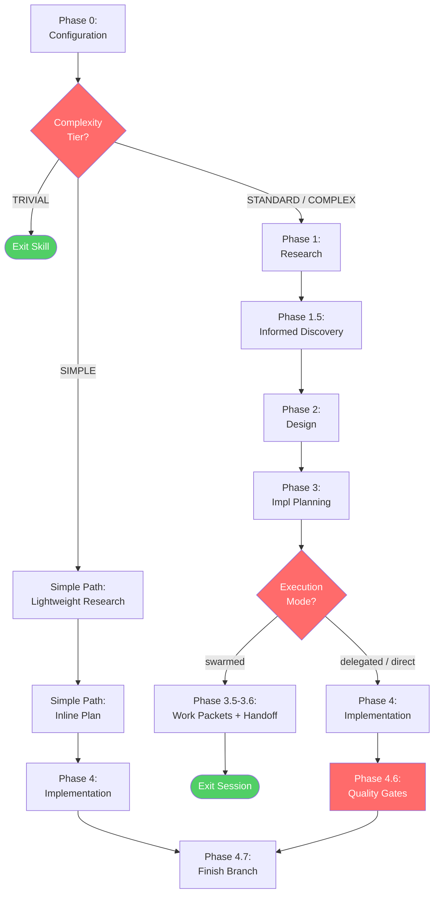
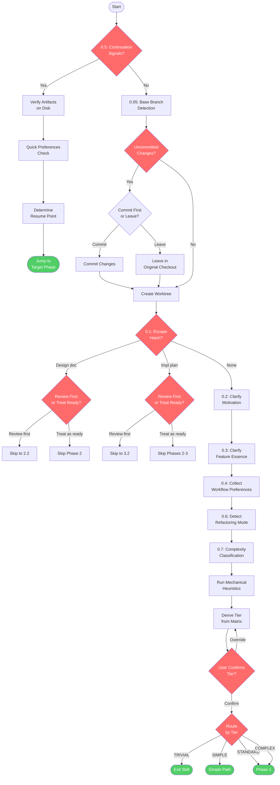
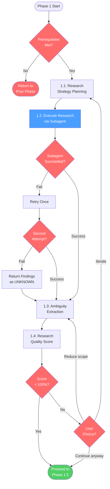
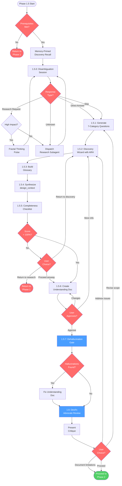
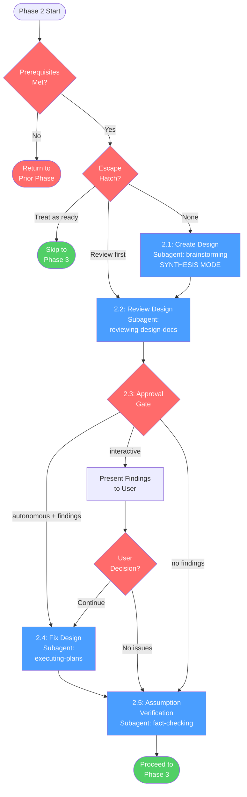
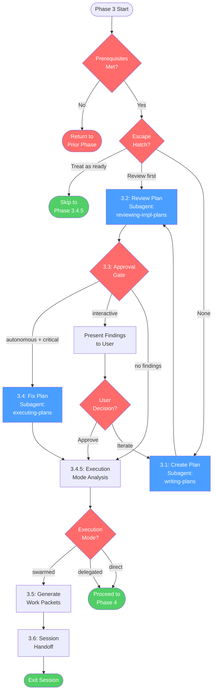
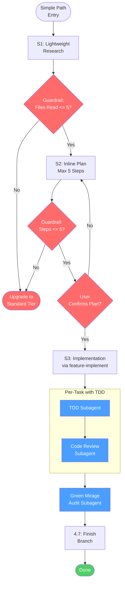
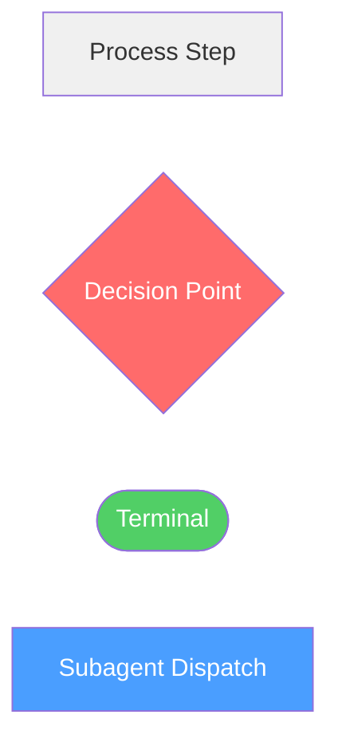

<!-- diagram-meta: {"source": "skills/implementing-features/SKILL.md", "source_hash": "sha256:1932468747153b8f00a44de1159baf29c8c13939e0cf028c047ce0311c15142d", "generated_at": "2026-03-10T06:26:28Z", "generator": "generate_diagrams.py"} -->
# Diagram: implementing-features

Now I have enough source material to generate the diagrams. Let me produce the headless output.

## Overview

```mermaid
flowchart TD
    P0[Phase 0:<br/>Configuration] --> P0_ROUTE{Complexity<br/>Tier?}
    P0_ROUTE -->|TRIVIAL| EXIT_TRIV([Exit Skill])
    P0_ROUTE -->|SIMPLE| S1[Simple Path:<br/>Lightweight Research]
    P0_ROUTE -->|STANDARD / COMPLEX| P1[Phase 1:<br/>Research]

    S1 --> S2[Simple Path:<br/>Inline Plan]
    S2 --> P4_SIMPLE[Phase 4:<br/>Implementation]
    P4_SIMPLE --> P47[Phase 4.7:<br/>Finish Branch]

    P1 --> P15[Phase 1.5:<br/>Informed Discovery]
    P15 --> P2[Phase 2:<br/>Design]
    P2 --> P3[Phase 3:<br/>Impl Planning]
    P3 --> P3_ROUTE{Execution<br/>Mode?}
    P3_ROUTE -->|swarmed| P35[Phase 3.5-3.6:<br/>Work Packets + Handoff]
    P35 --> EXIT_SWARM([Exit Session])
    P3_ROUTE -->|delegated / direct| P4[Phase 4:<br/>Implementation]
    P4 --> P46[Phase 4.6:<br/>Quality Gates]
    P46 --> P47

    style EXIT_TRIV fill:#51cf66,color:#fff
    style EXIT_SWARM fill:#51cf66,color:#fff
    style P0_ROUTE fill:#ff6b6b,color:#fff
    style P3_ROUTE fill:#ff6b6b,color:#fff
    style P46 fill:#ff6b6b,color:#fff
```

## Phase 0: Configuration

```mermaid
flowchart TD
    START([Start]) --> P05{0.5: Continuation<br/>Signals?}
    P05 -->|Yes| VERIFY_ART[Verify Artifacts<br/>on Disk]
    VERIFY_ART --> QUICK_PREFS[Quick Preferences<br/>Check]
    QUICK_PREFS --> RESUME_PT[Determine<br/>Resume Point]
    RESUME_PT --> JUMP([Jump to<br/>Target Phase])

    P05 -->|No| P005[0.05: Base Branch<br/>Detection]
    P005 --> P005_DIRTY{Uncommitted<br/>Changes?}
    P005_DIRTY -->|Yes| P005_ASK{Commit First<br/>or Leave?}
    P005_ASK -->|Commit| P005_COMMIT[Commit Changes]
    P005_ASK -->|Leave| P005_LEAVE[Leave in<br/>Original Checkout]
    P005_COMMIT --> P005_WT[Create Worktree]
    P005_LEAVE --> P005_WT
    P005_DIRTY -->|No| P005_WT

    P005_WT --> P01{0.1: Escape<br/>Hatch?}
    P01 -->|Design doc| ESC_D{Review First<br/>or Treat Ready?}
    ESC_D -->|Review first| ESC_D_REV[Skip to 2.2]
    ESC_D -->|Treat as ready| ESC_D_SKIP[Skip Phase 2]
    P01 -->|Impl plan| ESC_I{Review First<br/>or Treat Ready?}
    ESC_I -->|Review first| ESC_I_REV[Skip to 3.2]
    ESC_I -->|Treat as ready| ESC_I_SKIP[Skip Phases 2-3]
    P01 -->|None| P02[0.2: Clarify<br/>Motivation]
    P02 --> P03[0.3: Clarify<br/>Feature Essence]
    P03 --> P04[0.4: Collect<br/>Workflow Preferences]
    P04 --> P06[0.6: Detect<br/>Refactoring Mode]
    P06 --> P07[0.7: Complexity<br/>Classification]
    P07 --> HEURISTICS[Run Mechanical<br/>Heuristics]
    HEURISTICS --> DERIVE[Derive Tier<br/>from Matrix]
    DERIVE --> CONFIRM{User Confirms<br/>Tier?}
    CONFIRM -->|Confirm| ROUTE{Route<br/>by Tier}
    CONFIRM -->|Override| DERIVE

    ROUTE -->|TRIVIAL| EXIT_T([Exit Skill])
    ROUTE -->|SIMPLE| SIMPLE_PATH([Simple Path])
    ROUTE -->|STANDARD| RESEARCH([Phase 1])
    ROUTE -->|COMPLEX| RESEARCH

    style P05 fill:#ff6b6b,color:#fff
    style P01 fill:#ff6b6b,color:#fff
    style ESC_D fill:#ff6b6b,color:#fff
    style ESC_I fill:#ff6b6b,color:#fff
    style CONFIRM fill:#ff6b6b,color:#fff
    style ROUTE fill:#ff6b6b,color:#fff
    style P005_DIRTY fill:#ff6b6b,color:#fff
    style EXIT_T fill:#51cf66,color:#fff
    style JUMP fill:#51cf66,color:#fff
    style SIMPLE_PATH fill:#51cf66,color:#fff
    style RESEARCH fill:#51cf66,color:#fff
```

## Phase 1: Research

```mermaid
flowchart TD
    START([Phase 1 Start]) --> PREREQ{Prerequisites<br/>Met?}
    PREREQ -->|No| STOP([Return to<br/>Prior Phase])
    PREREQ -->|Yes| P11[1.1: Research<br/>Strategy Planning]
    P11 --> P12[1.2: Execute Research<br/>via Subagent]
    P12 --> P12_RESULT{Subagent<br/>Succeeded?}
    P12_RESULT -->|Fail| P12_RETRY[Retry Once]
    P12_RETRY --> P12_RESULT2{Second<br/>Attempt?}
    P12_RESULT2 -->|Fail| P12_UNKNOWN[Return Findings<br/>as UNKNOWN]
    P12_RESULT2 -->|Success| P13
    P12_RESULT -->|Success| P13[1.3: Ambiguity<br/>Extraction]
    P12_UNKNOWN --> P13

    P13 --> P14[1.4: Research<br/>Quality Score]
    P14 --> GATE{Score<br/>= 100%?}
    GATE -->|Yes| DONE([Proceed to<br/>Phase 1.5])
    GATE -->|No| GATE_OPT{User<br/>Choice?}
    GATE_OPT -->|Continue anyway| DONE
    GATE_OPT -->|Iterate| P11
    GATE_OPT -->|Reduce scope| P13

    style PREREQ fill:#ff6b6b,color:#fff
    style GATE fill:#ff6b6b,color:#fff
    style GATE_OPT fill:#ff6b6b,color:#fff
    style P12_RESULT fill:#ff6b6b,color:#fff
    style P12_RESULT2 fill:#ff6b6b,color:#fff
    style STOP fill:#ff6b6b,color:#fff
    style DONE fill:#51cf66,color:#fff
    style P12 fill:#4a9eff,color:#fff
```

## Phase 1.5: Informed Discovery

```mermaid
flowchart TD
    START([Phase 1.5 Start]) --> PREREQ{Prerequisites<br/>Met?}
    PREREQ -->|No| STOP([Return to<br/>Phase 1])
    PREREQ -->|Yes| MEMORY[Memory-Primed<br/>Discovery Recall]
    MEMORY --> P150[1.5.0: Disambiguation<br/>Session]
    P150 --> ARH_D{Response<br/>Type?}
    ARH_D -->|Direct Answer| P151
    ARH_D -->|Research Request| FRAC{High Impact?}
    FRAC -->|Yes| FRACTAL[Fractal Thinking<br/>Pulse]
    FRAC -->|No| SUB_RESEARCH[Dispatch<br/>Research Subagent]
    FRACTAL --> P150
    SUB_RESEARCH --> P150
    ARH_D -->|Unknown| SUB_RESEARCH
    ARH_D -->|Skip| P151

    P151[1.5.1: Generate<br/>7-Category Questions] --> P152[1.5.2: Discovery<br/>Wizard with ARH]
    P152 --> P153[1.5.3: Build<br/>Glossary]
    P153 --> P154[1.5.4: Synthesize<br/>design_context]
    P154 --> P155[1.5.5: Completeness<br/>Checklist]
    P155 --> COMP_GATE{Score<br/>= 100%?}
    COMP_GATE -->|No| COMP_OPT{User<br/>Choice?}
    COMP_OPT -->|Return to discovery| P152
    COMP_OPT -->|Return to research| STOP_R([Return to<br/>Phase 1])
    COMP_OPT -->|Proceed anyway| P156
    COMP_GATE -->|Yes| P156[1.5.6: Create<br/>Understanding Doc]
    P156 --> USER_APP{User<br/>Approves?}
    USER_APP -->|Approve| P157[1.5.7: Dehallucination<br/>Gate]
    USER_APP -->|Changes| P156
    USER_APP -->|More info| P152

    P157 --> DEHAL{Hallucinations<br/>Found?}
    DEHAL -->|Yes| FIX_DOC[Fix Understanding<br/>Doc] --> P16
    DEHAL -->|No| P16[1.6: Devil's<br/>Advocate Review]
    P16 --> DA_RESULT[Present<br/>Critique]
    DA_RESULT --> DA_OPT{User<br/>Choice?}
    DA_OPT -->|Address issues| P152
    DA_OPT -->|Document limitations| DONE
    DA_OPT -->|Revise scope| P151
    DA_OPT -->|Proceed| DONE([Proceed to<br/>Phase 2])

    style PREREQ fill:#ff6b6b,color:#fff
    style COMP_GATE fill:#ff6b6b,color:#fff
    style USER_APP fill:#ff6b6b,color:#fff
    style DEHAL fill:#ff6b6b,color:#fff
    style ARH_D fill:#ff6b6b,color:#fff
    style DA_OPT fill:#ff6b6b,color:#fff
    style COMP_OPT fill:#ff6b6b,color:#fff
    style STOP fill:#ff6b6b,color:#fff
    style STOP_R fill:#ff6b6b,color:#fff
    style DONE fill:#51cf66,color:#fff
    style P157 fill:#4a9eff,color:#fff
    style P16 fill:#4a9eff,color:#fff
```

## Phase 2: Design

```mermaid
flowchart TD
    START([Phase 2 Start]) --> PREREQ{Prerequisites<br/>Met?}
    PREREQ -->|No| STOP([Return to<br/>Prior Phase])
    PREREQ -->|Yes| ESC{Escape<br/>Hatch?}
    ESC -->|Treat as ready| SKIP([Skip to<br/>Phase 3])
    ESC -->|Review first| P22
    ESC -->|None| P21[2.1: Create Design<br/>Subagent: brainstorming<br/>SYNTHESIS MODE]
    P21 --> P22[2.2: Review Design<br/>Subagent:<br/>reviewing-design-docs]
    P22 --> P23{2.3: Approval<br/>Gate}
    P23 -->|autonomous + findings| P24[2.4: Fix Design<br/>Subagent:<br/>executing-plans]
    P24 --> P25
    P23 -->|interactive| PRESENT[Present Findings<br/>to User]
    PRESENT --> USER_D{User<br/>Decision?}
    USER_D -->|Continue| P24
    USER_D -->|No issues| P25
    P23 -->|no findings| P25[2.5: Assumption<br/>Verification<br/>Subagent: fact-checking]
    P25 --> DONE([Proceed to<br/>Phase 3])

    style PREREQ fill:#ff6b6b,color:#fff
    style ESC fill:#ff6b6b,color:#fff
    style P23 fill:#ff6b6b,color:#fff
    style USER_D fill:#ff6b6b,color:#fff
    style STOP fill:#ff6b6b,color:#fff
    style DONE fill:#51cf66,color:#fff
    style SKIP fill:#51cf66,color:#fff
    style P21 fill:#4a9eff,color:#fff
    style P22 fill:#4a9eff,color:#fff
    style P24 fill:#4a9eff,color:#fff
    style P25 fill:#4a9eff,color:#fff
```

## Phase 3: Implementation Planning

```mermaid
flowchart TD
    START([Phase 3 Start]) --> PREREQ{Prerequisites<br/>Met?}
    PREREQ -->|No| STOP([Return to<br/>Prior Phase])
    PREREQ -->|Yes| ESC{Escape<br/>Hatch?}
    ESC -->|Treat as ready| SKIP_34([Skip to<br/>Phase 3.4.5])
    ESC -->|Review first| P32
    ESC -->|None| P31[3.1: Create Plan<br/>Subagent:<br/>writing-plans]
    P31 --> P32[3.2: Review Plan<br/>Subagent:<br/>reviewing-impl-plans]
    P32 --> P33{3.3: Approval<br/>Gate}
    P33 -->|autonomous + critical| P34[3.4: Fix Plan<br/>Subagent:<br/>executing-plans]
    P34 --> P345
    P33 -->|interactive| PRESENT[Present Findings<br/>to User]
    PRESENT --> USER_P{User<br/>Decision?}
    USER_P -->|Approve| P345
    USER_P -->|Iterate| P31
    P33 -->|no findings| P345[3.4.5: Execution<br/>Mode Analysis]

    P345 --> MODE{Execution<br/>Mode?}
    MODE -->|swarmed| P35[3.5: Generate<br/>Work Packets]
    P35 --> P36[3.6: Session<br/>Handoff]
    P36 --> EXIT_S([Exit Session])

    MODE -->|delegated| PHASE4([Proceed to<br/>Phase 4])
    MODE -->|direct| PHASE4

    style PREREQ fill:#ff6b6b,color:#fff
    style ESC fill:#ff6b6b,color:#fff
    style P33 fill:#ff6b6b,color:#fff
    style MODE fill:#ff6b6b,color:#fff
    style USER_P fill:#ff6b6b,color:#fff
    style STOP fill:#ff6b6b,color:#fff
    style EXIT_S fill:#51cf66,color:#fff
    style PHASE4 fill:#51cf66,color:#fff
    style SKIP_34 fill:#51cf66,color:#fff
    style P31 fill:#4a9eff,color:#fff
    style P32 fill:#4a9eff,color:#fff
    style P34 fill:#4a9eff,color:#fff
```

## Phase 4: Implementation

```mermaid
flowchart TD
    START([Phase 4 Start]) --> P41[4.1: Setup<br/>Worktree]
    P41 --> P42[4.2: Execute<br/>Implementation Plan]
    P42 --> WT_TYPE{Worktree<br/>Strategy?}
    WT_TYPE -->|per_parallel_track| PAR_EXEC[Execute Tracks<br/>in Parallel Worktrees]
    PAR_EXEC --> P425[4.2.5: Smart Merge<br/>Subagent:<br/>merging-worktrees]
    P425 --> TASK_LOOP
    WT_TYPE -->|single / none| TASK_LOOP

    subgraph TASK_LOOP [Per-Task Loop]
        direction TB
        T43[4.3: TDD Subagent:<br/>test-driven-development] --> T44[4.4: Completion<br/>Verification Subagent]
        T44 --> T44_GATE{All Items<br/>Complete?}
        T44_GATE -->|No| T43
        T44_GATE -->|Yes| T45[4.5: Code Review<br/>Subagent:<br/>requesting-code-review]
        T45 --> T451[4.5.1: Fact-Check<br/>Subagent:<br/>fact-checking]
        T451 --> T_NEXT{More<br/>Tasks?}
        T_NEXT -->|Yes| T43
    end

    T_NEXT -->|No| P461[4.6.1: Comprehensive<br/>Impl Audit Subagent]
    P461 --> P461_GATE{Blocking<br/>Issues?}
    P461_GATE -->|Yes| P461_FIX[Fix Issues] --> P461
    P461_GATE -->|No| P462[4.6.2: Run Full<br/>Test Suite]
    P462 --> P462_GATE{Tests<br/>Pass?}
    P462_GATE -->|No| P462_DEBUG[Debug Subagent:<br/>systematic-debugging] --> P462
    P462_GATE -->|Yes| P463[4.6.3: Green Mirage<br/>Audit Subagent:<br/>audit-green-mirage]
    P463 --> P463_GATE{Issues<br/>Found?}
    P463_GATE -->|Yes| P463_FIX[Fix Tests] --> P463
    P463_GATE -->|No| P464[4.6.4: Comprehensive<br/>Fact-Check Subagent]
    P464 --> P465[4.6.5: Pre-PR<br/>Fact-Check Subagent]
    P465 --> P47{4.7: Post-Impl<br/>Preference?}
    P47 -->|offer_options| P47_FINISH[Subagent:<br/>finishing-branch]
    P47 -->|auto_pr| P47_PR[Push + Create PR]
    P47 -->|stop| P47_STOP[Announce Complete]
    P47_FINISH --> DONE([Done])
    P47_PR --> DONE
    P47_STOP --> DONE

    style T44_GATE fill:#ff6b6b,color:#fff
    style T_NEXT fill:#ff6b6b,color:#fff
    style P461_GATE fill:#ff6b6b,color:#fff
    style P462_GATE fill:#ff6b6b,color:#fff
    style P463_GATE fill:#ff6b6b,color:#fff
    style P47 fill:#ff6b6b,color:#fff
    style WT_TYPE fill:#ff6b6b,color:#fff
    style DONE fill:#51cf66,color:#fff
    style T43 fill:#4a9eff,color:#fff
    style T44 fill:#4a9eff,color:#fff
    style T45 fill:#4a9eff,color:#fff
    style T451 fill:#4a9eff,color:#fff
    style P461 fill:#4a9eff,color:#fff
    style P462_DEBUG fill:#4a9eff,color:#fff
    style P463 fill:#4a9eff,color:#fff
    style P464 fill:#4a9eff,color:#fff
    style P465 fill:#4a9eff,color:#fff
    style P47_FINISH fill:#4a9eff,color:#fff
    style P425 fill:#4a9eff,color:#fff
```

## Simple Path

```mermaid
flowchart TD
    START([Simple Path<br/>Entry]) --> S1[S1: Lightweight<br/>Research]
    S1 --> S1_GUARD{Guardrail:<br/>Files Read <= 5?}
    S1_GUARD -->|No| UPGRADE([Upgrade to<br/>Standard Tier])
    S1_GUARD -->|Yes| S2[S2: Inline Plan<br/>Max 5 Steps]
    S2 --> S2_GUARD{Guardrail:<br/>Steps <= 5?}
    S2_GUARD -->|No| UPGRADE
    S2_GUARD -->|Yes| S2_CONFIRM{User<br/>Confirms Plan?}
    S2_CONFIRM -->|No| S2
    S2_CONFIRM -->|Yes| S3[S3: Implementation<br/>via feature-implement]

    subgraph S3_LOOP [Per-Task with TDD]
        direction TB
        S_TDD[TDD Subagent] --> S_REVIEW[Code Review<br/>Subagent]
    end

    S3 --> S3_LOOP
    S3_LOOP --> S_MIRAGE[Green Mirage<br/>Audit Subagent]
    S_MIRAGE --> S_FINISH[4.7: Finish<br/>Branch]
    S_FINISH --> DONE([Done])

    style S1_GUARD fill:#ff6b6b,color:#fff
    style S2_GUARD fill:#ff6b6b,color:#fff
    style S2_CONFIRM fill:#ff6b6b,color:#fff
    style UPGRADE fill:#ff6b6b,color:#fff
    style DONE fill:#51cf66,color:#fff
    style S_TDD fill:#4a9eff,color:#fff
    style S_REVIEW fill:#4a9eff,color:#fff
    style S_MIRAGE fill:#4a9eff,color:#fff
```

## Cross-Reference

| Overview Node | Detail Section | Source |
|---|---|---|
| Phase 0: Configuration | Phase 0: Configuration | `commands/feature-config.md` |
| Phase 1: Research | Phase 1: Research | `commands/feature-research.md` |
| Phase 1.5: Informed Discovery | Phase 1.5: Informed Discovery | `commands/feature-discover.md` |
| Phase 2: Design | Phase 2: Design | `commands/feature-design.md` |
| Phase 3: Impl Planning | Phase 3: Implementation Planning | `commands/feature-implement.md` |
| Phase 4: Implementation | Phase 4: Implementation | `commands/feature-implement.md` |
| Simple Path | Simple Path | `skills/implementing-features/SKILL.md:503-507` |

## Subagent Dispatch Map

| Phase | Step | Skill Invoked | Source |
|---|---|---|---|
| 1.2 | Research | explore agent | `commands/feature-research.md:79-126` |
| 1.5.7 | Dehallucination Gate | dehallucination | `skills/implementing-features/SKILL.md:126-135` |
| 1.6 | Devil's Advocate | devils-advocate | `commands/feature-discover.md:529-543` |
| 2.1 | Design Creation | brainstorming (SYNTHESIS) | `commands/feature-design.md:67-97` |
| 2.2 | Design Review | reviewing-design-docs | `commands/feature-design.md:103-117` |
| 2.4 | Fix Design | executing-plans | `commands/feature-design.md:164-190` |
| 2.5 | Assumption Verification | fact-checking | `skills/implementing-features/SKILL.md:154-162` |
| 3.1 | Plan Creation | writing-plans | `commands/feature-implement.md:70-87` |
| 3.2 | Plan Review | reviewing-impl-plans | `commands/feature-implement.md:91-106` |
| 3.4 | Fix Plan | executing-plans | `commands/feature-implement.md:113-115` |
| 4.1 | Setup Worktree | using-git-worktrees | `commands/feature-implement.md:427-442` |
| 4.2.5 | Smart Merge | merging-worktrees | `commands/feature-implement.md:504-526` |
| 4.3 | Per-Task TDD | test-driven-development | `commands/feature-implement.md:528-567` |
| 4.4 | Completion Verification | inline audit prompt | `commands/feature-implement.md:569-648` |
| 4.5 | Per-Task Review | requesting-code-review | `commands/feature-implement.md:663-682` |
| 4.5.1 | Per-Task Fact-Check | fact-checking | `commands/feature-implement.md:692-709` |
| 4.6.1 | Comprehensive Audit | inline audit prompt | `commands/feature-implement.md:717-827` |
| 4.6.2 | Debug Test Failures | systematic-debugging | `commands/feature-implement.md:834-844` |
| 4.6.3 | Green Mirage Audit | audit-green-mirage | `commands/feature-implement.md:846-873` |
| 4.6.4 | Comprehensive Fact-Check | fact-checking | `commands/feature-implement.md:877-897` |
| 4.6.5 | Pre-PR Fact-Check | fact-checking | `commands/feature-implement.md:901-918` |
| 4.7 | Finish Branch | finishing-a-development-branch | `commands/feature-implement.md:920-939` |

## Legend

```mermaid
flowchart LR
    L1[Process Step]
    L2{Decision Point}
    L3([Terminal])
    L4[Subagent Dispatch]
    style L1 fill:#f0f0f0,color:#333
    style L2 fill:#ff6b6b,color:#fff
    style L3 fill:#51cf66,color:#fff
    style L4 fill:#4a9eff,color:#fff
```
