<!-- diagram-meta: {"source": "skills/implementing-features/SKILL.md", "source_hash": "sha256:45310e5e97a22420f93dc19dd07b6dc387eb1d59a623bd0598acafa1dfe25bfa", "generated_at": "2026-02-20T00:13:23Z", "generator": "generate_diagrams.py"} -->
# Diagram: implementing-features

Overview of the implementing-features skill workflow, which orchestrates complete feature implementation through 5 phases: Configuration (Phase 0), Research (Phase 1), Informed Discovery (Phase 1.5), Design (Phase 2), Implementation Planning (Phase 3), and Execution (Phase 4). Includes a Simple Path shortcut and escape hatch routing for pre-existing artifacts.

```mermaid
flowchart TD
    START([User Request]) --> P0_1

    subgraph P0["Phase 0: Configuration Wizard"]
        P0_1["0.1: Escape Hatch Detection"]
        P0_2["0.2: Motivation (WHY)"]
        P0_3["0.3: Feature Clarity (WHAT)"]
        P0_4["0.4: Workflow Preferences"]
        P0_5["0.5: Continuation Detection"]
        P0_6["0.6: Refactoring Mode"]
        P0_7{"0.7: Complexity Router"}

        P0_1 --> P0_2 --> P0_3 --> P0_4 --> P0_5 --> P0_6 --> P0_7
    end

    P0_7 -->|TRIVIAL| EXIT_TRIVIAL([Exit Skill])
    P0_7 -->|SIMPLE| S1
    P0_7 -->|STANDARD| ESC_CHECK{Escape Hatch?}
    P0_7 -->|COMPLEX| ESC_CHECK

    subgraph SP["Simple Path"]
        S1["S1: Lightweight Research"]
        S2["S2: Inline Plan ≤5 steps"]
        S3_GATE{"User Confirms?"}
        S3["S3: TDD + Code Review"]
        S_UPGRADE{"Guardrail Hit?"}

        S1 --> S_UPGRADE
        S_UPGRADE -->|No| S2
        S2 --> S3_GATE
        S3_GATE -->|Yes| S3
    end

    S_UPGRADE -->|Yes| UPGRADE["Upgrade to Standard"]
    UPGRADE --> ESC_CHECK
    S3_GATE -->|No: Revise| S2
    S3 --> P4_7

    ESC_CHECK -->|No Escape Hatch| P1_1
    ESC_CHECK -->|Design Doc: Review| P2_2
    ESC_CHECK -->|Design Doc: Ready| P3_1
    ESC_CHECK -->|Impl Plan: Review| P3_2
    ESC_CHECK -->|Impl Plan: Ready| P4_1

    subgraph P1["Phase 1: Research"]
        P1_1["1.1: Research Strategy"]
        P1_2["1.2: Execute Research"]:::subagent
        P1_3["1.3: Ambiguity Extraction"]
        P1_4{"1.4: GATE: Quality = 100%?"}

        P1_1 --> P1_2 --> P1_3 --> P1_4
    end

    P1_4 -->|Pass| P1_5_0
    P1_4 -->|Fail: Iterate| P1_1

    subgraph P15["Phase 1.5: Informed Discovery"]
        P1_5_0["1.5.0: Disambiguation"]
        P1_5_1["1.5.1: Discovery Questions"]
        P1_5_2["1.5.2: Discovery Wizard"]
        P1_5_3["1.5.3: Build Glossary"]
        P1_5_4["1.5.4: Synthesize Context"]
        P1_5_5{"1.5.5: GATE: 11/11?"}
        P1_5_6["1.5.6: Understanding Doc"]
        P1_6["1.6: Devil's Advocate"]:::subagent

        P1_5_0 --> P1_5_1 --> P1_5_2 --> P1_5_3 --> P1_5_4 --> P1_5_5
        P1_5_5 -->|Pass| P1_5_6 --> P1_6
        P1_5_5 -->|Fail: Iterate| P1_5_1
    end

    P1_6 --> P2_1

    subgraph P2["Phase 2: Design"]
        P2_1["2.1: Create Design"]:::subagent
        P2_2["2.2: Review Design"]:::subagent
        P2_3{"2.3: GATE: Approved?"}
        P2_4["2.4: Fix Findings"]:::subagent

        P2_1 --> P2_2 --> P2_3
        P2_3 -->|Critical Issues| P2_4 --> P2_2
    end

    P2_3 -->|Approved| P3_1

    subgraph P3["Phase 3: Implementation Planning"]
        P3_1["3.1: Create Plan"]:::subagent
        P3_2["3.2: Review Plan"]:::subagent
        P3_3{"3.3: GATE: Approved?"}
        P3_4["3.4: Fix Plan"]:::subagent
        P3_45{"3.4.5: Execution Mode?"}
        P3_5["3.5: Work Packets"]
        P3_6["3.6: Session Handoff"]

        P3_1 --> P3_2 --> P3_3
        P3_3 -->|Critical Issues| P3_4 --> P3_2
        P3_3 -->|Approved| P3_45
        P3_45 -->|Swarmed| P3_5 --> P3_6
    end

    P3_45 -->|Delegated / Direct| P4_1
    P3_6 --> EXIT_SWARM([Exit: Swarmed Handoff])

    subgraph P4["Phase 4: Implementation"]
        P4_1["4.1: Setup Worktree"]
        P4_2["4.2: Execute Tasks"]
        P4_25["4.2.5: Smart Merge"]

        P4_1 --> P4_2 --> P4_25

        subgraph TASK_LOOP["Per-Task Loop"]
            P4_3["4.3: TDD"]:::subagent
            P4_4["4.4: Completion Verify"]:::subagent
            P4_5["4.5: Code Review"]:::subagent
            P4_51["4.5.1: Fact-Check"]:::subagent

            P4_3 --> P4_4 --> P4_5 --> P4_51
        end

        P4_25 --> TASK_LOOP

        P4_61["4.6.1: Comprehensive Audit"]:::subagent
        P4_62{"4.6.2: All Tests Pass?"}
        P4_63["4.6.3: Green Mirage Audit"]:::subagent
        P4_64["4.6.4: Fact-Check All"]:::subagent
        P4_65["4.6.5: Pre-PR Fact-Check"]:::subagent
        P4_7["4.7: Finish Branch"]:::subagent

        TASK_LOOP --> P4_61 --> P4_62
        P4_62 -->|Fail| DEBUG["Debug"]:::subagent
        DEBUG --> P4_62
        P4_62 -->|Pass| P4_63 --> P4_64 --> P4_65 --> P4_7
    end

    P4_7 --> DONE([Feature Complete])

    classDef subagent fill:#4a9eff,stroke:#2563eb,color:#fff
    classDef default fill:#f0f4f8,stroke:#64748b,color:#1e293b
    classDef gate fill:#fbbf24,stroke:#d97706,color:#1e293b

    class P0_7,P1_4,P1_5_5,P2_3,P3_3,P3_45,P4_62,S3_GATE,S_UPGRADE,ESC_CHECK gate
```

## Legend

| Color | Meaning | Example Nodes |
|-------|---------|---------------|
| Blue (`#4a9eff`) | Subagent dispatch (invokes a spellbook skill) | 1.2: Execute Research, 1.6: Devil's Advocate, 2.1: Create Design, 4.3: TDD, 4.7: Finish Branch |
| Yellow (`#fbbf24`) | Decision point or quality gate | 0.7: Complexity Router, 1.4: Research Quality, 2.3: Design Approved, 3.4.5: Execution Mode |
| Light gray (`#f0f4f8`) | Standard workflow step | 0.1-0.6: Configuration steps, 1.5.0-1.5.6: Discovery steps |
| Rounded rectangle | Terminal node (start/end) | User Request, Exit Skill, Feature Complete, Exit: Swarmed Handoff |

## Cross-Reference

| Node | Source Location | Skill/Command Invoked |
|------|----------------|-----------------------|
| 0.1: Escape Hatch Detection | SKILL.md L405, `/feature-config` command | -- |
| 0.7: Complexity Router | SKILL.md L411, `/feature-config` command | Mechanical heuristics (file_count, behavioral_change, test_impact, structural_change, integration_points) |
| S1: Lightweight Research | SKILL.md L466 | explore subagent (Task tool), <=5 files |
| S2: Inline Plan | SKILL.md L467 | <=5 numbered steps, user confirms |
| S3: TDD + Code Review | SKILL.md L468 | `/feature-implement` (test-driven-development, requesting-code-review) |
| 1.2: Execute Research | SKILL.md L420, `/feature-research` command | explore subagent (Task tool) |
| 1.4: GATE: Quality = 100% | SKILL.md L422 | Research Quality Score threshold |
| 1.5.5: GATE: 11/11 | SKILL.md L430, `/feature-discover` command | 11 validation functions for completeness |
| 1.5.6: Understanding Doc | SKILL.md L431 | Artifact at `~/.local/spellbook/docs/<project>/understanding/` |
| 1.6: Devil's Advocate | SKILL.md L432, `/feature-discover` command | `devils-advocate` skill |
| 2.1: Create Design | SKILL.md L435, `/feature-design` command | `brainstorming` skill (SYNTHESIS MODE) |
| 2.2: Review Design | SKILL.md L436, `/feature-design` command | `reviewing-design-docs` skill |
| 2.4: Fix Findings | SKILL.md L438, `/feature-design` command | `executing-plans` skill |
| 3.1: Create Plan | SKILL.md L441, `/feature-implement` command | `writing-plans` skill |
| 3.2: Review Plan | SKILL.md L442, `/feature-implement` command | `reviewing-impl-plans` skill |
| 3.4: Fix Plan | SKILL.md L444, `/feature-implement` command | `executing-plans` skill |
| 3.4.5: Execution Mode | SKILL.md L445 | Tokens/tasks/tracks analysis -> swarmed, delegated, or direct |
| 3.5: Work Packets | SKILL.md L446 | `/merge-work-packets` command (if swarmed) |
| 3.6: Session Handoff | SKILL.md L447 | TERMINAL exit point for swarmed execution |
| 4.1: Setup Worktree | SKILL.md L449 | `using-git-worktrees` skill (per preference) |
| 4.3: TDD | SKILL.md L453, `/feature-implement` command | `test-driven-development` skill |
| 4.4: Completion Verify | SKILL.md L454 | Subagent audit (traced verification) |
| 4.5: Code Review | SKILL.md L455, `/feature-implement` command | `requesting-code-review` skill |
| 4.5.1: Fact-Check | SKILL.md L457, `/feature-implement` command | `fact-checking` skill |
| 4.6.1: Comprehensive Audit | SKILL.md L458 | Subagent audit |
| 4.6.2: All Tests Pass | SKILL.md L459 | `systematic-debugging` skill (if failures) |
| 4.6.3: Green Mirage Audit | SKILL.md L460 | `auditing-green-mirage` skill |
| 4.6.4: Fact-Check All | SKILL.md L461 | `fact-checking` skill |
| 4.6.5: Pre-PR Fact-Check | SKILL.md L462 | `fact-checking` skill |
| 4.7: Finish Branch | SKILL.md L463 | `finishing-a-development-branch` skill |
