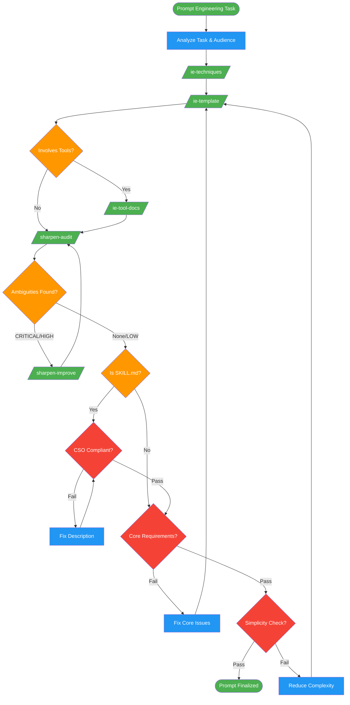

<!-- diagram-meta: {"source": "skills/instruction-engineering/SKILL.md", "source_hash": "sha256:d5e6dd6a1204aa29e6fd81b31cfaa7d65191e665c9655ab2e8cd5e9bd4c98b0d", "generated_at": "2026-02-19T00:00:00Z", "generator": "generate_diagrams.py"} -->
# Diagram: instruction-engineering

Orchestrator workflow for engineering LLM prompts and instructions. Analyzes the task, selects techniques, drafts using templates, optionally documents tools, sharpens for ambiguity, and validates against a comprehensive self-check.

## Legend

| Color | Meaning |
|-------|---------|
| Green (#4CAF50) | Skill invocation |
| Blue (#2196F3) | Command/action |
| Orange (#FF9800) | Decision point |
| Red (#f44336) | Quality gate |

## Cross-Reference

| Node | Source Reference |
|------|----------------|
| Analyze Task & Audience | Lines 71, 47-53: Step 1 analyze task, reasoning schema |
| /ie-techniques/ | Lines 63, 72: 16 proven techniques reference |
| /ie-template/ | Lines 64, 73: Template and example for drafting |
| /ie-tool-docs/ | Lines 65, 74: Tool documentation guidance |
| /sharpen-audit/ | Lines 66, 75: Ambiguity detection |
| /sharpen-improve/ | Lines 67, 75: Ambiguity resolution |
| CSO Compliant? | Lines 80-101: Skill description CSO checklist |
| Core Requirements? | Lines 125-133: Persona, stimuli, few-shot checks |
| Simplicity Check? | Lines 135-138: Shortest prompt that achieves the goal |
