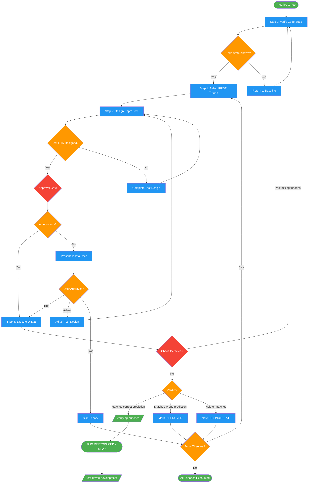

<!-- diagram-meta: {"source": "skills/isolated-testing/SKILL.md", "source_hash": "sha256:d64fd6f3ef90647ae9822eaf74bec360518871f02b0183bd22afe725debf8e62", "generated_at": "2026-02-19T00:00:00Z", "generator": "generate_diagrams.py"} -->
# Diagram: isolated-testing

Disciplined one-theory-one-test protocol for debugging. Enforces strict queue ordering, requires full test design before execution, and halts investigation immediately upon reproduction. Detects and prevents chaos patterns.

## Legend

| Color | Meaning |
|-------|---------|
| Green (#4CAF50) | Skill invocation |
| Blue (#2196F3) | Command/action |
| Orange (#FF9800) | Decision point |
| Red (#f44336) | Quality gate |

## Cross-Reference

| Node | Source Reference |
|------|----------------|
| Step 0: Verify Code State | Lines 41-55: Code state check template |
| Step 1: Select FIRST Theory | Lines 57-71: Queue discipline, FIRST untested theory |
| Step 2: Design Repro Test | Lines 73-107: Complete test design template |
| Approval Gate | Lines 109-115: Non-autonomous vs autonomous |
| Step 4: Execute ONCE | Lines 117-121: Run exactly once |
| Verdict? | Lines 123-129: REPRODUCED / DISPROVED / INCONCLUSIVE |
| BUG REPRODUCED - STOP | Lines 131-155: Full stop on reproduction |
| Chaos Detected? | Lines 159-200: Chaos detection FORBIDDEN list |
| /verifying-hunches/ | Lines 230: Invoked before claiming confirmation |
| /test-driven-development/ | Lines 231: Invoked for fix phase after reproduction |
