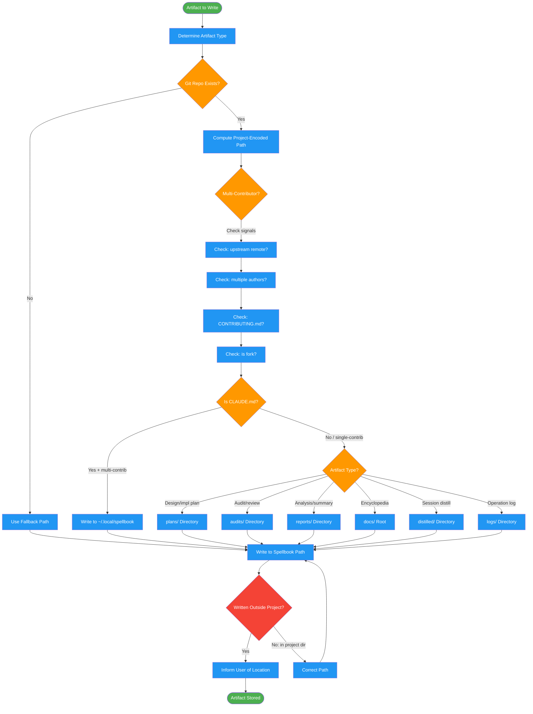

<!-- diagram-meta: {"source": "skills/managing-artifacts/SKILL.md", "source_hash": "sha256:fe7763b76b0d3e63a39e44123e2457e5ebccec2f8e120c3181e94f1908742d3a", "generated_at": "2026-02-19T00:00:00Z", "generator": "generate_diagrams.py"} -->
# Diagram: managing-artifacts

Artifact routing workflow that determines the correct storage location for generated files. Computes project-encoded paths, detects multi-contributor repos, and enforces the rule that generated artifacts never litter project directories.

## Legend

| Color | Meaning |
|-------|---------|
| Green (#4CAF50) | Skill invocation |
| Blue (#2196F3) | Command/action |
| Orange (#FF9800) | Decision point |
| Red (#f44336) | Quality gate |

## Cross-Reference

| Node | Source Reference |
|------|----------------|
| Determine Artifact Type | Lines 23-27: Analysis - determine artifact type |
| Git Repo Exists? | Lines 62-74: _outer_git_root function, NO_GIT_REPO fallback |
| Compute Project-Encoded Path | Lines 60-74: Project encoded path generation |
| Multi-Contributor? | Lines 100-105: Detection signals (upstream, authors, CONTRIBUTING, fork) |
| Is CLAUDE.md? | Lines 89-109: Open source project handling |
| Artifact Type? | Lines 111-121: Quick reference table for artifact locations |
| Written Outside Project? | Lines 78-85, 123-129: NEVER write to project dirs, FORBIDDEN list |
