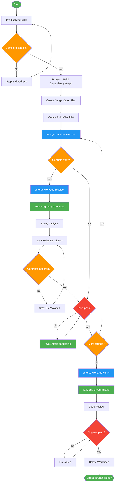

<!-- diagram-meta: {"source": "skills/merging-worktrees/SKILL.md", "source_hash": "sha256:84037998b7008117a900a2876abc4107c88c26c92319f3b9f9c8ae1e488cc199", "generated_at": "2026-02-19T00:00:00Z", "generator": "generate_diagrams.py"} -->
# Diagram: merging-worktrees

Merge parallel worktrees into a unified branch using dependency-ordered rounds with mandatory 3-way conflict analysis and per-round testing.

## Legend

| Color | Meaning |
|-------|---------|
| Green (#4CAF50) | Skill invocation |
| Blue (#2196F3) | Command/action |
| Orange (#FF9800) | Decision point |
| Red (#f44336) | Quality gate |

## Cross-Reference

| Node | Source Reference |
|------|----------------|
| Pre-Flight Checks | Pre-Flight section: verify merge context, dependency graph, contracts |
| Phase 1: Build Dependency Graph | Phase 1: Merge Order - rounds by dependency level |
| /merge-worktree-execute | Phase 2: Sequential Round Merging command dispatch |
| /merge-worktree-resolve | Phase 3: Conflict Resolution command dispatch |
| /resolving-merge-conflicts | Pre-Conflict Gate: mandatory skill for conflict subagents |
| 3-Way Analysis | Invariant Principle 2: base vs ours vs theirs mandatory |
| Contracts honored? | Invariant Principle 1: interface contracts are law |
| Tests pass? | Invariant Principle 3: test after each round |
| /merge-worktree-verify | Phases 4-5: Final Verification + Cleanup command dispatch |
| /auditing-green-mirage | Self-Check: run auditing-green-mirage on tests |
| Delete Worktrees | Self-Check: deleted all worktrees after success |
