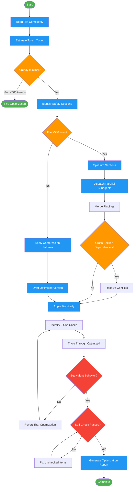

<!-- diagram-meta: {"source": "skills/optimizing-instructions/SKILL.md", "source_hash": "sha256:add0cee415819c2666629f8e41dd531612c17ed5736b6bbe5b2c674292b5f853", "generated_at": "2026-02-19T00:00:00Z", "generator": "generate_diagrams.py"} -->
# Diagram: optimizing-instructions

Optimize instruction files for token efficiency while preserving all capabilities, with a verification protocol to prevent capability regression.

## Legend

| Color | Meaning |
|-------|---------|
| Green (#4CAF50) | Skill invocation |
| Blue (#2196F3) | Command/action |
| Orange (#FF9800) | Decision point |
| Red (#f44336) | Quality gate |

## Cross-Reference

| Node | Source Reference |
|------|----------------|
| Read File Completely | Process step 1 |
| Estimate Token Count | Process step 2: words * 1.3 |
| Already minimal? | Skip Optimization When: <500 tokens |
| Identify Safety Sections | Process step 3: skip safety-critical sections |
| File >500 lines? | Large File Strategy threshold |
| Split Into Sections / Parallel Subagents | Large File Strategy: parallelization approach |
| Apply Compression Patterns | Compression Patterns section and Declarative Principles |
| Identify 3 Use Cases | Verification Protocol step 1 |
| Trace Through Optimized | Verification Protocol step 2: mentally trace each use case |
| Equivalent Behavior? | Verification Protocol step 3: compare behavior |
| Self-Check Passes? | Self-Check: token count, triggers, edge cases, safety, terminology, formats |
| Generate Optimization Report | Output Format section: summary, changes, verification, optimized content |
