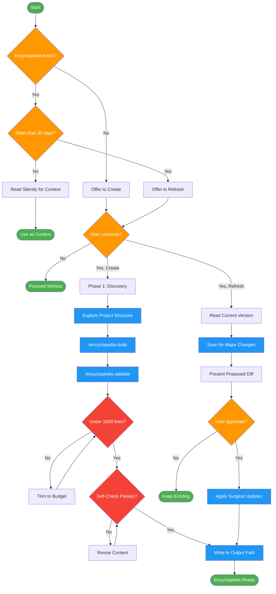

<!-- diagram-meta: {"source": "skills/project-encyclopedia/SKILL.md", "source_hash": "sha256:1bdd25b00ecf7db7739568b84c667d03efc40b9fc1856b7d95b05fa7bcb1b73e", "generated_at": "2026-02-19T00:00:00Z", "generator": "generate_diagrams.py"} -->
# Diagram: project-encyclopedia

Create or refresh persistent project encyclopedias with glossary, architecture maps, and decision records to solve agent amnesia across sessions.

## Legend

| Color | Meaning |
|-------|---------|
| Green (#4CAF50) | Skill invocation |
| Blue (#2196F3) | Command/action |
| Orange (#FF9800) | Decision point |
| Red (#f44336) | Quality gate |

## Cross-Reference

| Node | Source Reference |
|------|----------------|
| Encyclopedia exists? | Session Integration: check existence and freshness |
| Older than 30 days? | Invariant Principle 4: staleness detection, mtime >= 30 days |
| User consents? | Invariant Principle 2: offer, don't force |
| Phase 1: Discovery | Phase 1: gather project type, entry points, directories, tests, build commands |
| /encyclopedia-build | Phases 2-5: subagent builds glossary, architecture, decisions, entry points |
| /encyclopedia-validate | Phase 6: subagent validates against quality checklist and writes output |
| Under 1000 lines? | Invariant Principle 5: context budget 500-1000 lines |
| Self-Check Passes? | Self-Check: consent, size, no duplication, diagram nodes, glossary, rationale, path, mtime |
| Refresh workflow | Refresh Workflow: surgical update, not regeneration from scratch |
| Present Proposed Diff | Refresh step 3: present diff of proposed changes |
