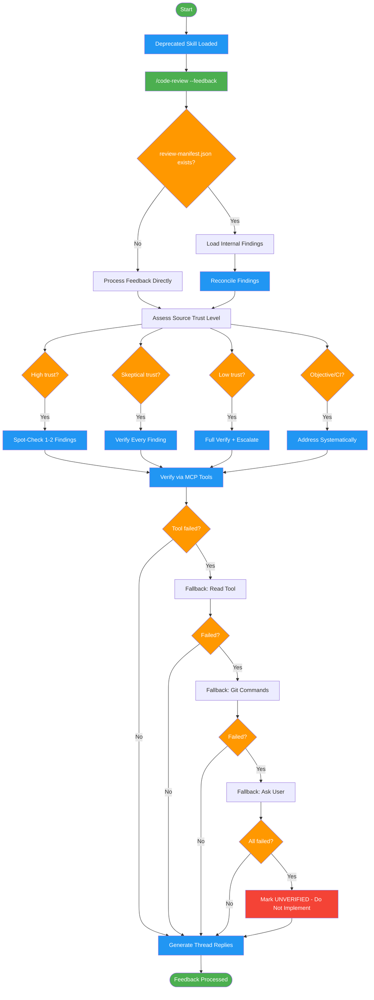

<!-- diagram-meta: {"source": "skills/receiving-code-review/SKILL.md", "source_hash": "sha256:31a0f417c8c663992f5361569c4e82a4e139fdc2d9b55c46aac136a2a2b3b96c", "generated_at": "2026-02-19T00:00:00Z", "generator": "generate_diagrams.py"} -->
# Diagram: receiving-code-review

Deprecated routing skill that redirects all feedback processing to `code-review --feedback`, with fallback verification chains and trust-level-based processing.

## Legend

| Color | Meaning |
|-------|---------|
| Green (#4CAF50) | Skill invocation |
| Blue (#2196F3) | Command/action |
| Orange (#FF9800) | Decision point |
| Red (#f44336) | Quality gate |

## Cross-Reference

| Node | Source Reference |
|------|----------------|
| Deprecated Skill Loaded | Frontmatter: deprecated: true, replacement: code-review --feedback |
| /code-review --feedback | Automatic Routing: immediately invoke replacement |
| review-manifest.json exists? | Handoff from Requesting Skill: check for existing manifest |
| Reconcile Findings | Finding Reconciliation table: match, new, missing, contradictory |
| Assess Source Trust Level | Feedback Source Trust Levels table: High, Skeptical, Low, Objective |
| Spot-Check 1-2 Findings | Trust Level Actions: High Trust verification |
| Verify Every Finding | Trust Level Actions: Skeptical / Low Trust verification |
| Verify via MCP Tools | MCP Tool Failures: primary tool chain |
| Fallback chain | MCP Tool Failures: Read Tool, Git Commands, Ask User |
| Mark UNVERIFIED | Hard Stop Rule: cannot verify, do not implement |
| Generate Thread Replies | Thread Reply Protocol: FIXED, ACKNOWLEDGED, QUESTION, DISAGREE formats |
