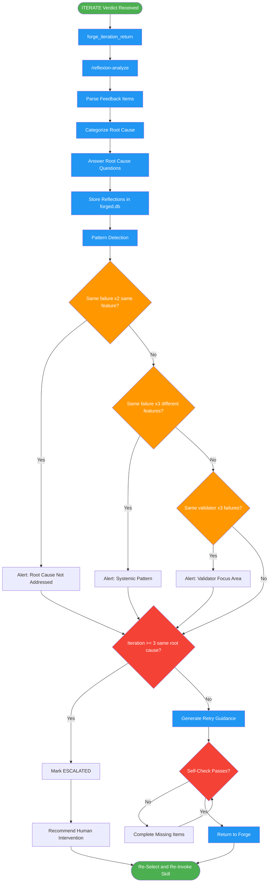

<!-- diagram-meta: {"source": "skills/reflexion/SKILL.md", "source_hash": "sha256:b775b3b124cc4d17310230cb6e8029ade4aa4a41bce2e031ccdf747272433b73", "generated_at": "2026-02-19T00:00:00Z", "generator": "generate_diagrams.py"} -->
# Diagram: reflexion

Analyze roundtable ITERATE feedback to extract root causes, store reflections, detect failure patterns, and generate retry guidance for the Forge workflow.

## Legend

| Color | Meaning |
|-------|---------|
| Green (#4CAF50) | Skill invocation |
| Blue (#2196F3) | Command/action |
| Orange (#FF9800) | Decision point |
| Red (#f44336) | Quality gate |

## Cross-Reference

| Node | Source Reference |
|------|----------------|
| ITERATE Verdict Received | Integration with Forge: trigger is forge_iteration_return with ITERATE |
| forge_iteration_return | Integration with Forge: MCP tool that triggers reflexion |
| /reflexion-analyze | Phase Sequence: Steps 1-3 dispatched as subagent command |
| Parse Feedback Items | Step 1: extract structured fields from each feedback item |
| Categorize Root Cause | Step 2: map to categories (Incomplete Analysis, Misunderstanding, etc.) |
| Answer Root Cause Questions | Step 3: expected vs actual, why deviation, what prevents |
| Store Reflections | Step 4: write to forged.db with PENDING status |
| Pattern Detection | Pattern Detection table: thresholds for alerts |
| Same failure x2 same feature? | Pattern Detection: "Root cause not addressed" threshold |
| Same failure x3 different features? | Pattern Detection: "Systemic pattern" threshold |
| Same validator x3 failures? | Pattern Detection: "Validator focus area" threshold |
| Iteration >= 3? | Escalation: after 3 iterations on same stage with same root cause |
| Generate Retry Guidance | Step 5: specific correction guidance for re-invoked skill |
| Self-Check Passes? | Self-Check: all items analyzed, categorized, stored, patterns checked, guidance generated |
