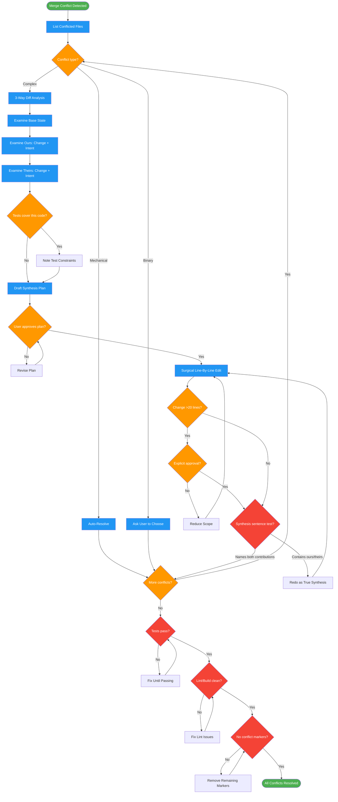

<!-- diagram-meta: {"source": "skills/resolving-merge-conflicts/SKILL.md", "source_hash": "sha256:58f8ab125df4ff9e40a28241599e78ab2df250d0a8fdb4e08fff2c34249cfa0b", "generated_at": "2026-02-19T00:00:00Z", "generator": "generate_diagrams.py"} -->
# Diagram: resolving-merge-conflicts

Resolve git merge conflicts through mandatory 3-way analysis and synthesis, never selecting ours/theirs, preserving both branches' intent.

## Legend

| Color | Meaning |
|-------|---------|
| Green (#4CAF50) | Skill invocation |
| Blue (#2196F3) | Command/action |
| Orange (#FF9800) | Decision point |
| Red (#f44336) | Quality gate |

## Cross-Reference

| Node | Source Reference |
|------|----------------|
| List Conflicted Files | Resolution Workflow step 1: detect and classify |
| Conflict type? | Conflict Classification table: Mechanical, Binary, Complex |
| Auto-Resolve | Mechanical: regenerate locks, chronological changelog merge |
| Ask User to Choose | Acceptable Amputation Cases: binary files, no synthesis possible |
| 3-Way Diff Analysis | Resolution Workflow step 2: base vs ours vs theirs |
| Examine Base/Ours/Theirs | Reasoning Schema: merge base state, ours changed, theirs changed |
| Tests cover this code? | Invariant Principle 4: evidence-based decisions |
| Draft Synthesis Plan | Plan Template: base, ours, theirs, synthesis, risk |
| User approves plan? | Invariant Principle 5: consent before loss |
| Surgical Line-By-Line Edit | Invariant Principle 3: surgical precision |
| Change >20 lines? | Invariant Principle 3: >20 line changes require explicit approval |
| Synthesis sentence test | Mechanical Synthesis Test in Self-Check section |
| Tests pass? | Self-Check: tests pass, both ours and theirs functionality |
| Lint/Build clean? | Self-Check: lint/build clean |
| No conflict markers? | Self-Check: all conflicts resolved, no markers remain |
