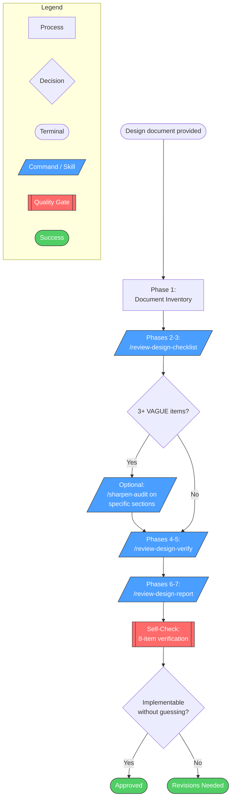
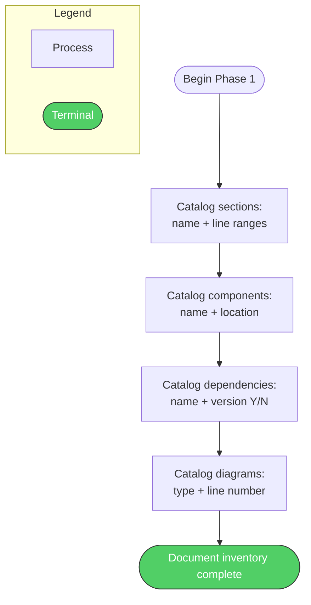
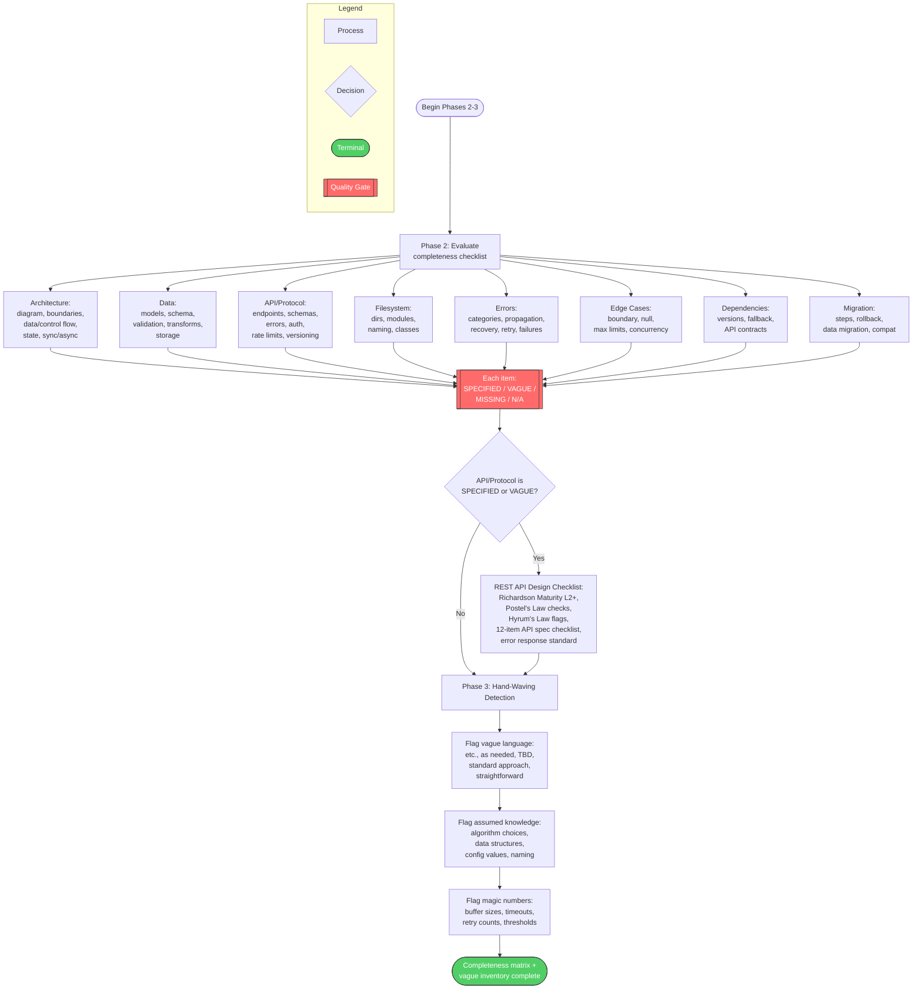
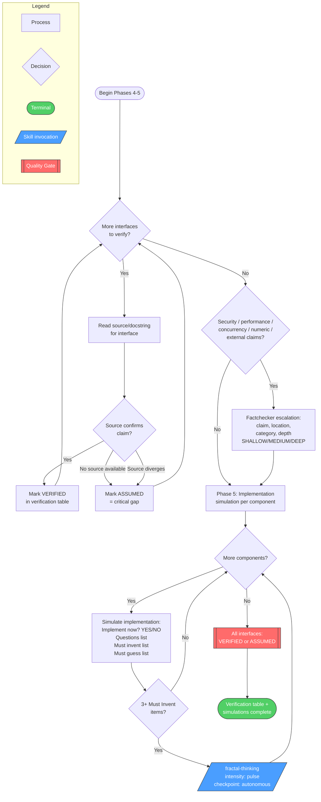
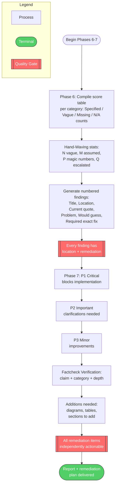
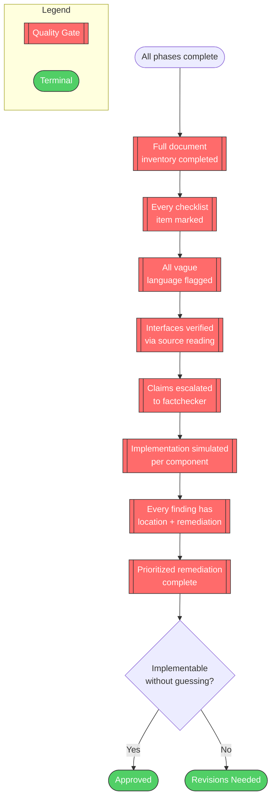

<!-- diagram-meta: {"source": "skills/reviewing-design-docs/SKILL.md","source_hash": "sha256:c8014a26a3daf698c8ae3971d4a9c27c5c7f906121d544cc58c4a88f10a80ab0","generator": "stamp"} -->
# Reviewing Design Docs - Diagrams

Seven-phase design document review workflow: inventories document structure, evaluates completeness checklist, detects hand-waving and vague language, verifies interface claims against source code, simulates implementation per component, compiles scored findings, and produces a prioritized remediation plan.

## Overview: Phase Flow

```mermaid
flowchart TD
    subgraph Legend
        L1[Process]
        L2{Decision}
        L3([Terminal])
        L4[/"Command / Skill"/]:::subagent
        L5[[Quality Gate]]:::gate
        L6([Success]):::success
    end

    Start([Design document provided]) --> P1[Phase 1:<br>Document Inventory]
    P1 --> P23[/"Phases 2-3:<br>/review-design-checklist"/]:::subagent
    P23 --> VagueCheck{3+ VAGUE items?}
    VagueCheck -->|Yes| Sharpen[/"Optional:<br>/sharpen-audit on<br>specific sections"/]:::subagent
    Sharpen --> P45
    VagueCheck -->|No| P45
    P45[/"Phases 4-5:<br>/review-design-verify"/]:::subagent
    P45 --> P67[/"Phases 6-7:<br>/review-design-report"/]:::subagent
    P67 --> SelfCheck[[Self-Check:<br>8-item verification]]:::gate
    SelfCheck --> CoreQ{Implementable<br>without guessing?}
    CoreQ -->|Yes| Approved([Approved]):::success
    CoreQ -->|No| Revisions([Revisions Needed]):::success

    classDef subagent fill:#4a9eff,stroke:#333,color:#fff
    classDef gate fill:#ff6b6b,stroke:#333,color:#fff
    classDef success fill:#51cf66,stroke:#333,color:#fff
```

### Cross-Reference Table

| Overview Node | Detail Diagram |
|---------------|----------------|
| Phase 1: Document Inventory | [Phase 1 Detail](#phase-1-document-inventory) |
| Phases 2-3: /review-design-checklist | [Phases 2-3 Detail](#phases-2-3-completeness-checklist--hand-waving-detection) |
| Phases 4-5: /review-design-verify | [Phases 4-5 Detail](#phases-4-5-interface-verification--implementation-simulation) |
| Phases 6-7: /review-design-report | [Phases 6-7 Detail](#phases-6-7-findings-report--remediation-plan) |
| Self-Check: 8-item verification | [Self-Check Gate](#self-check-gate) |

---

## Phase 1: Document Inventory

```mermaid
flowchart TD
    subgraph Legend
        L1[Process]
        L2([Terminal]):::success
    end

    Start([Begin Phase 1]) --> Sections[Catalog sections:<br>name + line ranges]
    Sections --> Components[Catalog components:<br>name + location]
    Components --> Deps[Catalog dependencies:<br>name + version Y/N]
    Deps --> Diagrams[Catalog diagrams:<br>type + line number]
    Diagrams --> Done([Document inventory complete]):::success

    classDef success fill:#51cf66,stroke:#333,color:#fff
```

**Source:** SKILL.md Phase 1 (lines 55-62)

---

## Phases 2-3: Completeness Checklist + Hand-Waving Detection

```mermaid
flowchart TD
    subgraph Legend
        L1[Process]
        L2{Decision}
        L3([Terminal]):::success
        L4[[Quality Gate]]:::gate
    end

    Start([Begin Phases 2-3]) --> Checklist[Phase 2: Evaluate<br>completeness checklist]

    Checklist --> Arch[Architecture:<br>diagram, boundaries,<br>data/control flow,<br>state, sync/async]
    Checklist --> Data[Data:<br>models, schema,<br>validation, transforms,<br>storage]
    Checklist --> API[API/Protocol:<br>endpoints, schemas,<br>errors, auth,<br>rate limits, versioning]
    Checklist --> FS[Filesystem:<br>dirs, modules,<br>naming, classes]
    Checklist --> Errors[Errors:<br>categories, propagation,<br>recovery, retry, failures]
    Checklist --> Edge[Edge Cases:<br>boundary, null,<br>max limits, concurrency]
    Checklist --> DepCat[Dependencies:<br>versions, fallback,<br>API contracts]
    Checklist --> Migration[Migration:<br>steps, rollback,<br>data migration, compat]

    Arch & Data & API & FS & Errors & Edge & DepCat & Migration --> VerdictGate[[Each item:<br>SPECIFIED / VAGUE /<br>MISSING / N/A]]:::gate

    VerdictGate --> APICheck{API/Protocol is<br>SPECIFIED or VAGUE?}
    APICheck -->|Yes| RESTChecklist[REST API Design Checklist:<br>Richardson Maturity L2+,<br>Postel's Law checks,<br>Hyrum's Law flags,<br>12-item API spec checklist,<br>error response standard]
    APICheck -->|No| Phase3
    RESTChecklist --> Phase3

    Phase3[Phase 3: Hand-Waving Detection] --> VagueLang[Flag vague language:<br>etc., as needed, TBD,<br>standard approach,<br>straightforward]
    VagueLang --> Assumed[Flag assumed knowledge:<br>algorithm choices,<br>data structures,<br>config values, naming]
    Assumed --> Magic[Flag magic numbers:<br>buffer sizes, timeouts,<br>retry counts, thresholds]
    Magic --> Done([Completeness matrix +<br>vague inventory complete]):::success

    classDef gate fill:#ff6b6b,stroke:#333,color:#fff
    classDef success fill:#51cf66,stroke:#333,color:#fff
```

**Source:** review-design-checklist.md (Phases 2-3)

---

## Phases 4-5: Interface Verification + Implementation Simulation

```mermaid
flowchart TD
    subgraph Legend
        L1[Process]
        L2{Decision}
        L3([Terminal]):::success
        L4[/"Skill invocation"/]:::subagent
        L5[[Quality Gate]]:::gate
    end

    Start([Begin Phases 4-5]) --> VerifyLoop{More interfaces<br>to verify?}
    VerifyLoop -->|Yes| ReadInterface[Read source/docstring<br>for interface]
    ReadInterface --> MarkVerdict{Source confirms<br>claim?}
    MarkVerdict -->|Yes| MarkVerified[Mark VERIFIED<br>in verification table]
    MarkVerdict -->|No source available| MarkAssumed[Mark ASSUMED<br>= critical gap]
    MarkVerdict -->|Source diverges| MarkAssumed
    MarkVerified --> VerifyLoop
    MarkAssumed --> VerifyLoop

    VerifyLoop -->|No| EscalationCheck{Security / performance /<br>concurrency / numeric /<br>external claims?}
    EscalationCheck -->|Yes| Escalate[Factchecker escalation:<br>claim, location,<br>category, depth<br>SHALLOW/MEDIUM/DEEP]
    EscalationCheck -->|No| Phase5
    Escalate --> Phase5

    Phase5[Phase 5: Implementation<br>simulation per component] --> SimLoop{More components?}
    SimLoop -->|Yes| SimComponent[Simulate implementation:<br>Implement now? YES/NO<br>Questions list<br>Must invent list<br>Must guess list]
    SimComponent --> InventCheck{3+ Must Invent<br>items?}
    InventCheck -->|Yes| Fractal[/"fractal-thinking<br>intensity: pulse<br>checkpoint: autonomous"/]:::subagent
    InventCheck -->|No| SimLoop
    Fractal --> SimLoop
    SimLoop -->|No| AllMarked[[All interfaces:<br>VERIFIED or ASSUMED]]:::gate
    AllMarked --> Done([Verification table +<br>simulations complete]):::success

    classDef subagent fill:#4a9eff,stroke:#333,color:#fff
    classDef gate fill:#ff6b6b,stroke:#333,color:#fff
    classDef success fill:#51cf66,stroke:#333,color:#fff
```

**Source:** review-design-verify.md (Phases 4-5)

---

## Phases 6-7: Findings Report + Remediation Plan

```mermaid
flowchart TD
    subgraph Legend
        L1[Process]
        L2([Terminal]):::success
        L3[[Quality Gate]]:::gate
    end

    Start([Begin Phases 6-7]) --> Score[Phase 6: Compile score table<br>per category: Specified /<br>Vague / Missing / N/A counts]
    Score --> HWStats[Hand-Waving stats:<br>N vague, M assumed,<br>P magic numbers, Q escalated]
    HWStats --> Findings[Generate numbered findings:<br>Title, Location,<br>Current quote,<br>Problem, Would guess,<br>Required exact fix]
    Findings --> FindingsGate[[Every finding has<br>location + remediation]]:::gate

    FindingsGate --> P1Items[Phase 7: P1 Critical<br>blocks implementation]
    P1Items --> P2Items[P2 Important<br>clarifications needed]
    P2Items --> P3Items[P3 Minor<br>improvements]
    P3Items --> FactCheck[Factcheck Verification:<br>claim + category + depth]
    FactCheck --> Additions[Additions needed:<br>diagrams, tables,<br>sections to add]
    Additions --> RemGate[[All remediation items<br>independently actionable]]:::gate
    RemGate --> Done([Report + remediation<br>plan delivered]):::success

    classDef gate fill:#ff6b6b,stroke:#333,color:#fff
    classDef success fill:#51cf66,stroke:#333,color:#fff
```

**Source:** review-design-report.md (Phases 6-7)

---

## Self-Check Gate

Final verification before delivering review results.

```mermaid
flowchart TD
    subgraph Legend
        L1[[Quality Gate]]:::gate
        L2([Terminal]):::success
    end

    Start([All phases complete]) --> SC1[[Full document<br>inventory completed]]:::gate
    SC1 --> SC2[[Every checklist<br>item marked]]:::gate
    SC2 --> SC3[[All vague<br>language flagged]]:::gate
    SC3 --> SC4[[Interfaces verified<br>via source reading]]:::gate
    SC4 --> SC5[[Claims escalated<br>to factchecker]]:::gate
    SC5 --> SC6[[Implementation simulated<br>per component]]:::gate
    SC6 --> SC7[[Every finding has<br>location + remediation]]:::gate
    SC7 --> SC8[[Prioritized remediation<br>complete]]:::gate
    SC8 --> CoreQ{Implementable<br>without guessing?}
    CoreQ -->|Yes| Approved([Approved]):::success
    CoreQ -->|No| Revisions([Revisions Needed]):::success

    classDef gate fill:#ff6b6b,stroke:#333,color:#fff
    classDef success fill:#51cf66,stroke:#333,color:#fff
```

**Source:** SKILL.md Self-Check (lines 106-117) and Final Emphasis (lines 119-127)

---

## Source Cross-Reference

| Diagram Node | Source File | Reference |
|--------------|------------|-----------|
| Phase 1: Document Inventory | SKILL.md | Lines 55-62: section/component/dependency/diagram catalog |
| Phases 2-3: /review-design-checklist | SKILL.md | Lines 66-73: completeness checklist dispatch |
| 8 checklist categories | review-design-checklist.md | Lines 17-28: Architecture through Migration |
| REST API Design Checklist | review-design-checklist.md | Lines 30-101: Richardson, Postel, Hyrum checks |
| Hand-Waving Detection | review-design-checklist.md | Lines 104-118: vague language, assumed knowledge, magic numbers |
| 3+ VAGUE -> /sharpen-audit | SKILL.md | Line 74: optional deep audit |
| Phases 4-5: /review-design-verify | SKILL.md | Lines 78-84: interface verification dispatch |
| Interface VERIFIED/ASSUMED loop | review-design-verify.md | Lines 9-44: read source, mark verdict |
| Factchecker escalation | review-design-verify.md | Lines 46-50: security/performance/concurrency claims |
| Implementation simulation | review-design-verify.md | Lines 54-64: per-component YES/NO + gap lists |
| fractal-thinking invocation | review-design-verify.md | Line 64: 3+ Must Invent triggers fractal pulse |
| Phases 6-7: /review-design-report | SKILL.md | Lines 88-94: findings report dispatch |
| Score table | review-design-report.md | Lines 19-27: category counts |
| Numbered findings format | review-design-report.md | Lines 29-38: title, loc, current, problem, fix |
| P1/P2/P3 remediation plan | review-design-report.md | Lines 42-61: prioritized items + factcheck + additions |
| Self-Check 8-item gate | SKILL.md | Lines 106-117: checklist verification |
| Core question | SKILL.md | Lines 119-127: implementable without guessing |
