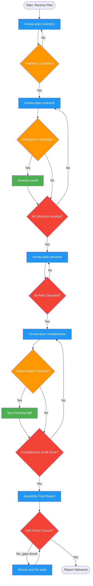

<!-- diagram-meta: {"source": "skills/reviewing-impl-plans/SKILL.md", "source_hash": "sha256:787ae767b7192af1a899f9b9eff284d44752edcd1c413b69c28c5079b05ef83d", "generated_at": "2026-02-19T00:00:00Z", "generator": "generate_diagrams.py"} -->
# Diagram: reviewing-impl-plans

Reviews implementation plans before execution, auditing interface contracts between parallel work streams, verifying behavior references against source code, and checking completeness. Dispatches subagents for each phase and assembles a prioritized remediation report.

## Legend

| Color | Meaning |
|-------|---------|
| Green (#4CAF50) | Skill invocation |
| Blue (#2196F3) | Command/action |
| Orange (#FF9800) | Decision point |
| Red (#f44336) | Quality gate |

## Cross-Reference

| Node | Source Reference |
|------|----------------|
| /review-plan-inventory | Phase 1: Context and Inventory (line 48) |
| /review-plan-contracts | Phase 2: Interface Contract Audit (line 56) |
| /sharpen-audit | Phase 2 optional deep audit (line 60) |
| /review-plan-behavior | Phase 3: Behavior Verification Audit (line 66) |
| /review-plan-completeness | Phase 4-5: Completeness Checks and Escalation (line 74) |
| fact-checking skill | Phase 4-5 escalation for claims (line 76) |
| Assemble Final Report | Report Assembly (line 82) |
| Self-Check Passes? | Reflection checklist (lines 159-186) |
