<!-- diagram-meta: {"source": "skills/security-auditing/SKILL.md", "source_hash": "sha256:32aeb0af1dab31741bbd92ff746dcf84c35df11868b1375de8c1357f0d33cd72", "generated_at": "2026-02-19T00:00:00Z", "generator": "generate_diagrams.py"} -->
# Diagram: security-auditing

Six-phase security audit workflow: discovers audit scope, runs static analysis scanner, classifies and deduplicates findings, traces attack chains for high/critical issues, generates a structured report, and enforces a pass/warn/fail quality gate.

```mermaid
flowchart TD
    START([Start]) --> P1[Phase 1: Discover]

    %% Phase 1: Discover
    P1 --> ParseScope{Scope Type?}

    ParseScope -->|skills| ScanSkills[Catalog Skill Files]
    ParseScope -->|mcp| ScanMCP[Catalog Python Files]
    ParseScope -->|changeset| ScanDiff[Catalog Diff Lines]
    ParseScope -->|all| ScanAll[Catalog All Targets]
    ParseScope -->|specific path| ScanPath[Catalog Specific Path]

    ScanSkills --> SetMode[Set Security Mode]
    ScanMCP --> SetMode
    ScanDiff --> SetMode
    ScanAll --> SetMode
    ScanPath --> SetMode

    SetMode --> ModeChoice{Security Mode?}
    ModeChoice -->|permissive| ModeSet[CRITICAL Only]
    ModeChoice -->|standard| ModeSet2[HIGH and Above]
    ModeChoice -->|paranoid| ModeSet3[MEDIUM and Above]

    ModeSet --> P2
    ModeSet2 --> P2
    ModeSet3 --> P2

    %% Phase 2: Analyze
    P2[Phase 2: Run Scanner] --> RunSkillScan[Scan Markdown Files]
    P2 --> RunMCPScan[Scan Python Files]
    P2 --> RunDiffScan[Scan Changeset]

    RunSkillScan --> CaptureRaw[Capture Raw Findings]
    RunMCPScan --> CaptureRaw
    RunDiffScan --> CaptureRaw

    %% Phase 3: Classify
    CaptureRaw --> P3[Phase 3: Classify]
    P3 --> Dedup[Deduplicate Findings]
    Dedup --> AssessSeverity[Assess Real Severity]
    AssessSeverity --> TrustLevel{Apply Trust Level}

    TrustLevel -->|"system (5)"| TrustHigh[CRITICAL Only Matters]
    TrustLevel -->|"verified (4)"| TrustVerified[HIGH and Above]
    TrustLevel -->|"user (3)"| TrustUser[MEDIUM and Above]
    TrustLevel -->|"untrusted (2)"| TrustLow[All Findings]
    TrustLevel -->|"hostile (1)"| TrustHostile[All + Paranoid]

    TrustHigh --> ClassifyEach[Classify Each Finding]
    TrustVerified --> ClassifyEach
    TrustUser --> ClassifyEach
    TrustLow --> ClassifyEach
    TrustHostile --> ClassifyEach

    ClassifyEach --> FPCheck{False Positive?}
    FPCheck -->|Yes| DocFP[Document FP + Rationale]
    FPCheck -->|No| ActiveFindings[Active Findings List]

    DocFP --> ActiveFindings

    %% Phase 4: Trace
    ActiveFindings --> P4{HIGH/CRITICAL Found?}
    P4 -->|No| P5
    P4 -->|Yes| TraceChains[Phase 4: Trace Chains]

    TraceChains --> IdentifyEntry[Identify Entry Points]
    IdentifyEntry --> MapTrustBoundary[Map Trust Boundaries]
    MapTrustBoundary --> AssessImpact[Assess Impact]
    AssessImpact --> DocChain[Document Attack Chain]
    DocChain --> ReassessSeverity[Re-Assess Severity]

    ReassessSeverity --> P5

    %% Phase 5: Report
    P5[Phase 5: Generate Report] --> WriteHeader[Write Header + Verdict]
    WriteHeader --> WriteExecSummary[Write Executive Summary]
    WriteExecSummary --> WriteCounts[Write Finding Counts]
    WriteCounts --> WriteFindings[Write Findings by Severity]
    WriteFindings --> WriteChains[Write Attack Chains]
    WriteChains --> WriteFPs[Write False Positives]
    WriteFPs --> WriteRecs[Write Recommendations]
    WriteRecs --> SaveReport[Save Audit Report]

    %% Phase 6: Gate
    SaveReport --> P6{Phase 6: Verdict?}

    P6 -->|"Zero findings"| PASS([PASS])
    P6 -->|"Only LOW/MEDIUM"| WARN_ACK{WARN: Acknowledge?}
    P6 -->|"HIGH with no chain"| WARN_ACK
    P6 -->|"HIGH with viable chain"| FAIL([FAIL: Block])
    P6 -->|"Any CRITICAL"| FAIL

    WARN_ACK -->|Acknowledged| PROCEED([Proceed])
    WARN_ACK -->|Not acknowledged| BLOCKED[Blocked]

    FAIL --> REMEDIATE[Remediate + Re-Scan]
    REMEDIATE --> P2

    style START fill:#333,color:#fff
    style PASS fill:#333,color:#fff
    style PROCEED fill:#333,color:#fff
    style FAIL fill:#f44336,color:#fff
    style P1 fill:#2196F3,color:#fff
    style P2 fill:#2196F3,color:#fff
    style P3 fill:#2196F3,color:#fff
    style P5 fill:#2196F3,color:#fff
    style ScanSkills fill:#2196F3,color:#fff
    style ScanMCP fill:#2196F3,color:#fff
    style ScanDiff fill:#2196F3,color:#fff
    style ScanAll fill:#2196F3,color:#fff
    style ScanPath fill:#2196F3,color:#fff
    style SetMode fill:#2196F3,color:#fff
    style ModeSet fill:#2196F3,color:#fff
    style ModeSet2 fill:#2196F3,color:#fff
    style ModeSet3 fill:#2196F3,color:#fff
    style RunSkillScan fill:#4CAF50,color:#fff
    style RunMCPScan fill:#4CAF50,color:#fff
    style RunDiffScan fill:#4CAF50,color:#fff
    style CaptureRaw fill:#2196F3,color:#fff
    style Dedup fill:#2196F3,color:#fff
    style AssessSeverity fill:#2196F3,color:#fff
    style ClassifyEach fill:#2196F3,color:#fff
    style DocFP fill:#2196F3,color:#fff
    style ActiveFindings fill:#2196F3,color:#fff
    style TraceChains fill:#2196F3,color:#fff
    style IdentifyEntry fill:#2196F3,color:#fff
    style MapTrustBoundary fill:#2196F3,color:#fff
    style AssessImpact fill:#2196F3,color:#fff
    style DocChain fill:#2196F3,color:#fff
    style ReassessSeverity fill:#2196F3,color:#fff
    style WriteHeader fill:#2196F3,color:#fff
    style WriteExecSummary fill:#2196F3,color:#fff
    style WriteCounts fill:#2196F3,color:#fff
    style WriteFindings fill:#2196F3,color:#fff
    style WriteChains fill:#2196F3,color:#fff
    style WriteFPs fill:#2196F3,color:#fff
    style WriteRecs fill:#2196F3,color:#fff
    style SaveReport fill:#2196F3,color:#fff
    style REMEDIATE fill:#2196F3,color:#fff
    style BLOCKED fill:#f44336,color:#fff
    style ParseScope fill:#FF9800,color:#fff
    style ModeChoice fill:#FF9800,color:#fff
    style TrustLevel fill:#FF9800,color:#fff
    style FPCheck fill:#FF9800,color:#fff
    style P4 fill:#FF9800,color:#fff
    style P6 fill:#f44336,color:#fff
    style WARN_ACK fill:#f44336,color:#fff
    style TrustHigh fill:#2196F3,color:#fff
    style TrustVerified fill:#2196F3,color:#fff
    style TrustUser fill:#2196F3,color:#fff
    style TrustLow fill:#2196F3,color:#fff
    style TrustHostile fill:#2196F3,color:#fff
```

## Legend

| Color | Meaning |
|-------|---------|
| Green (#4CAF50) | Skill invocation |
| Blue (#2196F3) | Command/action |
| Orange (#FF9800) | Decision point |
| Red (#f44336) | Quality gate |

## Cross-Reference

| Node | Source Reference |
|------|----------------|
| Phase 1: Discover | Phase 1: DISCOVER (line 78) |
| Scope Type? | Parse scope argument: skills, mcp, changeset, all, specific path (lines 86-91) |
| Set Security Mode | Determine security mode, default to standard (line 99) |
| Security Mode? | Security Modes table: permissive, standard, paranoid (lines 70-74) |
| Phase 2: Run Scanner | Phase 2: ANALYZE (line 103) |
| Scan Markdown Files | scan_skill / scan_directory for .md files (lines 113-119) |
| Scan Python Files | scan_python_file / scan_mcp_directory for .py files (lines 121-125) |
| Scan Changeset | scan_changeset for unified diff (lines 127-133) |
| Phase 3: Classify | Phase 3: CLASSIFY (line 148) |
| Deduplicate Findings | Group identical rule triggers across files (line 153) |
| Assess Real Severity | Does context make this more or less dangerous? (lines 155-165) |
| Apply Trust Level | Trust-level context table: system through hostile (lines 166-174) |
| Classify Each Finding | Classify template: RULE_ID, file, severity, FP determination (lines 176-181) |
| False Positive? | Remove confirmed false positives, document separately (lines 183-184) |
| HIGH/CRITICAL Found? | Phase 4 entry condition: HIGH and CRITICAL survivors (line 188) |
| Phase 4: Trace Chains | Phase 4: TRACE (line 187) |
| Identify Entry Points | What is the entry point? (line 199) |
| Map Trust Boundaries | What is the trust boundary? (line 200) |
| Assess Impact | What is the impact? (line 201) |
| Document Attack Chain | Attack chain documentation fields (lines 207-214) |
| Re-Assess Severity | Re-assess based on attack chain analysis (line 216) |
| Phase 5: Generate Report | Phase 5: REPORT (line 220) |
| Save Audit Report | Output to $SPELLBOOK_CONFIG_DIR/docs/.../audits/ (line 244) |
| Phase 6: Verdict? | Phase 6: GATE verdict determination table (lines 253-260) |
| PASS | Zero findings after classification (line 256) |
| WARN: Acknowledge? | Only LOW/MEDIUM or HIGH with no chain (lines 257-258) |
| FAIL: Block | HIGH with viable chain or any CRITICAL (lines 259-260) |
| Remediate + Re-Scan | FAIL blocks until remediated and re-scan passes (line 266) |
