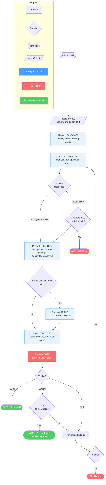
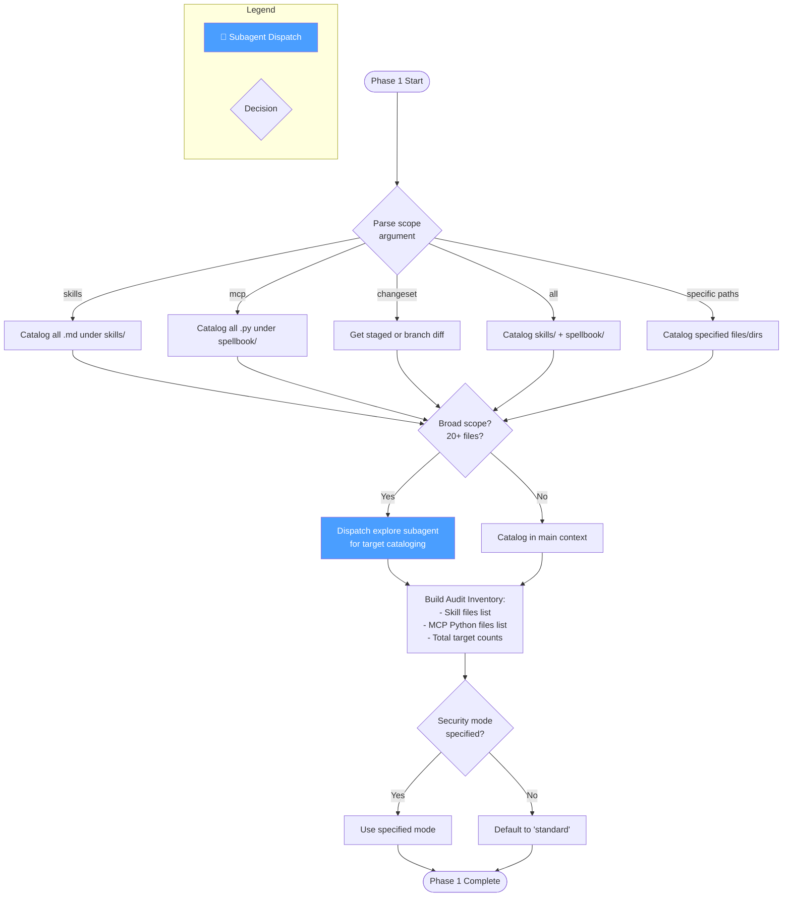
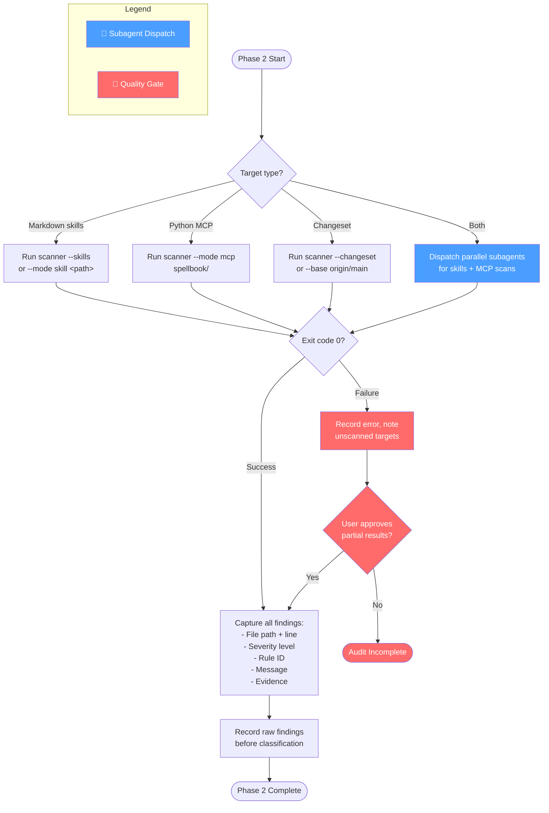
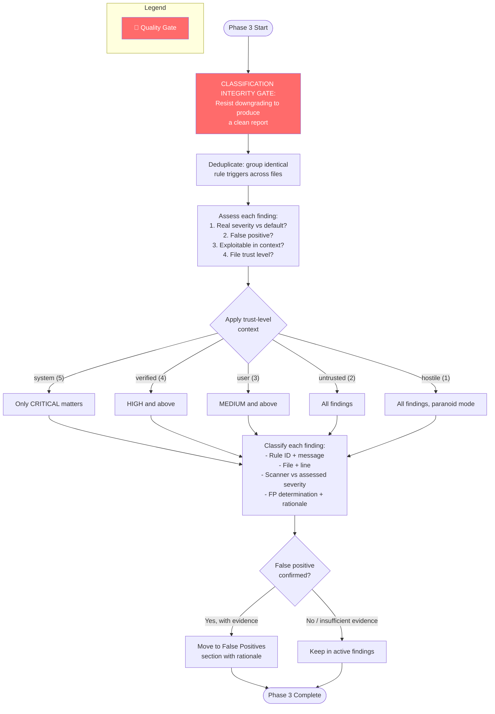
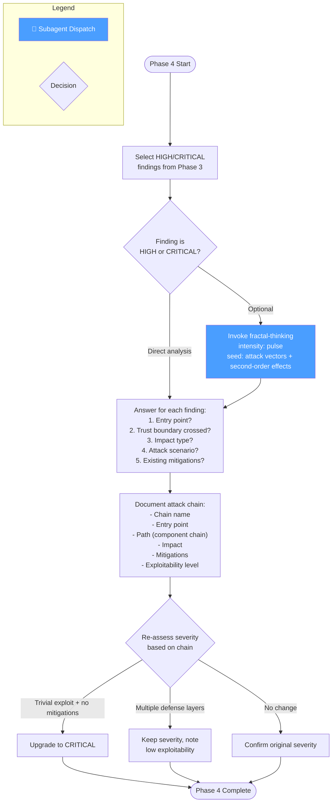
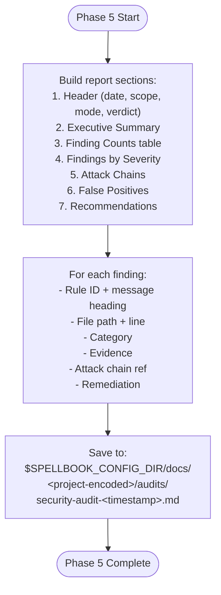
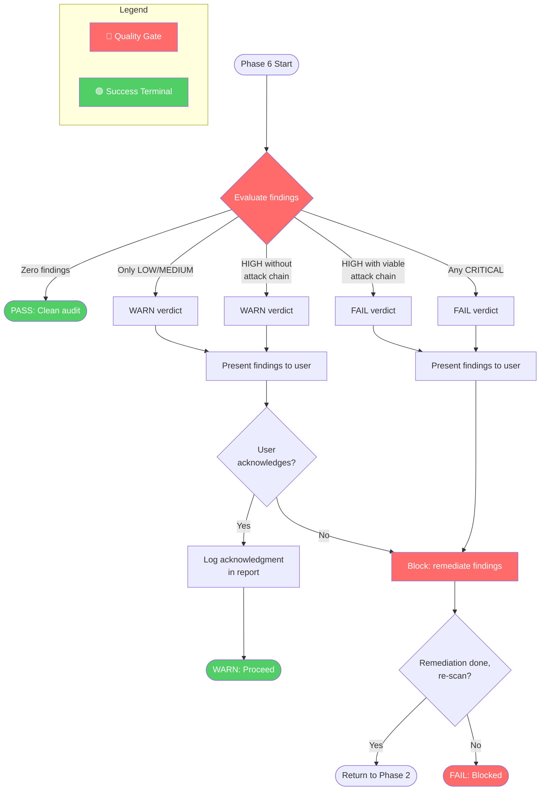
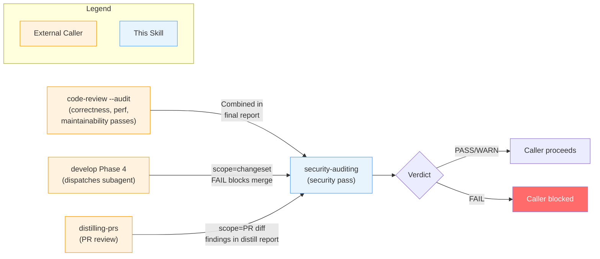
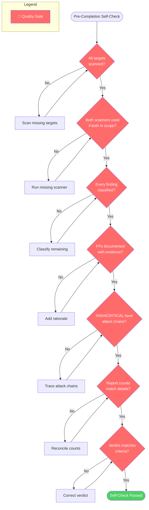

<!-- diagram-meta: {"source": "skills/security-auditing/SKILL.md", "source_hash": "sha256:07e79fa6bbf8cb6c32166fcf760b20c26e0808ce73f6bd272581cc511d266b5a", "generated_at": "2026-03-19T05:50:51Z", "generator": "generate_diagrams.py"} -->
# Diagram: security-auditing

Now I have the full skill. Let me generate the diagrams.

## Overview Diagram

```mermaid
graph TD
    subgraph Legend
        L1[Process]
        L2{Decision}
        L3([Terminal])
        L4[/Input/Output/]
        L5["🔵 Subagent Dispatch"]
        L6["🔴 Quality Gate"]
        L7["🟢 Success Terminal"]
        style L5 fill:#4a9eff,color:#fff
        style L6 fill:#ff6b6b,color:#fff
        style L7 fill:#51cf66,color:#fff
    end

    START([Skill Invoked]) --> INPUT[/Inputs: scope, security_mode, diff_text/]
    INPUT --> P1["Phase 1: DISCOVER<br>Identify scope, catalog targets"]
    P1 --> P2["Phase 2: ANALYZE<br>Run scanner against all targets"]
    P2 --> SCAN_OK{Scanner<br>succeeded?}
    SCAN_OK -->|All targets scanned| P3["Phase 3: CLASSIFY<br>Deduplicate, assess severity,<br>identify false positives"]
    SCAN_OK -->|Partial failure| USER_APPROVE{User approves<br>partial results?}
    USER_APPROVE -->|Yes| P3
    USER_APPROVE -->|No| INCOMPLETE([Audit Incomplete])
    style INCOMPLETE fill:#ff6b6b,color:#fff
    P3 --> HC{Any HIGH/CRITICAL<br>findings?}
    HC -->|Yes| P4["Phase 4: TRACE<br>Attack chain analysis"]
    HC -->|No| P5
    P4 --> P5["Phase 5: REPORT<br>Generate structured audit report"]
    P5 --> P6["Phase 6: GATE<br>Enforce audit verdict"]
    P6 --> VERDICT{Verdict?}
    VERDICT -->|PASS| PASS([PASS: Clean audit])
    style PASS fill:#51cf66,color:#fff
    VERDICT -->|WARN| WARN_ACK{User<br>acknowledges?}
    WARN_ACK -->|Yes| WARN_PROCEED([WARN: Proceed with acknowledgment])
    style WARN_PROCEED fill:#51cf66,color:#fff
    WARN_ACK -->|No| REMEDIATE
    VERDICT -->|FAIL| REMEDIATE[Remediate findings]
    REMEDIATE --> RESCAN{Re-scan?}
    RESCAN -->|Yes| P2
    RESCAN -->|No| BLOCKED([FAIL: Blocked])
    style BLOCKED fill:#ff6b6b,color:#fff

    style P1 fill:#e8f4fd,stroke:#4a9eff
    style P2 fill:#e8f4fd,stroke:#4a9eff
    style P3 fill:#e8f4fd,stroke:#4a9eff
    style P4 fill:#e8f4fd,stroke:#4a9eff
    style P5 fill:#e8f4fd,stroke:#4a9eff
    style P6 fill:#ff6b6b,color:#fff
```

### Cross-Reference Table

| Overview Node | Detail Diagram |
|---------------|---------------|
| Phase 1: DISCOVER | Detail Diagram 1 |
| Phase 2: ANALYZE | Detail Diagram 2 |
| Phase 3: CLASSIFY | Detail Diagram 3 |
| Phase 4: TRACE | Detail Diagram 4 |
| Phase 5: REPORT | Detail Diagram 5 |
| Phase 6: GATE | Detail Diagram 6 |

---

## Detail Diagram 1: Phase 1 - DISCOVER

```mermaid
graph TD
    subgraph Legend
        L1["🔵 Subagent Dispatch"]
        L2{Decision}
        style L1 fill:#4a9eff,color:#fff
    end

    START([Phase 1 Start]) --> PARSE{Parse scope<br>argument}
    PARSE -->|"skills"| SK[Catalog all .md under skills/]
    PARSE -->|"mcp"| MCP[Catalog all .py under spellbook/]
    PARSE -->|"changeset"| CS[Get staged or branch diff]
    PARSE -->|"all"| ALL[Catalog skills/ + spellbook/]
    PARSE -->|"specific paths"| SP[Catalog specified files/dirs]

    SK --> BROAD{Broad scope?<br>20+ files?}
    MCP --> BROAD
    CS --> BROAD
    ALL --> BROAD
    SP --> BROAD

    BROAD -->|Yes| SUBAGENT["Dispatch explore subagent<br>for target cataloging"]
    style SUBAGENT fill:#4a9eff,color:#fff
    BROAD -->|No| DIRECT[Catalog in main context]

    SUBAGENT --> INVENTORY[Build Audit Inventory:<br>- Skill files list<br>- MCP Python files list<br>- Total target counts]
    DIRECT --> INVENTORY

    INVENTORY --> MODE{Security mode<br>specified?}
    MODE -->|Yes| USE_MODE[Use specified mode]
    MODE -->|No| DEFAULT[Default to 'standard']
    USE_MODE --> DONE([Phase 1 Complete])
    DEFAULT --> DONE
```

---

## Detail Diagram 2: Phase 2 - ANALYZE

```mermaid
graph TD
    subgraph Legend
        L1["🔵 Subagent Dispatch"]
        L2["🔴 Quality Gate"]
        style L1 fill:#4a9eff,color:#fff
        style L2 fill:#ff6b6b,color:#fff
    end

    START([Phase 2 Start]) --> SCOPE{Target type?}

    SCOPE -->|Markdown skills| SKILL_SCAN["Run scanner --skills<br>or --mode skill &lt;path&gt;"]
    SCOPE -->|Python MCP| MCP_SCAN["Run scanner --mode mcp<br>spellbook/"]
    SCOPE -->|Changeset| CS_SCAN["Run scanner --changeset<br>or --base origin/main"]
    SCOPE -->|Both| PARALLEL["Dispatch parallel subagents<br>for skills + MCP scans"]
    style PARALLEL fill:#4a9eff,color:#fff

    SKILL_SCAN --> CHECK_EXIT{Exit code 0?}
    MCP_SCAN --> CHECK_EXIT
    CS_SCAN --> CHECK_EXIT
    PARALLEL --> CHECK_EXIT

    CHECK_EXIT -->|Success| CAPTURE[Capture all findings:<br>- File path + line<br>- Severity level<br>- Rule ID<br>- Message<br>- Evidence]
    CHECK_EXIT -->|Failure| FAILURE["Record error, note<br>unscanned targets"]
    style FAILURE fill:#ff6b6b,color:#fff

    FAILURE --> INCOMPLETE_GATE{User approves<br>partial results?}
    style INCOMPLETE_GATE fill:#ff6b6b,color:#fff
    INCOMPLETE_GATE -->|Yes| CAPTURE
    INCOMPLETE_GATE -->|No| ABORT([Audit Incomplete])
    style ABORT fill:#ff6b6b,color:#fff

    CAPTURE --> RAW[Record raw findings<br>before classification]
    RAW --> DONE([Phase 2 Complete])
```

---

## Detail Diagram 3: Phase 3 - CLASSIFY

```mermaid
graph TD
    subgraph Legend
        L1["🔴 Quality Gate"]
        style L1 fill:#ff6b6b,color:#fff
    end

    START([Phase 3 Start]) --> INTEGRITY["CLASSIFICATION INTEGRITY GATE:<br>Resist downgrading to produce<br>a clean report"]
    style INTEGRITY fill:#ff6b6b,color:#fff

    INTEGRITY --> DEDUP[Deduplicate: group identical<br>rule triggers across files]

    DEDUP --> ASSESS["Assess each finding:<br>1. Real severity vs default?<br>2. False positive?<br>3. Exploitable in context?<br>4. File trust level?"]

    ASSESS --> TRUST{Apply trust-level<br>context}

    TRUST -->|"system (5)"| T5[Only CRITICAL matters]
    TRUST -->|"verified (4)"| T4[HIGH and above]
    TRUST -->|"user (3)"| T3[MEDIUM and above]
    TRUST -->|"untrusted (2)"| T2[All findings]
    TRUST -->|"hostile (1)"| T1[All findings, paranoid mode]

    T5 --> CLASSIFY_TEMPLATE
    T4 --> CLASSIFY_TEMPLATE
    T3 --> CLASSIFY_TEMPLATE
    T2 --> CLASSIFY_TEMPLATE
    T1 --> CLASSIFY_TEMPLATE

    CLASSIFY_TEMPLATE["Classify each finding:<br>- Rule ID + message<br>- File + line<br>- Scanner vs assessed severity<br>- FP determination + rationale"]

    CLASSIFY_TEMPLATE --> FP{False positive<br>confirmed?}
    FP -->|Yes, with evidence| FP_DOC[Move to False Positives<br>section with rationale]
    FP -->|No / insufficient evidence| ACTIVE[Keep in active findings]

    FP_DOC --> DONE([Phase 3 Complete])
    ACTIVE --> DONE
```

---

## Detail Diagram 4: Phase 4 - TRACE

```mermaid
graph TD
    subgraph Legend
        L1["🔵 Subagent Dispatch"]
        L2{Decision}
        style L1 fill:#4a9eff,color:#fff
    end

    START([Phase 4 Start]) --> FILTER[Select HIGH/CRITICAL<br>findings from Phase 3]

    FILTER --> FRACTAL{Finding is<br>HIGH or CRITICAL?}

    FRACTAL -->|Optional| FRACTAL_THINK["Invoke fractal-thinking<br>intensity: pulse<br>seed: attack vectors + second-order effects"]
    style FRACTAL_THINK fill:#4a9eff,color:#fff

    FRACTAL -->|Direct analysis| ANSWER_Q

    FRACTAL_THINK --> ANSWER_Q["Answer for each finding:<br>1. Entry point?<br>2. Trust boundary crossed?<br>3. Impact type?<br>4. Attack scenario?<br>5. Existing mitigations?"]

    ANSWER_Q --> CHAIN["Document attack chain:<br>- Chain name<br>- Entry point<br>- Path (component chain)<br>- Impact<br>- Mitigations<br>- Exploitability level"]

    CHAIN --> REASSESS{Re-assess severity<br>based on chain}

    REASSESS -->|"Trivial exploit + no mitigations"| UPGRADE[Upgrade to CRITICAL]
    REASSESS -->|"Multiple defense layers"| KEEP[Keep severity, note<br>low exploitability]
    REASSESS -->|"No change"| CONFIRM[Confirm original severity]

    UPGRADE --> DONE([Phase 4 Complete])
    KEEP --> DONE
    CONFIRM --> DONE
```

---

## Detail Diagram 5: Phase 5 - REPORT

```mermaid
graph TD
    START([Phase 5 Start]) --> STRUCTURE["Build report sections:<br>1. Header (date, scope, mode, verdict)<br>2. Executive Summary<br>3. Finding Counts table<br>4. Findings by Severity<br>5. Attack Chains<br>6. False Positives<br>7. Recommendations"]

    STRUCTURE --> FINDINGS["For each finding:<br>- Rule ID + message heading<br>- File path + line<br>- Category<br>- Evidence<br>- Attack chain ref<br>- Remediation"]

    FINDINGS --> SAVE["Save to:<br>$SPELLBOOK_CONFIG_DIR/docs/<br>&lt;project-encoded&gt;/audits/<br>security-audit-&lt;timestamp&gt;.md"]

    SAVE --> DONE([Phase 5 Complete])
```

---

## Detail Diagram 6: Phase 6 - GATE

```mermaid
graph TD
    subgraph Legend
        L1["🔴 Quality Gate"]
        L2["🟢 Success Terminal"]
        style L1 fill:#ff6b6b,color:#fff
        style L2 fill:#51cf66,color:#fff
    end

    START([Phase 6 Start]) --> EVAL{Evaluate findings}
    style EVAL fill:#ff6b6b,color:#fff

    EVAL -->|"Zero findings"| PASS([PASS: Clean audit])
    style PASS fill:#51cf66,color:#fff

    EVAL -->|"Only LOW/MEDIUM"| WARN1[WARN verdict]
    EVAL -->|"HIGH without<br>attack chain"| WARN2[WARN verdict]
    EVAL -->|"HIGH with viable<br>attack chain"| FAIL1[FAIL verdict]
    EVAL -->|"Any CRITICAL"| FAIL2[FAIL verdict]

    WARN1 --> PRESENT_WARN[Present findings to user]
    WARN2 --> PRESENT_WARN

    PRESENT_WARN --> ACK{User<br>acknowledges?}
    ACK -->|Yes| LOG[Log acknowledgment<br>in report]
    LOG --> PROCEED([WARN: Proceed])
    style PROCEED fill:#51cf66,color:#fff
    ACK -->|No| REMEDIATE

    FAIL1 --> PRESENT_FAIL[Present findings to user]
    FAIL2 --> PRESENT_FAIL
    PRESENT_FAIL --> REMEDIATE[Block: remediate findings]
    style REMEDIATE fill:#ff6b6b,color:#fff

    REMEDIATE --> RESCAN{Remediation done,<br>re-scan?}
    RESCAN -->|Yes| BACK([Return to Phase 2])
    RESCAN -->|No| BLOCKED([FAIL: Blocked])
    style BLOCKED fill:#ff6b6b,color:#fff
```

---

## Integration Points Diagram

```mermaid
graph LR
    subgraph Legend
        L1[External Caller]
        L2[This Skill]
        style L1 fill:#fff3e0,stroke:#ff9800
        style L2 fill:#e8f4fd,stroke:#4a9eff
    end

    CR["code-review --audit<br>(correctness, perf,<br>maintainability passes)"]
    style CR fill:#fff3e0,stroke:#ff9800

    DEV["develop Phase 4<br>(dispatches subagent)"]
    style DEV fill:#fff3e0,stroke:#ff9800

    DISTILL["distilling-prs<br>(PR review)"]
    style DISTILL fill:#fff3e0,stroke:#ff9800

    SA["security-auditing<br>(security pass)"]
    style SA fill:#e8f4fd,stroke:#4a9eff

    CR -->|"Combined in<br>final report"| SA
    DEV -->|"scope=changeset<br>FAIL blocks merge"| SA
    DISTILL -->|"scope=PR diff<br>findings in distill report"| SA

    SA --> VERDICT{Verdict}
    VERDICT -->|PASS/WARN| CALLER_OK[Caller proceeds]
    VERDICT -->|FAIL| CALLER_BLOCK[Caller blocked]
    style CALLER_BLOCK fill:#ff6b6b,color:#fff
```

---

## Self-Check Gate Diagram

```mermaid
graph TD
    subgraph Legend
        L1["🔴 Quality Gate"]
        style L1 fill:#ff6b6b,color:#fff
    end

    START([Pre-Completion Self-Check]) --> C1{All targets<br>scanned?}
    style C1 fill:#ff6b6b,color:#fff
    C1 -->|No| FIX1[Scan missing targets]
    FIX1 --> C1
    C1 -->|Yes| C2{Both scanners used<br>if both in scope?}
    style C2 fill:#ff6b6b,color:#fff
    C2 -->|No| FIX2[Run missing scanner]
    FIX2 --> C2
    C2 -->|Yes| C3{Every finding<br>classified?}
    style C3 fill:#ff6b6b,color:#fff
    C3 -->|No| FIX3[Classify remaining]
    FIX3 --> C3
    C3 -->|Yes| C4{FPs documented<br>with evidence?}
    style C4 fill:#ff6b6b,color:#fff
    C4 -->|No| FIX4[Add rationale]
    FIX4 --> C4
    C4 -->|Yes| C5{HIGH/CRITICAL have<br>attack chains?}
    style C5 fill:#ff6b6b,color:#fff
    C5 -->|No| FIX5[Trace attack chains]
    FIX5 --> C5
    C5 -->|Yes| C6{Report counts<br>match details?}
    style C6 fill:#ff6b6b,color:#fff
    C6 -->|No| FIX6[Reconcile counts]
    FIX6 --> C6
    C6 -->|Yes| C7{Verdict matches<br>criteria?}
    style C7 fill:#ff6b6b,color:#fff
    C7 -->|No| FIX7[Correct verdict]
    FIX7 --> C7
    C7 -->|Yes| DONE([Self-Check Passed])
    style DONE fill:#51cf66,color:#fff
```
