<!-- diagram-meta: {"source": "skills/sharpening-prompts/SKILL.md", "source_hash": "sha256:50604b04bd33720dcce72891f911405ae2311840de5ef307cc64d181a2e41911", "generated_at": "2026-02-19T00:00:00Z", "generator": "generate_diagrams.py"} -->
# Diagram: sharpening-prompts

Audit or improve LLM prompts by systematically finding ambiguities that executors would fill with hallucinated assumptions.

```mermaid
flowchart TD
    START([Start]) --> IDENTIFY[Identify Prompt Type]
    IDENTIFY --> EXECUTOR[Identify Intended Executor]
    EXECUTOR --> CONTEXT[Assess Available Context]
    CONTEXT --> MODE{Mode?}
    MODE -->|Audit| AUDIT["/sharpen-audit"]
    MODE -->|Improve| IMPROVE["/sharpen-improve"]
    AUDIT --> SCAN_WEASEL[Scan for Weasel Words]
    SCAN_WEASEL --> SCAN_TBD[Scan for TBD Markers]
    SCAN_TBD --> SCAN_MAGIC[Scan for Magic Values]
    SCAN_MAGIC --> SCAN_IFACE[Scan for Implicit Interfaces]
    SCAN_IFACE --> SCAN_SCOPE[Scan for Scope Leaks]
    SCAN_SCOPE --> SCAN_PRONOUN[Scan for Pronoun Ambiguity]
    SCAN_PRONOUN --> SCAN_COND[Scan for Conditional Gaps]
    SCAN_COND --> SCAN_TEMPORAL[Scan for Temporal Vagueness]
    SCAN_TEMPORAL --> SCAN_SUCCESS[Scan for Success Ambiguity]
    SCAN_SUCCESS --> SCAN_ASSUMED[Scan for Assumed Knowledge]
    SCAN_ASSUMED --> CLASSIFY_SEV[Classify Severity per Finding]
    CLASSIFY_SEV --> PREDICT[Predict Executor Guesses]
    PREDICT --> AUTHOR{Author available?}
    AUTHOR -->|Yes| CLARIFY[Ask Clarification Questions]
    CLARIFY --> REPORT
    AUTHOR -->|No| REPORT[Generate Findings Report]
    REPORT --> SELF_CHECK{Self-Check Passes?}
    SELF_CHECK -->|No| FIX[Complete Missing Items]
    FIX --> SELF_CHECK
    SELF_CHECK -->|Yes| DONE_AUDIT([Audit Complete])
    IMPROVE --> AUDIT_FIRST[Run Audit Internally]
    AUDIT_FIRST --> REWRITE[Rewrite with Clarifications]
    REWRITE --> CHANGELOG[Generate Change Log]
    CHANGELOG --> REMAINING{Unresolvable ambiguities?}
    REMAINING -->|Yes| AUTHOR_Q[List Author Questions]
    AUTHOR_Q --> DONE_IMPROVE
    REMAINING -->|No| DONE_IMPROVE([Improved Prompt Ready])

    style START fill:#4CAF50,color:#fff
    style DONE_AUDIT fill:#4CAF50,color:#fff
    style DONE_IMPROVE fill:#4CAF50,color:#fff
    style AUDIT fill:#2196F3,color:#fff
    style IMPROVE fill:#2196F3,color:#fff
    style SCAN_WEASEL fill:#2196F3,color:#fff
    style SCAN_TBD fill:#2196F3,color:#fff
    style SCAN_MAGIC fill:#2196F3,color:#fff
    style SCAN_IFACE fill:#2196F3,color:#fff
    style SCAN_SCOPE fill:#2196F3,color:#fff
    style SCAN_PRONOUN fill:#2196F3,color:#fff
    style SCAN_COND fill:#2196F3,color:#fff
    style SCAN_TEMPORAL fill:#2196F3,color:#fff
    style SCAN_SUCCESS fill:#2196F3,color:#fff
    style SCAN_ASSUMED fill:#2196F3,color:#fff
    style CLASSIFY_SEV fill:#2196F3,color:#fff
    style PREDICT fill:#2196F3,color:#fff
    style REPORT fill:#2196F3,color:#fff
    style REWRITE fill:#2196F3,color:#fff
    style MODE fill:#FF9800,color:#fff
    style AUTHOR fill:#FF9800,color:#fff
    style REMAINING fill:#FF9800,color:#fff
    style SELF_CHECK fill:#f44336,color:#fff
```

## Legend

| Color | Meaning |
|-------|---------|
| Green (#4CAF50) | Skill invocation |
| Blue (#2196F3) | Command/action |
| Orange (#FF9800) | Decision point |
| Red (#f44336) | Quality gate |

## Cross-Reference

| Node | Source Reference |
|------|----------------|
| Identify Prompt Type | Reasoning Schema analysis: skill, command, subagent, system prompt |
| Identify Intended Executor | Reasoning Schema analysis: who/what is the intended executor |
| Mode? | Inputs: mode = audit (report findings) or improve (rewrite prompt) |
| /sharpen-audit | Workflow: Mode Audit dispatches sharpen-audit command |
| /sharpen-improve | Workflow: Mode Improve dispatches sharpen-improve command |
| Scan for Weasel Words | Ambiguity Categories: "appropriate", "properly", "as needed" |
| Scan for TBD Markers | Ambiguity Categories: "TBD", "TODO", "later" |
| Scan for Magic Values | Ambiguity Categories: unexplained numbers, thresholds |
| Scan for Implicit Interfaces | Ambiguity Categories: assumed APIs without verification |
| Scan for Scope Leaks | Ambiguity Categories: "etc.", "and so on" |
| Scan for Pronoun Ambiguity | Ambiguity Categories: "it", "this", "that" with unclear referents |
| Scan for Conditional Gaps | Ambiguity Categories: if/then with no else branch |
| Scan for Temporal Vagueness | Ambiguity Categories: "soon", "quickly", "eventually" |
| Scan for Success Ambiguity | Ambiguity Categories: "should work", "handle properly" |
| Scan for Assumed Knowledge | Ambiguity Categories: undocumented patterns/conventions |
| Classify Severity | Severity Levels: CRITICAL, HIGH, MEDIUM, LOW |
| Predict Executor Guesses | Finding Schema: executor_would_guess field |
| Author available? | Inputs: author_available parameter |
| Self-Check Passes? | Self-Check: all statements evaluated, weasel words flagged, TBDs flagged, etc. |
| Rewrite with Clarifications | Improve mode: rewritten prompt with embedded clarifications |
