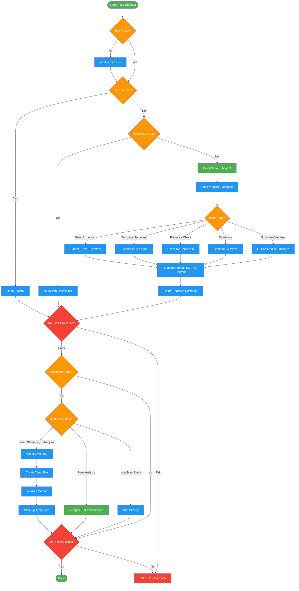

<!-- diagram-meta: {"source": "skills/smart-reading/SKILL.md", "source_hash": "sha256:4f6e08e8da1c1a91d27a18907f201a83fb08b1c841f3cb3b61a180afc606dd3c", "generated_at": "2026-02-19T00:00:00Z", "generator": "generate_diagrams.py"} -->
# Diagram: smart-reading

Protocol for reading files and command output without blind truncation or silent data loss. Decides approach based on content size and intent.

## Legend

| Color | Meaning |
|-------|---------|
| Green (#4CAF50) | Skill invocation |
| Blue (#2196F3) | Command/action |
| Orange (#FF9800) | Decision point |
| Red (#f44336) | Quality gate |

## Cross-Reference

| Node | Source Reference |
|------|----------------|
| Start: Read Request | Smart Reading Protocol (line 17) |
| wc -l to measure | "Size Before Strategy" principle (line 22) |
| Lines <= 200? | Decision Matrix (lines 46-52) |
| Read Directly | Decision Matrix: direct read for small files (line 48-49) |
| Read with Offset/Limit | Decision Matrix: targeted section read (line 50) |
| Delegate to Subagent | Decision Matrix: delegate for understanding (line 51) |
| Specify Intent Statement | Delegation Intents table (lines 140-146) |
| Intent Types | Delegation Intents: error extraction, summary, presence, diff, structure (lines 142-146) |
| Subagent Reads ENTIRE Content | Delegation Template (lines 150-158) |
| No Blind Truncation? | Invariant Principle 1: No Silent Data Loss (line 23) |
| Command Output? | Command Output Capture section (lines 59-77) |
| Capture with tee | The Pattern: tee capture (lines 66-77) |
| Cleanup Temp Files | Cleanup Rules (lines 96-110) |
| Self-Check Passed? | Self-Check checklist (lines 232-238) |
