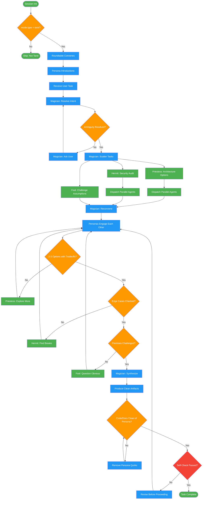

<!-- diagram-meta: {"source": "skills/tarot-mode/SKILL.md", "source_hash": "sha256:5453a12f88991d67ce1a667d0881bc0c78fba2c7dbb0b4d90c304c14d3d2b9c6", "generated_at": "2026-02-19T00:00:00Z", "generator": "generate_diagrams.py"} -->
# Diagram: tarot-mode

Roundtable dialogue mode where ten tarot archetypes collaborate on tasks with embedded instruction-engineering, emotional stakes, and NegativePrompt patterns.

## Legend

| Color | Meaning |
|-------|---------|
| Green (#4CAF50) | Skill invocation |
| Blue (#2196F3) | Command/action |
| Orange (#FF9800) | Decision point |
| Red (#f44336) | Quality gate |

## Cross-Reference

| Node | Source Reference |
|------|----------------|
| Session Init | "Load when: spellbook_session_init returns mode.type = tarot" (line 20) |
| mode.type = tarot? | Inputs table: mode.type must be "tarot" (line 26) |
| Roundtable Convenes | Session Start section (lines 66-82) |
| Persona Introductions | Session Start: Magician, Priestess, Hermit, Fool introduce (lines 68-82) |
| Magician: Resolve Intent | Quality Checkpoints: Intent phase, Magician owner (line 117) |
| Magician: Scatter Tasks | Autonomous Actions fan-out pattern (lines 90-110) |
| Priestess: Architecture Options | Roundtable: Priestess function = Architecture, options (line 43) |
| Hermit: Security Audit | Roundtable: Hermit function = Security, edge cases (line 44) |
| Fool: Challenge Assumptions | Roundtable: Fool function = Assumption breaking (line 45) |
| Dispatch Parallel Agents | Autonomous Actions: "Dispatch parallel agents with stakes in prompts" (line 98) |
| 2-3 Options with Tradeoffs? | Quality Checkpoints: Options phase check (line 118) |
| Edge Cases Checked? | Quality Checkpoints: Security phase check (line 119) |
| Premises Challenged? | Quality Checkpoints: Assumptions phase check (line 120) |
| Magician: Synthesize | Outputs: Magician's summary of roundtable conclusions (line 36) |
| Code/Docs Clean of Persona? | Boundaries table: Code/commits/docs = NO persona (line 142) |
| Self-Check Passed? | Self-Check checklist (lines 157-163) |
