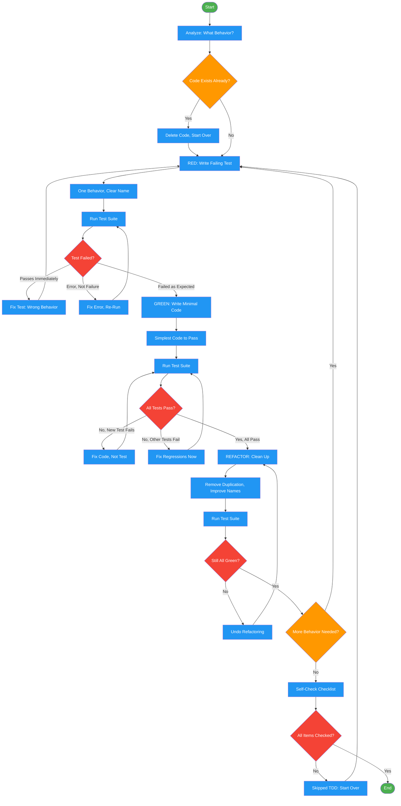

<!-- diagram-meta: {"source": "skills/test-driven-development/SKILL.md", "source_hash": "sha256:c8ef7af081f73bb45846398e3752a57506e559831e63dc96c6177b15f8d76642", "generated_at": "2026-02-19T00:00:00Z", "generator": "generate_diagrams.py"} -->
# Diagram: test-driven-development

Red-Green-Refactor cycle enforcing strict test-first discipline. Tests must fail before implementation, implementation must be minimal, and refactoring must preserve green state.

## Legend

| Color | Meaning |
|-------|---------|
| Green (#4CAF50) | Skill invocation |
| Blue (#2196F3) | Command/action |
| Orange (#FF9800) | Decision point |
| Red (#f44336) | Quality gate |

## Cross-Reference

| Node | Source Reference |
|------|----------------|
| Analyze: What Behavior? | Reasoning Schema (lines 62-67) |
| Code Exists Already? | The Iron Law (lines 52-58): "Code before test? Delete. Start over." |
| Delete Code, Start Over | The Iron Law (line 58) |
| RED: Write Failing Test | RED phase (lines 78-80) |
| One Behavior, Clear Name | RED guidance (line 80) |
| Run Test Suite | Verify RED (lines 116-129) |
| Test Failed? | Gate at lines 123-129: confirm failure, not error |
| Fix Test: Wrong Behavior | Line 128: "Test passes? Testing existing behavior. Fix test." |
| Fix Error, Re-Run | Line 129: "Test errors? Fix error, re-run until it fails correctly." |
| GREEN: Write Minimal Code | GREEN phase (lines 131-133) |
| Simplest Code to Pass | Line 133: "Simplest code to pass. No features, no refactoring." |
| All Tests Pass? | Verify GREEN (lines 167-181) |
| Fix Code, Not Test | Line 180: "Test fails? Fix code, not test." |
| Fix Regressions Now | Line 181: "Other tests fail? Fix now." |
| REFACTOR: Clean Up | REFACTOR phase (lines 183-185) |
| Remove Duplication, Improve Names | Line 185: "Remove duplication, improve names, extract helpers." |
| Still All Green? | REFACTOR gate (line 185): "Keep tests green." |
| More Behavior Needed? | Repeat section (lines 187-189) |
| Self-Check Checklist | Self-Check (lines 305-316) |
| All Items Checked? | Line 316: "If ANY unchecked: Skipped TDD. Start over." |
