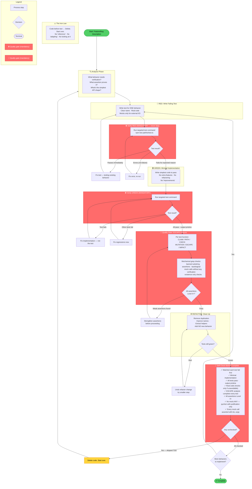

<!-- diagram-meta: {"source": "skills/test-driven-development/SKILL.md", "source_hash": "sha256:3dcca80ec419ef32365049b3675b8347eb3060eda082bba80639a95619f39bb2", "generated_at": "2026-05-25T01:33:57Z", "generator": "generate_diagrams.py"} -->
# Diagram: test-driven-development

## TDD Skill — Overview

```mermaid
flowchart TD
    START([Start: Feature/Bug Description]) --> ANALYSIS

    subgraph ANALYSIS["🔍 Analysis Phase"]
        A1["What behavior needs verification?
        What assertion proves it?
        What's the simplest API shape?"]
    end

    ANALYSIS --> RED_WRITE

    subgraph RED["🔴 RED: Write Failing Test"]
        RED_WRITE["Write test for ONE behavior
        Clear name · Real code
        Mocks only for external I/O"]
    end

    RED_WRITE --> VERIFY_RED

    subgraph VERIFY_RED_BLOCK["⛔ Verify RED (MANDATORY — never skip)"]
        VERIFY_RED["Run targeted test command
        npm test path/to/test.ts"]
        VERIFY_RED --> RED_RESULT{Test result?}
    end

    RED_RESULT -->|"Passes immediately"| FIX_TEST["Fix test — testing existing behavior"]
    FIX_TEST --> RED_WRITE
    RED_RESULT -->|"Errors (not failure)"| FIX_ERROR["Fix error, re-run"]
    FIX_ERROR --> VERIFY_RED
    RED_RESULT -->|"Fails for expected reason"| GREEN_IMPL

    subgraph GREEN["🟢 GREEN: Minimal Implementation"]
        GREEN_IMPL["Write simplest code to pass
        No extra features · No refactoring
        No 'improvements'"]
    end

    GREEN_IMPL --> VERIFY_GREEN

    subgraph VERIFY_GREEN_BLOCK["⛔ Verify GREEN (MANDATORY)"]
        VERIFY_GREEN["Run targeted test command"]
        VERIFY_GREEN --> GREEN_RESULT{Test result?}
    end

    GREEN_RESULT -->|"Test fails"| FIX_IMPL["Fix implementation — not the test"]
    FIX_IMPL --> VERIFY_GREEN
    GREEN_RESULT -->|"Other tests fail"| FIX_REGRESSION["Fix regressions now"]
    FIX_REGRESSION --> VERIFY_GREEN
    GREEN_RESULT -->|"All pass · output pristine"| ESCAPE_GATE

    subgraph ESCAPE_GATE_BLOCK["🔴 Quality Gate: ESCAPE Analysis"]
        ESCAPE_GATE["Per test function:
        CLAIM / PATH / CHECK
        MUTATION / ESCAPE / IMPACT"]
        ESCAPE_GATE --> STRENGTH_CHECK["Mechanical grep checks:
        banned substring assertions · tautological
        mock calls without arg verification
        existence-only checks"]
        STRENGTH_CHECK --> ESCAPE_OK{All assertions
        Level 4+?}
    end

    ESCAPE_OK -->|"Weak assertions found"| STRENGTHEN["Strengthen assertions
    before proceeding"]
    STRENGTHEN --> ESCAPE_GATE
    ESCAPE_OK -->|"Pass"| REFACTOR

    subgraph REFACTOR_BLOCK["♻️ REFACTOR: Clean Up"]
        REFACTOR["Remove duplication
        Improve names · Extract helpers
        Add NO new behavior"]
        REFACTOR --> REFACTOR_CHECK{Tests still green?}
    end

    REFACTOR_CHECK -->|"Red"| UNDO["Undo refactor change
    try smaller step"]
    UNDO --> REFACTOR
    REFACTOR_CHECK -->|"Green"| SELF_CHECK

    subgraph SELF_CHECK_BLOCK["🔴 Self-Check Before Complete"]
        SELF_CHECK["✓ Watched each test fail first
        ✓ Minimal implementation
        ✓ All tests pass · output pristine
        ✓ Real code (mocks only if unavoidable)
        ✓ ESCAPE analysis complete every test
        ✓ All assertions Level 4+
        ✓ No mock.ANY — pychoir with justification only
        ✓ Every mock call asserted with ALL args"]
        SELF_CHECK --> CHECKLIST_OK{Any unchecked?}
    end

    CHECKLIST_OK -->|"Yes — skipped TDD"| DELETE["Delete code. Start over."]
    DELETE --> ANALYSIS
    CHECKLIST_OK -->|"All checked"| MORE_BEHAVIOR{More behaviors
    to implement?}

    MORE_BEHAVIOR -->|"Yes"| RED_WRITE
    MORE_BEHAVIOR -->|"No"| DONE([✅ Complete])

    subgraph IRON_LAW["⚠️ The Iron Law"]
        IL["Code before test → Delete. Start over.
        No 'reference' · No 'adapting' · No looking at it"]
    end

    subgraph LEGEND["Legend"]
        L1["Process step"]
        L2{Decision}
        L3([Terminal])
        L4["⛔ Quality gate (mandatory)"]:::gate
        L5["🔴 Quality gate (mandatory)"]:::gate
    end

    classDef gate fill:#ff6b6b,color:#fff,stroke:#cc0000
    classDef dispatch fill:#4a9eff,color:#fff,stroke:#0055cc
    classDef success fill:#51cf66,color:#000,stroke:#2b9e44
    classDef warning fill:#ffd43b,color:#000,stroke:#e67700

    class VERIFY_RED_BLOCK,VERIFY_GREEN_BLOCK,ESCAPE_GATE_BLOCK,SELF_CHECK_BLOCK gate
    class DONE success
    class DELETE warning
    class START success
```

---

## TDD Skill — Assertion Quality Detail

```mermaid
flowchart TD
    WRITE_ASSERTION["Write assertion for test"] --> LEVEL_CHECK{Assertion level?}

    LEVEL_CHECK -->|"Level 1: existence only
    len > 0 · is not None
    file.exists()"| BANNED1["❌ BANNED
    Strengthening required"]

    LEVEL_CHECK -->|"Level 2: count or substring
    len == N · 'key' in result
    stringContaining"| BANNED2["❌ BANNED
    Strengthening required"]

    LEVEL_CHECK -->|"Level 3: single field
    result.status == 'ok'
    (without other fields)"| WEAK["⚠️ Weak — justify or strengthen"]

    LEVEL_CHECK -->|"Level 4+: exact equality
    complete object · all fields
    full string output"| DYNAMIC_CHECK{Contains dynamic
    values?}

    BANNED1 --> REWRITE["Rewrite: assert result == [expected_1, expected_2]"]
    BANNED2 --> REWRITE
    REWRITE --> LEVEL_CHECK

    DYNAMIC_CHECK -->|"Yes: timestamps · UUIDs
    derived strings"| CONSTRUCT["Construct complete expected value
    using same logic as production
    assert message == f'Today is {date.today()}'"]
    CONSTRUCT --> TRULY_UNKNOWABLE{Truly unknowable?
    UUIDs · server PIDs
    OS-assigned values}

    TRULY_UNKNOWABLE -->|"Yes"| PYCHOIR["Use pychoir matcher
    + justification comment
    assert result == \{'id': IsInstance(str), 'name': 'expected'\}"]
    TRULY_UNKNOWABLE -->|"No — just dynamic"| CONSTRUCT

    DYNAMIC_CHECK -->|"No: static output"| EXACT["assert result == expected_complete_output"]

    PYCHOIR --> MOCK_CHECK
    EXACT --> MOCK_CHECK
    CONSTRUCT --> MOCK_CHECK

    MOCK_CHECK{Uses mocks?} -->|"Yes"| MOCK_RULES["Assert EVERY call
    with ALL args
    verify call_count
    mock.ANY → BANNED"]
    MOCK_CHECK -->|"No"| ESCAPE_ANALYSIS

    MOCK_RULES --> MOCK_FIDELITY{Mock matches real
    system contract?}
    MOCK_FIDELITY -->|"No"| ADD_INTEGRATION["Add integration test
    exercising real system
    (when infra available)"]
    MOCK_FIDELITY -->|"Yes"| ESCAPE_ANALYSIS

    ADD_INTEGRATION --> ESCAPE_ANALYSIS

    subgraph ESCAPE_BLOCK["ESCAPE Analysis (mandatory per test function)"]
        ESCAPE_ANALYSIS["Fill in template:
        CLAIM: what does test claim to verify?
        PATH: what code actually executes?
        CHECK: what do assertions verify?"]
        ESCAPE_ANALYSIS --> MUTATION["MUTATION: for each assertion, name
        specific production code change that
        would cause that assertion to fail"]
        MUTATION --> MUTATION_OK{Can name a mutation
        for each assertion?}
        MUTATION_OK -->|"No — assertion too weak"| REWRITE
        MUTATION_OK -->|"Yes"| ESCAPE_FIELD["ESCAPE: name specific broken
        implementation that still passes
        ('nothing' requires explicit justification)"]
        ESCAPE_FIELD --> IMPACT["IMPACT: what breaks in production
        if broken implementation ships?"]
    end

    IMPACT --> GREP_CHECKS

    subgraph GREP_BLOCK["Mechanical Grep Checks (pre-commit)"]
        GREP_CHECKS["1. Banned substring on serialized output
        expect.*stringContaining.*JSON"]
        GREP_CHECKS --> G2["2. Tautological assertions
        expect(true).toBe(true) · assert True"]
        G2 --> G3["3. Mock call without arg verification
        toHaveBeenCalled() · assert_called()"]
        G3 --> G4["4. Existence-only checks
        typeof === 'function' · callable("]
        G4 --> G5["5. Stateful operations: at least one assertion
        MUST inspect post-state, not just return value"]
        G5 --> GREP_RESULT{Any grep hits?}
    end

    GREP_RESULT -->|"Yes"| STRENGTHEN_ASSERTION["Strengthen assertion
    BEFORE next gate"]
    STRENGTHEN_ASSERTION --> GREP_CHECKS
    GREP_RESULT -->|"No"| ASSERTION_APPROVED(["✅ Assertion approved — Level 4+"])

    subgraph LEGEND["Legend"]
        direction LR
        LA["Process step"]
        LB{Decision}
        LC(["Terminal"])
        LD["❌ Banned pattern"]:::banned
        LE["⚠️ Weak pattern"]:::weak
    end

    classDef banned fill:#ff6b6b,color:#fff,stroke:#cc0000
    classDef weak fill:#ffd43b,color:#000,stroke:#e67700
    classDef approved fill:#51cf66,color:#000,stroke:#2b9e44
    classDef gate fill:#ff6b6b,color:#fff,stroke:#cc0000

    class BANNED1,BANNED2 banned
    class WEAK weak
    class ASSERTION_APPROVED approved
    class GREP_BLOCK,ESCAPE_BLOCK gate
```

---

## Cross-Reference Table

| Overview node | Detail diagram |
|---|---|
| `ESCAPE_GATE_BLOCK` — ESCAPE Analysis quality gate | Assertion Quality Detail: full ESCAPE + MUTATION template |
| `STRENGTH_CHECK` — mechanical grep checks | Assertion Quality Detail: `GREP_BLOCK` |
| `RED_WRITE` — write failing test | Assertion Quality Detail: entry point for each assertion written |
| `IRON_LAW` — delete and start over | Applies when any anti-pattern from `<FORBIDDEN>` block is detected |
