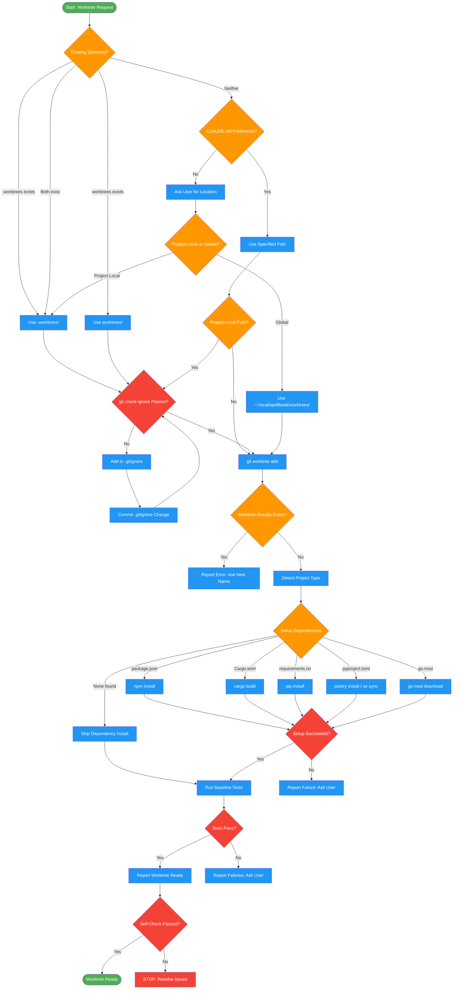

<!-- diagram-meta: {"source": "skills/using-git-worktrees/SKILL.md", "source_hash": "sha256:c7a571a5be25f296f9154a74da5c0fc2f0ace6b7342820fb6bff4766a5baa823", "generated_at": "2026-02-19T00:00:00Z", "generator": "generate_diagrams.py"} -->
# Diagram: using-git-worktrees

Workspace isolation via git worktrees with safety verification, dependency setup, and clean test baseline enforcement.

## Legend

| Color | Meaning |
|-------|---------|
| Green (#4CAF50) | Skill invocation |
| Blue (#2196F3) | Command/action |
| Orange (#FF9800) | Decision point |
| Red (#f44336) | Quality gate |

## Cross-Reference

| Node | Source Reference |
|------|----------------|
| Start: Worktree Request | Inputs: feature_name required (line 25) |
| Existing Directory? | Directory Selection Process step 1 (lines 43-51) |
| CLAUDE.md Preference? | Directory Selection Process step 2 (lines 53-59) |
| Ask User for Location | Directory Selection Process step 3 (lines 61-72) |
| git check-ignore Passes? | Safety Verification: verify directory is ignored (lines 76-95) |
| Add to .gitignore | Safety Verification: fix if not ignored (lines 97-100) |
| git worktree add | Creation Steps step 2 (lines 114-133) |
| Detect Project Type | Creation Steps step 3: auto-detect setup (lines 135-152) |
| Setup Dependencies | Creation Steps step 3: language-specific install (lines 140-152) |
| Run Baseline Tests | Creation Steps step 4: verify clean baseline (lines 156-178) |
| Tests Pass? | Reflection block: do tests pass in new worktree? (lines 168-174) |
| Report Worktree Ready | Creation Steps step 5: report location (lines 180-186) |
| Self-Check Passed? | Self-Check checklist (lines 296-304) |
