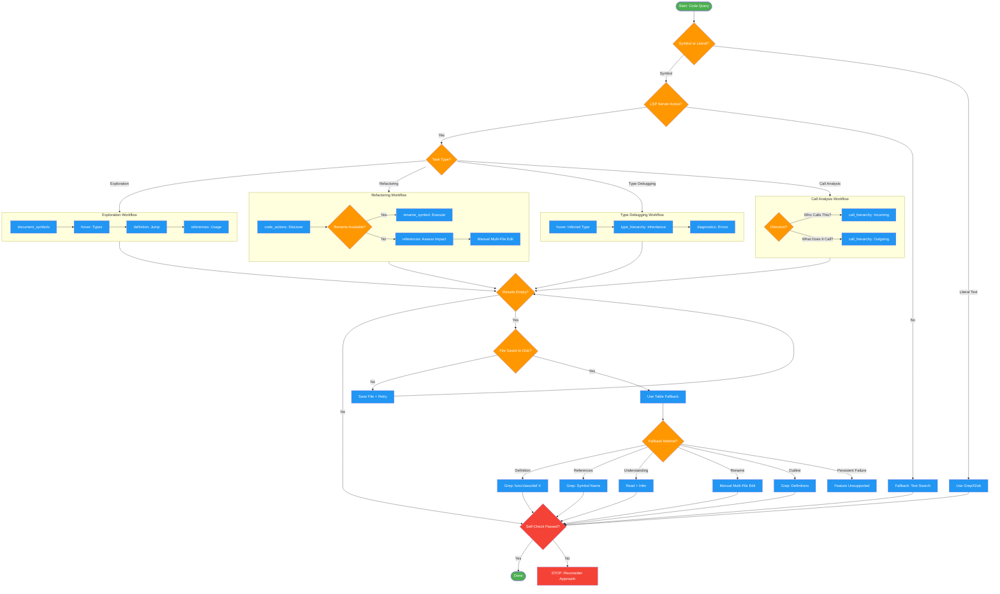

<!-- diagram-meta: {"source": "skills/using-lsp-tools/SKILL.md", "source_hash": "sha256:761e585ed244000f52b4a794a7b8330ee36c45418327906680ae1fb89f8b0bdd", "generated_at": "2026-02-19T00:00:00Z", "generator": "generate_diagrams.py"} -->
# Diagram: using-lsp-tools

Decision protocol for choosing LSP semantic tools versus text-based search, with fallback handling and workflow patterns for exploration, refactoring, and type debugging.

## Legend

| Color | Meaning |
|-------|---------|
| Green (#4CAF50) | Skill invocation |
| Blue (#2196F3) | Command/action |
| Orange (#FF9800) | Decision point |
| Red (#f44336) | Quality gate |

## Cross-Reference

| Node | Source Reference |
|------|----------------|
| Start: Code Query | Inputs: filePath, line, column, symbolName (lines 33-41) |
| Symbol or Literal? | Invariant Principle 2: LSP for Symbols, Grep for Strings (line 16) |
| LSP Server Active? | Analysis block: Is LSP server active for this language? (line 23) |
| Exploration Workflow | Workflows: Exploration sequence (line 92) |
| Refactoring Workflow | Workflows: Refactoring sequence (line 94) |
| Type Debugging Workflow | Workflows: Type debugging sequence (line 96) |
| Call Analysis Workflow | Workflows: Call analysis direction (line 98) |
| document_symbols | Tool Priority Matrix (line 59) |
| hover | Tool Priority Matrix (line 57) |
| definition | Tool Priority Matrix (line 55) |
| references | Tool Priority Matrix (line 56) |
| rename_symbol | Tool Priority Matrix (line 58) |
| call_hierarchy | Tool Priority Matrix (lines 60-61) |
| Results Empty? | Invariant Principle 3: Verify Before Fallback (line 17) |
| File Saved to Disk? | Fallback Protocol step 1: check file saved (line 112) |
| Use Table Fallback | Fallback Protocol step 2: try table fallback (line 113) |
| Feature Unsupported | Fallback Protocol step 3: persistent failure (line 114) |
| Self-Check Passed? | Self-Check checklist (lines 118-124) |
