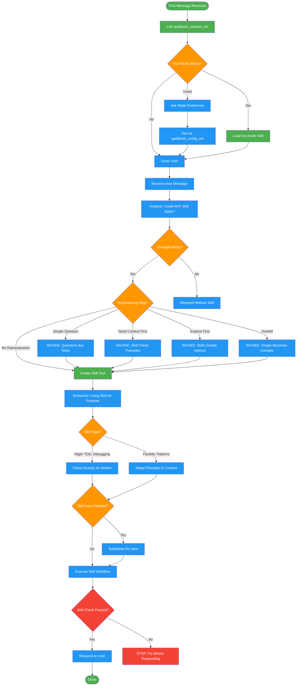

<!-- diagram-meta: {"source": "skills/using-skills/SKILL.md", "source_hash": "sha256:cbb84fbeed93f30f3d5dccfb311bd3bd929b38250057571c0fce0b5781c0364d", "generated_at": "2026-02-19T00:00:00Z", "generator": "generate_diagrams.py"} -->
# Diagram: using-skills

Meta-skill for routing user requests to the correct skill. Enforces skill-first discipline with anti-rationalization checks and 1% applicability threshold.

## Legend

| Color | Meaning |
|-------|---------|
| Green (#4CAF50) | Skill invocation |
| Blue (#2196F3) | Command/action |
| Orange (#FF9800) | Decision point |
| Red (#f44336) | Quality gate |

## Cross-Reference

| Node | Source Reference |
|------|----------------|
| First Message Received | Session Init: "On first message, call spellbook_session_init" (line 36) |
| Call spellbook_session_init | Session Init section (lines 36-44) |
| Fun Mode Status? | Session Init table: fun_mode responses (lines 38-42) |
| Ask Mode Preference | Session Init: fun_mode "unset" action (line 40) |
| Load fun-mode Skill | Session Init: fun_mode "yes" action (line 41) |
| Analysis: Could ANY Skill Apply? | Decision Flow: analysis block (lines 48-53) |
| 1% Applicability? | Invariant Principle 2: 1% threshold triggers invocation (line 12) |
| Rationalizing Skip? | Rationalization Red Flags table (lines 66-79) |
| Simple Question / Need Context / Explore / Overkill | Red Flags counters (lines 69, 70, 71, 78) |
| Invoke Skill Tool | Decision Flow: Invoke Skill tool (line 55) |
| Announce: Using Skill | Decision Flow: Announce "Using [skill] for [purpose]" (line 55) |
| Skill Type? | Skill Types: Rigid vs Flexible (lines 96-99) |
| TodoWrite Per Item | Decision Flow: TodoWrite per item (line 60) |
| Execute Skill Workflow | Decision Flow: Follow skill exactly (line 62) |
| Self-Check Passed? | Self-Check checklist (lines 112-119) |
