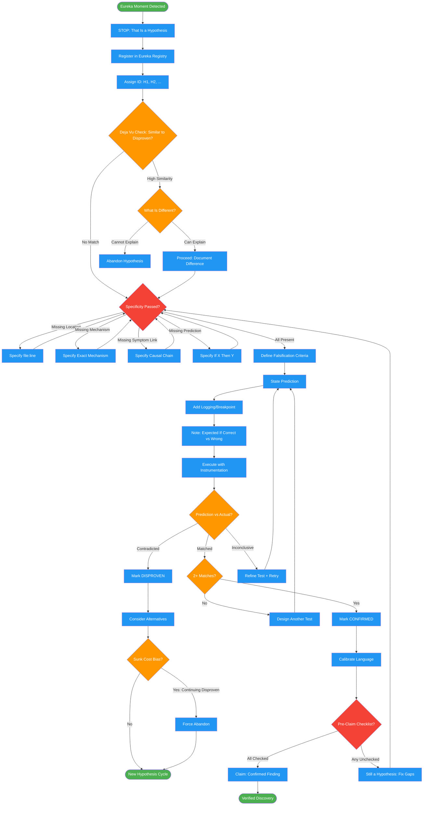

<!-- diagram-meta: {"source": "skills/verifying-hunches/SKILL.md", "source_hash": "sha256:574578062d5e23e01ab37931868044d2ee21324a8b82db13730ad92c389df2b4", "generated_at": "2026-02-19T00:00:00Z", "generator": "generate_diagrams.py"} -->
# Diagram: verifying-hunches

Prevents premature root cause claims during debugging by enforcing hypothesis registration, specificity requirements, falsification criteria, and test-before-claim discipline.

## Legend

| Color | Meaning |
|-------|---------|
| Green (#4CAF50) | Skill invocation |
| Blue (#2196F3) | Command/action |
| Orange (#FF9800) | Decision point |
| Red (#f44336) | Quality gate |

## Cross-Reference

| Node | Source Reference |
|------|----------------|
| Eureka Moment Detected | "You are here because you're about to claim a discovery. STOP." (line 15) |
| Register in Eureka Registry | Eureka Registry section (lines 36-48) |
| Assign ID: H1, H2 | Eureka Registry: id field (line 40) |
| Deja Vu Check | Eureka Registry: deja vu check before new hypothesis (line 47) |
| What Is Different? | Eureka Registry: "explain what's DIFFERENT or abandon" (line 47) |
| Specificity Passed? | Specificity Requirements (lines 62-68) |
| file:line | Specificity: Exact location (line 63) |
| Exact Mechanism | Specificity: Exact mechanism (line 64) |
| Causal Chain | Specificity: Symptom link (line 65) |
| If X Then Y | Specificity: Testable prediction (line 66) |
| Define Falsification Criteria | Invariant Principle 4: Falsification before confirmation (line 30) |
| State Prediction | Test-Before-Claim step 1 (line 74) |
| Add Logging/Breakpoint | Test-Before-Claim step 2: Instrument (line 75) |
| Execute with Instrumentation | Test-Before-Claim step 3: Execute (line 76) |
| Prediction vs Actual? | Test-Before-Claim step 4: Compare (line 77) |
| 2+ Matches? | Test-Before-Claim step 5: CONFIRMED requires 2+ matches (line 78) |
| Sunk Cost Bias? | FORBIDDEN: Sunk Cost (line 107) |
| Pre-Claim Checklist? | Pre-Claim Checklist (lines 82-91) |
| Calibrate Language | Confidence Calibration table (lines 53-58) |
