<!-- diagram-meta: {"source": "skills/writing-commands/SKILL.md", "source_hash": "sha256:9a517e381de684be4e532c7cc704188e82eb9de0214a9df02c2ae397c0728211", "generated_at": "2026-02-19T00:00:00Z", "generator": "generate_diagrams.py"} -->
# Diagram: writing-commands

Three-phase workflow for creating, reviewing, and pairing commands. Commands are direct agent prompts that must be self-contained, unambiguous, and structured for scanning under pressure.

```mermaid
flowchart TD
    Start([Start: Command Task]) --> TaskType{Task Type?}

    TaskType -->|Create New| Phase1
    TaskType -->|Review Existing| Phase2
    TaskType -->|Paired Command| Phase3

    subgraph Phase1[Phase 1: Create Command]
        P1Start[/writing-commands-create/] --> DefineSchema[Define File Naming + Frontmatter]
        DefineSchema --> WriteMission[Write MISSION Section]
        WriteMission --> WriteRole[Write ROLE Tag]
        WriteRole --> WriteInvariants[Write 3-5 Invariant Principles]
        WriteInvariants --> WriteSteps[Write Numbered Execution Steps]
        WriteSteps --> FailurePaths{Every Step Has Failure Path?}
        FailurePaths -->|No| AddFailurePath[Add Missing Failure Branches]
        AddFailurePath --> FailurePaths
        FailurePaths -->|Yes| WriteForbidden[Write FORBIDDEN Section: 5+ Items]
        WriteForbidden --> WriteAnalysis[Add analysis + reflection Tags]
        WriteAnalysis --> TokenCheck{Token Target Met?}
        TokenCheck -->|No| Optimize[Optimize for Efficiency]
        Optimize --> TokenCheck
        TokenCheck -->|Yes| P1Gate{Phase 1 Self-Check?}
    end

    subgraph Phase2[Phase 2: Review Command]
        P2Start[/writing-commands-review/] --> RunChecklist[Run Quality Checklist]
        RunChecklist --> ScoreStructure[Score: Structure]
        ScoreStructure --> ScoreContent[Score: Content Quality]
        ScoreContent --> ScoreBehavior[Score: Behavioral Correctness]
        ScoreBehavior --> ScoreAntiPattern[Score: Anti-Pattern Avoidance]
        ScoreAntiPattern --> CalcScore[Calculate Overall Score]
        CalcScore --> FlagCritical{Critical Issues Found?}
        FlagCritical -->|Yes| ReportIssues[Report Critical Issues]
        FlagCritical -->|No| ReportPass[Report: Review Passed]
        ReportIssues --> P2Gate{Phase 2 Self-Check?}
        ReportPass --> P2Gate
    end

    subgraph Phase3[Phase 3: Paired Commands]
        P3Start[/writing-commands-paired/] --> CheckArtifacts{Creates Artifacts?}
        CheckArtifacts -->|No| NoPair[No Pair Needed]
        CheckArtifacts -->|Yes| DefineManifest[Define Manifest Format]
        DefineManifest --> WriteRemoval[Write Removal Command]
        WriteRemoval --> CrossRef[Add Cross-References]
        CrossRef --> SafetyVerify{Removal Safe?}
        SafetyVerify -->|No| AddSafeguards[Add Safety Guards]
        AddSafeguards --> SafetyVerify
        SafetyVerify -->|Yes| P3Gate{Phase 3 Self-Check?}
    end

    P1Gate -->|Pass| Phase2
    P1Gate -->|Fail| FixPhase1[Fix Phase 1 Issues]
    FixPhase1 --> P1Gate

    P2Gate -->|Pass| NeedsPair{Produces Artifacts?}
    P2Gate -->|Fail| FixPhase2[Fix Phase 2 Issues]
    FixPhase2 --> P2Gate

    NeedsPair -->|Yes| Phase3
    NeedsPair -->|No| FinalCheck

    P3Gate -->|Pass| FinalCheck
    P3Gate -->|Fail| FixPhase3[Fix Phase 3 Issues]
    FixPhase3 --> P3Gate

    NoPair --> FinalCheck

    FinalCheck{Final Self-Check Passed?}
    FinalCheck -->|Yes| Done([Command Complete])
    FinalCheck -->|No| FixFinal[STOP: Fix Before Declaring Complete]

    style Start fill:#4CAF50,color:#fff
    style Done fill:#4CAF50,color:#fff
    style TaskType fill:#FF9800,color:#fff
    style FailurePaths fill:#FF9800,color:#fff
    style TokenCheck fill:#FF9800,color:#fff
    style FlagCritical fill:#FF9800,color:#fff
    style CheckArtifacts fill:#FF9800,color:#fff
    style SafetyVerify fill:#FF9800,color:#fff
    style NeedsPair fill:#FF9800,color:#fff
    style P1Gate fill:#f44336,color:#fff
    style P2Gate fill:#f44336,color:#fff
    style P3Gate fill:#f44336,color:#fff
    style FinalCheck fill:#f44336,color:#fff
    style FixPhase1 fill:#f44336,color:#fff
    style FixPhase2 fill:#f44336,color:#fff
    style FixPhase3 fill:#f44336,color:#fff
    style FixFinal fill:#f44336,color:#fff
    style P1Start fill:#4CAF50,color:#fff
    style P2Start fill:#4CAF50,color:#fff
    style P3Start fill:#4CAF50,color:#fff
    style DefineSchema fill:#2196F3,color:#fff
    style WriteMission fill:#2196F3,color:#fff
    style WriteRole fill:#2196F3,color:#fff
    style WriteInvariants fill:#2196F3,color:#fff
    style WriteSteps fill:#2196F3,color:#fff
    style AddFailurePath fill:#2196F3,color:#fff
    style WriteForbidden fill:#2196F3,color:#fff
    style WriteAnalysis fill:#2196F3,color:#fff
    style Optimize fill:#2196F3,color:#fff
    style RunChecklist fill:#2196F3,color:#fff
    style ScoreStructure fill:#2196F3,color:#fff
    style ScoreContent fill:#2196F3,color:#fff
    style ScoreBehavior fill:#2196F3,color:#fff
    style ScoreAntiPattern fill:#2196F3,color:#fff
    style CalcScore fill:#2196F3,color:#fff
    style ReportIssues fill:#2196F3,color:#fff
    style ReportPass fill:#2196F3,color:#fff
    style NoPair fill:#2196F3,color:#fff
    style DefineManifest fill:#2196F3,color:#fff
    style WriteRemoval fill:#2196F3,color:#fff
    style CrossRef fill:#2196F3,color:#fff
    style AddSafeguards fill:#2196F3,color:#fff
```

## Legend

| Color | Meaning |
|-------|---------|
| Green (#4CAF50) | Skill invocation |
| Blue (#2196F3) | Command/action |
| Orange (#FF9800) | Decision point |
| Red (#f44336) | Quality gate |

## Cross-Reference

| Node | Source Reference |
|------|----------------|
| Start: Command Task | Inputs: Command purpose, Trigger phrase (lines 37-41) |
| Task Type? | Phase Overview table: Create, Review, Paired (lines 49-55) |
| /writing-commands-create/ | Phase 1: Create Command, Execute command (line 63) |
| Write MISSION Section | FORBIDDEN: Creating commands without a MISSION section (line 96) |
| Write ROLE Tag | Self-Check: ROLE tag has domain expert + stakes (line 114) |
| Write 3-5 Invariant Principles | Self-Check: 3-5 Invariant Principles, each testable (line 115) |
| Numbered Execution Steps | Invariant Principle 2: Structure enables scanning (line 29) |
| Every Step Has Failure Path? | FORBIDDEN: Leaving conditional branches undefined (line 99) |
| Write FORBIDDEN Section | Invariant Principle 3: FORBIDDEN closes loopholes (line 30) |
| Add analysis + reflection Tags | Invariant Principle 4: Reasoning tags force deliberation (line 31) |
| /writing-commands-review/ | Phase 2: Review Command, Execute command (line 74) |
| Run Quality Checklist | FORBIDDEN: Reviewing without full Quality Checklist (line 104) |
| /writing-commands-paired/ | Phase 3: Paired Commands, Execute command (line 87) |
| Creates Artifacts? | Invariant Principle 5: Paired commands share a contract (line 32) |
| Define Manifest Format | Self-Check: manifest format defined (line 122) |
| Cross-References | Self-Check: both commands cross-reference each other (line 122) |
| Final Self-Check Passed? | Self-Check checklist (lines 110-124) |
